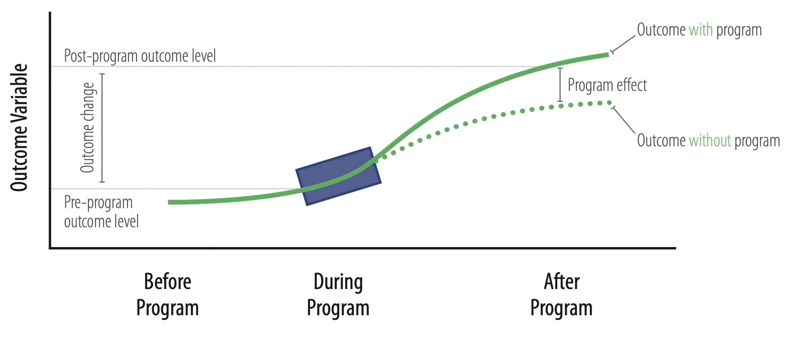
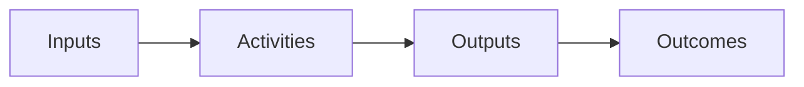
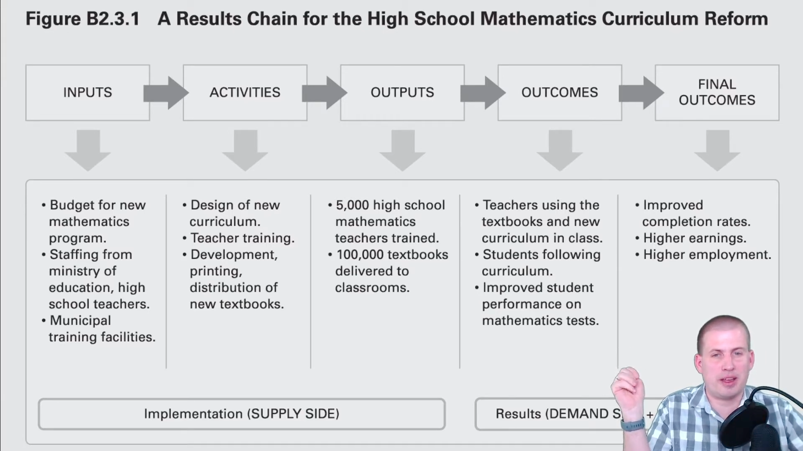
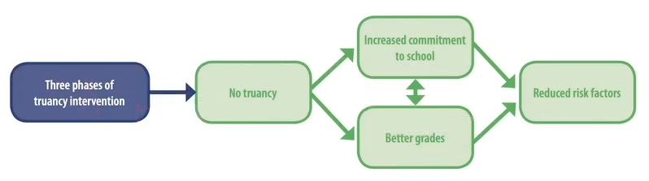
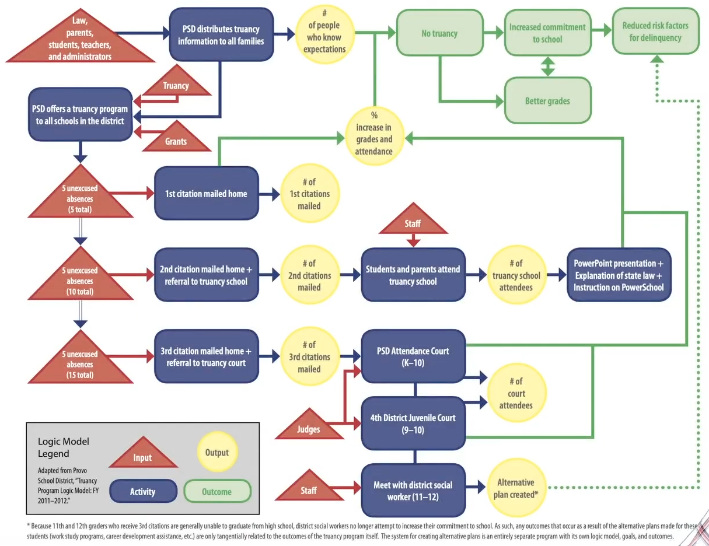

# Program Evaluation

Measuring the effect of a treatment
- Data Science
- Causal Inference

## Elements of Program

```mermaid
flowchart LR
Inputs -->
Activities -->
Outputs -->
Outcomes
```

| Element                | Meaning                                                                         | Controllable | Measurable |                         |
| ---------------------- | ------------------------------------------------------------------------------- | ------------ | ---------- | ----------------------- |
| Inputs                 | Things that go into an activity                                                 | ✅            | ✅          | Money People Time |
| Activities (Causes) | Actions that convert inputs to outputs Things that the program does          | ✅            | ✅          |                         |
| Output                 | Tangible goods & services produced by activities You have control over these | ✅            | ✅          |                         |
| Outcome (Effects)   | What happens when the target population uses the outputs                     | ❌            | ❌          |                         |

## Program Theory

- How and why an intervention causes change
- Theory for the sequence of events that connects inputs to activities to outputs to outcomes

### Steps

|               |                                 |                               |
| ------------- | ------------------------------- | ----------------------------- |
| Results Chain |                                 |  |
| Impact Theory | How activities link to outcomes |         |
| Logic Model   |                                 |    |

## Types

| Types of Program Evaluation                                                                                     | Validity | Requires structural model | Example                   |
| --------------------------------------------------------------------------------------------------------------- | -------- | ------------------------- | ------------------------- |
| Evaluating the impacts of historical programs on outcomes in the same population/environment                    | Internal | ⚠️                        | Policy in same country    |
| Forecasting the impacts of programs implemented in one population/environment in other populations/environments | External | ✅                         | Policy in another country |
| Forecasting the impacts of programs never historically experienced.                                             | External | ✅                         | Effect of tax             |

For all three types of problems, if we want to evaluate welfare impact, we need a structural model.

