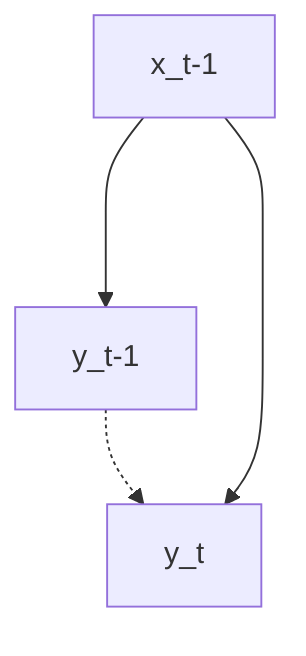
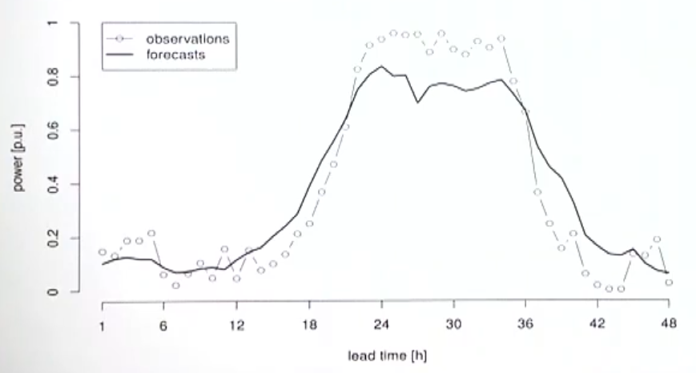

# Time Series Modelling

For all the following models

- The variable has to be stationary model
    - Else, use non-stationary $\to$ stationary transformation
- We drop parameters if they are significantly equal to 0

Difficulty

- The underlying data-generating process may change
	- Solution: Give higher sample weight to recent past

## Uni-Variate vs Causal

|                | Uni-Variate                                                                                                  | Multi-variate                                             |
| -------------- | ------------------------------------------------------------------------------------------------------------ | --------------------------------------------------------- |
| Characteristic | statistical                                                                                                  | Causal                                                    |
|                | Differencing                                                                                                 | Causal Predictors                                         |
| Modelling      | Dymamics                                                                                                     | Response                                                  |
| Preferred for  | Short-term                                                                                                   | Long-term                                                 |
|                | Unknown features                                                                                             | Known features such as time index, seasonal period length |
| Limitations    | Temporal confounding Prone to overfitting: Assumes that factors will affect in the same manner throughout |                                                           |

### Temporal confounding

- Lagged value is a mediator and opens backdoor, resulting in learning spurious autocorrelation 
- Makes learning of exogenous effects harder
- Do not include unnecessary lag when you can model the underlying structure: Causal > Statistical

Solution
- Model response with causal factors
- Model causal residuals with non-autoregressive uni-variate features such as trend, seasonality, etc.
- Model final residuals with ARIMA
	- After modelling everything, you can use lagged/seasonal lag/ error as predictor

Danger of overparameterizing in time-series
> A new worrisome trend in finance is that some academic researchers are advocating for the use of overparameterized/overfit black-box machine learning algorithms to exploit the so-called double-descent phenomenon. While this approach may work well in physical systems, where the underlying laws are relatively constant, it is dangerous in finance. Economic systems are highly dynamic, and the parameters of the data-generating process are unlikely to remain stable, making overparameterized/overfit black-boxes hazardous to investors
> 
> ~ Marcos Lopez de Prado

## Forecasting Types

### Single-Step Forecasting

### Multi-Step Forecasting

Rather than building a model for each step, you can define the model as

$$
\Delta^d y_{t+h} =
f(h) +
\sum_{i=1}^p \alpha_i \Delta^d y_{t-1} +
\sum_{i=1}^q \beta_i u_{t-1} +
u_t
$$

where

- $h$ is the horizon
- $f(h)$ is the captured mapping for $h$. You may have to perform binary encoding (such as one-hot, etc).

## Forecast Confidence Interval

It shows the range upto which the forecast is expected to deviate

$$
\text{CI }{y_{t+h}} = \hat y_{t+h} \pm h \sigma_{y+h}
$$

If standard deviation remains constant across all time points, $\sigma_{y+h} = \sigma_y$

## Correlogram

| If the correlogram of error term wrt previous lags has | Accepted? | Reason                            |
| ------------------------------------------------------ | :-------: | --------------------------------- |
| all bars inside the marked lines                       |     ✅     | $u_t$ has **no** auto-correlation |
| one/more bars outside marked lines                     |     ❌     | $u_t$ has auto-correlation        |

## Simple/Baseline Models

| Method         |                                                              | $\hat y_{t+h}, \ h>=0$                                | Appropriate for                                              |
| -------------- | ------------------------------------------------------------ | ----------------------------------------------------- | ------------------------------------------------------------ |
| Average        | Average of past values                                       | $\overline{ \{ y_{t-k} \} }$                          |                                                              |
| Naive          | Last value                                                   | $y_{t-1}$                                             | Random walk process (Consequence of efficient market hypothesis) |
| Seasonal Naive | Last seasonal value                                          | ${\large y}_{t+h-mk}$ where $m=$ seasonal period |                                                              |
| Drift Method   | Last value plus average change Equivalent to extrapolating line between first and last point | ${\large y}_{t-1} + \overline{ \{ y_t - y_{t-1} \} }$ |                                                              |

Where $k > 0$

## Simulation Models

We do not use the observed values of the process as inputs

Preferred for long-term forecasts

### Advantages

1. Simple & Intuitive
2. Non-parametric
3. Easy to aggregate

### Disadvantages

1. Needs lots of data for good sample
2. Assumption required for new products
3. Assumes stationarity

### Synthetic Data Generation using Gaussian Copula

You can use the below property to generate data similar to your original data
$$
R \Alpha^{1/2} E \sim N(0, \Sigma)
$$

- $R$ is an $n \times 1$ random normal vector
- $\Alpha^{1/2}$ is an $n \times n$ diagonal matrix with square roots of eigen values
- $E$ is matrix of Eigen vectors
- $\Sigma$ is covariance matrix of $X$

### ETS Model

Errors, Trend, Seasonality

$$
\hat y_t = f(t, S, u_t)
$$

### Monte-Carlo Simulation

Allows us to model the random component of a process; can be used along with an existing model for systematic component

System needs to describable in terms of pdf

$$
\hat y_t = f(\hat y_{t-1}, u_t)
$$

### FIR Model

Only using input features

$$
\hat y_t = f(X_{t-k}, u_t)
$$

$k$ is the no of lagged input features

### Output Error Model/Recursive Forecasting

FIR model using past estimations also. Ideally you should develop a model for this (infinite-step forecasting), and then work on using the same model for multi-step forecasting.

$$
y_t =
\sum_{i=p} \hat y_{t-i} +\sum_{i=\textcolor{hotpink}{0}} \hat X_{t-k} + u_t
$$

## State Space Models

## Kalman Filter

## GMM

Generalized method of moments

Find relationship b/w moments of random variables

Yule-Walker estimates

## Types of Errors

| Error Type |                                                              |
| ---------- | ------------------------------------------------------------ |
| Amplitude  |  |
| Phase      |  |
