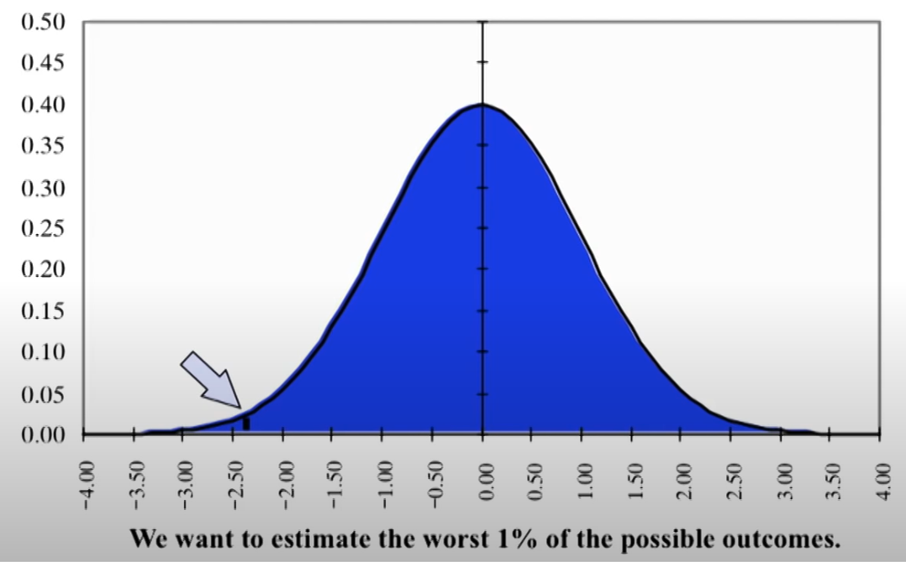

# Value Modelling

|                                                       | VAR                                           | VAG                               |
| ----------------------------------------------------- | --------------------------------------------- | --------------------------------- |
| Meaning                                               | Value at Risk                                 | Value at Gain                     |
| $p_x = x \%$ VAR/VAG is values for __ of distribution | Bottom $x \%$                                 | Top $x \%$ Bottom $(1-x) \%$ |
| Probability of __ given level                         | Losses <                                      | Gains >                           |
| Preferred for                                         | Lending (concerned about receiving repayment) | Investing (interested in gain)    |
| Example                                               |           |                                   |

Note: Both are ==**one-sided tails**==

## Target Curve

Cumulative Distribution of outcomes (rarely frequency distribution)

Goes from VAR % to VAG %

### Dominance

If target curve 1 always to right of another, it dominates

But it is not necessary that one alternative always performs better than other in all situations, as best case for one situation may be bad for another situation

## Evaluation Methods

| Method                         |                                                              |
| ------------------------------ | ------------------------------------------------------------ |
| Historical                     | Percentile of historical values                              |
| Parametric/Variance-Covariance | 1. Calculate covariance matrix of all securities 2. Annualize them 3. Calculate portfolio standard deviation: $\sigma_p = \sqrt{w' \Sigma w}$  |
| Monte Carlo Simulation         | 1. Obtain dist statistics: Mean, Variance, … 2. Run simulation 3. Get the required percentiles |
