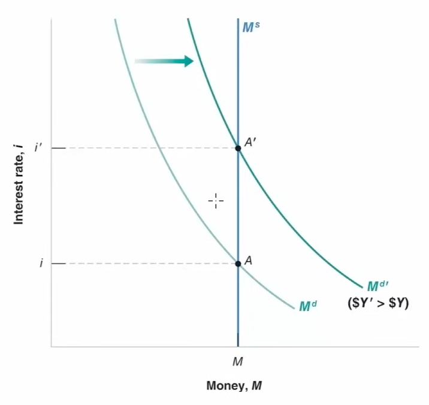

# Policy

|                                | Monetary Policy                                                     | Fiscal Policy                                    |
| ------------------------------ | ------------------------------------------------------------------- | ------------------------------------------------ |
| Short-Run objectives           | Interest rates Exchange rate Money supply Aggregate Demand |                                                  |
| Long-Run objectives            | Price level Inflation                                            | Equilibrium Growth                               |
| **Instruments**                | Repo rates Trade of financial assets                             | Government spending Taxation Subsidies     |
| **Authority**                  | Managed by central banks                                            | Managed by government (Congress/Parliament)      |
| Nature                         | Indirect (effect on G&S market via Financial Market)             | Direct (direct effects on G&S market)         |
| **Changes Implementation Lag** | Quicker                                                             | Slower                                           |
| **Changes Impact Lag**         | Quicker                                                             | Slower                                           |
| **Inflation Control**          | Directly targets inflation                                          | Indirectly influences inflation through spending |
| **Economic Impact**            | Affects borrowing costs directly                                    | Affects aggregate demand through fiscal measures |

$$
\text{Interest Rate} \propto \text{Repo Rate}
$$

## Money Supply

$$
\text{Inflation} \propto \text{Money Supply} \propto \dfrac{1}{\text{Interest Rate}}
$$

However, this may **not always** be true

1. Interest Rate $\not \propto$ Repo Rate
   Commericial banks may not follow the same as central bank, if they have high liquidity (lots of hot cash)
2. Inflation $\not \propto \frac{1}{\text{Interest Rate}}$
   People may not always spend more just because of higher money supply caused by lower interest rates

## Budget Deficit

Scenario where Govt Expenditure > Revenue. This happens a lot in developing countries, as they are trying to develop as rapidly as possible.

High budget deficit leads to high inflation
- When the govt spends a lot of money in development, then the demand for investment and labor will increase
- Developing countries always try to spend more than their revenue, because they're trying to develop as quickly as possible

### Monetization of budget deficit

When the govt prints money/borrows from banks, instead of selling assets

This leads to inflation as there is more money in the system

### Money

Exchange Rate

|             | Absolute exchange rate                 | Real exchange rate                                                                         |
| ----------- | -------------------------------------- | ------------------------------------------------------------------------------------------ |
| **Meaning** | Ratio of nominal value of 2 currencies | Rate at which one commodity is exchanged for another                                       |
| **Comment** |                                        | Also called as terms of trade Ratio of the goods/services you can buy with 2 currencies |

#### Pegging

the absolute exchange rate is fixed against another currency

isn’t natural
it is due to govt intervention

for eg, in UAE Dirham, the Central Bank of UAE

- buys dollars when the value of dollars reduces
    - in order to create a fake shortage
    - and hence increase value
- sells dollars when the value of dollars decreases

### Demand for Money

Tradeoff
- Hold more money: ease of transactions, but opportunity cost of missing return
- Hold more bonds: higher returns, but low liquidity

How much of your wealth you hold in form of money and bonds depends on
- price level of transactions
- absolute income
- interest rate

## Equilibrium Interest Rate

$$
M_s = M_d = \$ Y L(i)
$$

In reality, $M_d$ is very volatile
- Seasonality
- Holidays
- Events

| Nominal Income | Interest Rates | $\implies$ | Money Supply | Interest Rates |                                              |
| -------------- | -------------- | :--------: | ------------ | -------------- | -------------------------------------------- |
| Constant       | Constant       |            | Constant     | Constant       |     |
| Constant       | Decrease       |            | Increase     |                |      |
| Increase       |                |            | Constant     | Increase       |  |

Money supply changed through trade of bonds
- Central bank buying bonds
	- Decreases bond supply, increases price of bonds, decreases the interest rate
	- Increased money supply, decrease money demand, decrease interest rate

