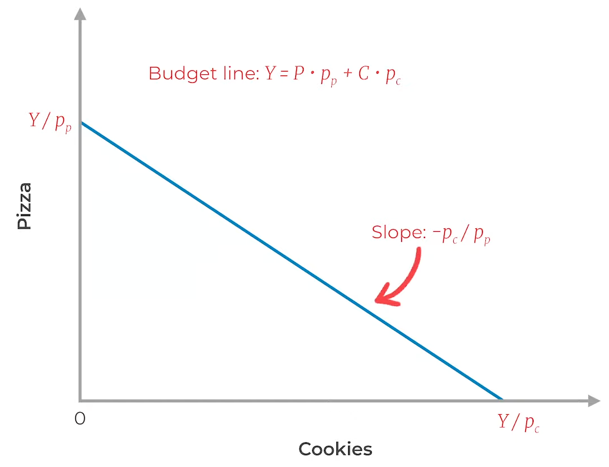
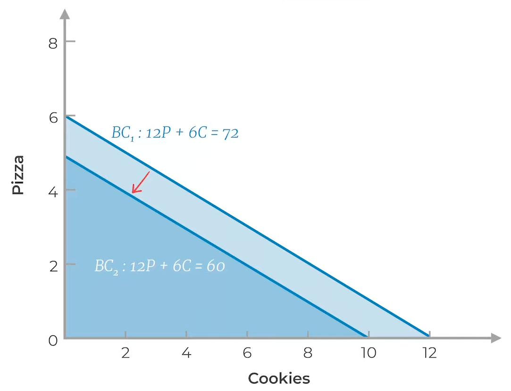
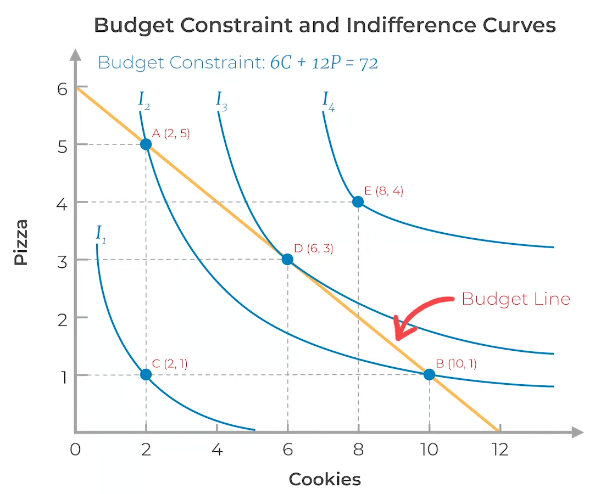
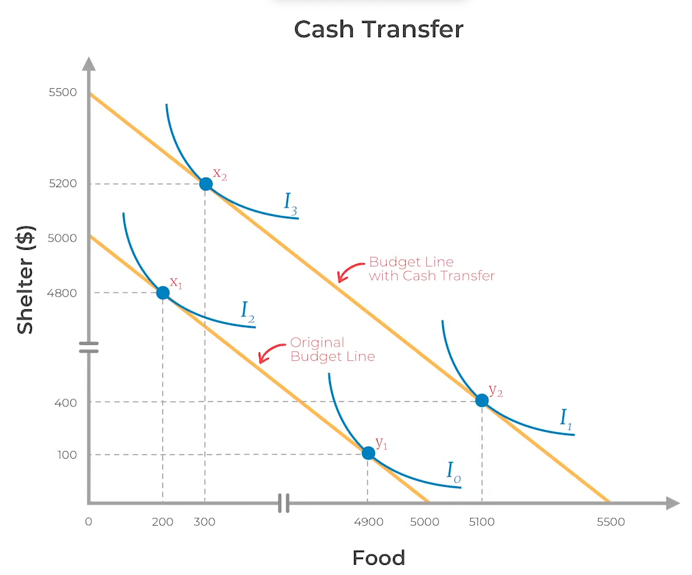

# Consumer Theory
## Utility-Maximization Model

Constrained optimization: Marginal Benefit = Marginal Cost
1. Objective: Maximize utility
2. Satisfy budget constraints

## Utility
### Indifference Curves

At any point on the curve, the combination of the two will leave the consumer equally well off or equally satisfied—hence indifferent.

|                                  | Shows all combinations of __ that provide the same utility | Slope gives |                                                                |
| -------------------------------- | ---------------------------------------------------------- | ----------- | -------------------------------------------------------------- |
| Goods-Indifference Curve         | two commodities at the same time point                     | MRS         |                           |
| Fisher’s Time-Indifference Curve | same commodity at different time points                    |             |  |

### Properties

| Property                                              | Satisfies Assumption               |
| ----------------------------------------------------- | ---------------------------------- |
| Higher indifference curve is preferred                | non-satiation                      |
| Indifference curves are downward-sloping              | non-satiation                      |
| Indifference curves never intersect                   | transitivity                       |
| Only one indifference curve through every combination | completeness                       |
| Convex to the origin                                  | Diminishing marginal utility & MRS |

### Utility

Utility is ordinal; not nominal: can only rank

Let $Q$ be consumption

$$
U \propto Q
$$

### Marginal Utility

Derivative of utility function

$$
\begin{aligned}
\dfrac{dU}{dQ} &\propto \dfrac{1}{Q} \\
\dfrac{dU}{dQ} &> 0
\end{aligned}
$$

#### Diminishing Marginal Utility

With increased consumption
- total utility increases
- marginal utility decreases

This is why price of a good does not increase proportionately with the quantity. eg: Milk

### MRS

Marginal Rate Substitute

Rate at which you are willing to substitute one good for another

$$
\begin{aligned}
\text{MRS}
&= \dfrac{dQ_2}{dQ_1} \\
&= -\dfrac{\text{MU}_1}{\text{MU}_2}
\end{aligned}
$$
#### Diminishing MRS

With increased consumption, MRS decreases

## Budget

### Expenditure

$$
y = \sum_i P_i Q_i
$$

where
- $y =$ spent amount
- $P_i =$ price of commodity $i$
- $Q_i =$ quantity of commodity $i$

### Budget Line

### Opportunity Set

Set of choices available to you given the constraints

### MRT

Marginal Rate of Transformation = Slope

Shows the real/opportunity cost of $x$ (how much we're sacrificing $y$)

MRT of producing/consuming $x$ wrt $y$ shows no of units of $y$ to be sacrificed to increase the output/consumption of $x$ by one unit

$$
\begin{aligned}
y &= f(x) \\
\text{MRT}_{x,y} &= -\frac{\mathrm{d} y}{\mathrm{d} x}
\end{aligned}
$$

### Changes

| Change | Outcome             | Example                    |                                                |
| ------ | ------------------- | -------------------------- | ---------------------------------------------- |
| Cost   | Change in Slope     | Increase in price of pizza |   |
| Budget | Change in intercept | Decrease in income         |  |
## Choice

Highest indifference curve achievable given the budget: the tangency

Point at which MRT = MRS

Rate at which you want = Rate at which market will allow

## Case Study

Cash Transfer vs Food Stamps

|            | Cash Transfer                                       | Food Stamps                                         |
| ---------- | --------------------------------------------------- | --------------------------------------------------- |
|            |                        |                        |
| Belief     | Everyone is responsible and makes the right choices | Paternalism: Economist knows better than the person |
| Limitation |                                                     | May lead to black market                            |
