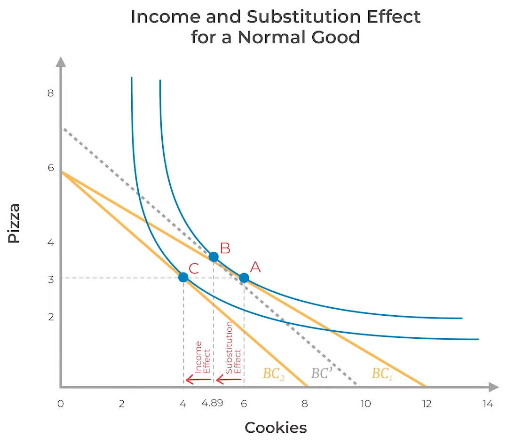
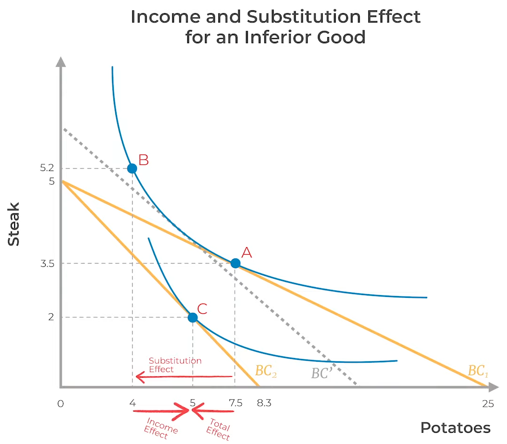

# Demand

**optimal** quantity of commodities which consumers are willing and able to buy at a particular price, in a particular period

if prices change, demand also changes

## Law of Demand

Assuming every factor (like preferences, current state affairs) remains constant

$$
\text{Demand} \propto \frac{1}{\text{Price}}
$$

Causes
- Income effect: +ve/-ve
- Substitution effect/compensated demand: always -ve

| Type of good | Price | Substitution effect | Income effect | Total effect |
| ------------ | ----- | ------------------- | ------------- | ------------ |
| Normal       | Inc   | -ve                 | -ve           | -ve          |
|              | Dec   | +ve                 | +ve           | +ve          |
| Inferior     | Inc   | -ve                 | +ve           | depends      |
|              | Dec   | +ve                 | -ve           | depends      |

## Individual Demand Curve

Shows the relationship between price and quantity demanded

Can vary from one individual to another even for the same commodity, due to [Factors of Trade](01_Intro.md#factors of trade)

graph is a straight line with a negative slope

- x = Demand
- y = price

Be careful of the slope, cuz the slope formula is for the inversed graph of the demand Curve
Slope $= \frac 1 {\alpha_2}$

$$
\text{Demand as a function of price}\\
\begin{aligned}
D &= f(P) \\
&= \alpha_1 - \alpha_2 P \\
\alpha_2 &= -\frac{\partial D}{\partial P}
\end{aligned}
$$

| Term       | Meaning                                                                                                                                                                                           |
| ---------- | ------------------------------------------------------------------------------------------------------------------------------------------------------------------------------------------------- |
| $x$        | Demand                                                                                                                                                                                            |
| $P$        | Price                                                                                                                                                                                             |
| $\alpha_2$ | Sensitivity of demand wrt price The no of units of demand decreases by when the price increases by 1 unit  - Necessities have low sensitivity  - Luxury goods have high sensitivity |
| $\alpha_1$ | Demand even when commodity is free Captures impact of all other factors that affect the demand (Income of consumers, advertising, etc)                                                       |

## Change in Price

| Normal Good                                | Inferior Good                                            |
| ------------------------------------------ | -------------------------------------------------------- |
|  |  |

## Graph Characteristics

|                | Horizontal Graph                                             | Vertical Graph                                               |
| -------------- | ------------------------------------------------------------ | ------------------------------------------------------------ |
| Slope of graph | $\to 0$                                                      | $\to \infty$                                                 |
| $\alpha_2$     | $\to \infty$                                                 | $\to 0$                                                      |
| sensitivity    | High                                                         | Low                                                          |
|                | even a small change in price will cause variation in demand  | even large changes in price cause negligible change in demand |
| Example        | when there are too many sellers and buyers; and only one seller changes the price | medicines, food                                              |

## Market Demand

total demand for a commodity in a market at a particular price

summation of individual demands for commodity at particular prices

## Giffen Goods

Law of demand not applicable for them

eg: BW TVs, Nokia Phone

$\text{demand} \propto \text{price}$

# Factors of Demand

Out of the following factors, economic policies mainly target the expectations factor

$$
x_1 = 
\alpha
- \alpha_1 p
\pm \alpha_2 M
\pm \alpha_3 W
\pm \alpha_4 M^e
\pm \alpha_5 p^e
+ \alpha_6 A
$$

## Income and Wealth

More income and wealth means more spending and hence, higher demand

- Income is flow of money currently
- Wealth is what we have accumulated over time

| Relationship Type | Elastic Demand? | Shift in individual demand curve | Consumption at same price |          Example          |
| :--------------------: | :------------------: | :-----------------------------------: | :----------------------------: | :-----------------------: |
|          +ve           |          ✅           |               Rightward               |            Greater             |       Luxury Items        |
|        Neutral         |          ❌           |                 None                  |              Same              |       Staple foods        |
|          -ve           |          ✅           |               Leftward                |             Lower              | Inferior and Giffen goods |

### Types of Goods based on Income Elasticity

| Type        | Income Elasticity |                                          |
| ----------- | :---------------: | ---------------------------------------- |
| Superior    |        +ve        | Smartphones, LED TVs, Cars               |
| Necessities |         0         | Staple foods                             |
| Inferior    |        -ve        | B/W TV, tungsten bulbs, public transport |

## Price of Other goods

Cross Price is measured by $\alpha_3$

when price of complimentary good increases, the demand of main commodity decreases
when price of substitute good increases, the demand of main commodity increases

hence, if

- $\alpha_3 > 0$ substitute
- $\alpha_3 < 0$ complimentary

### Types of Goods based on substitution

| Type                | Meaning                                   | Example      |
| ------------------- | ----------------------------------------- | ------------ |
| Complimentary goods | Goods that are consumed together          | Car & Petrol |
| Substitute Goods    | Goods that are alternatives of each other | Pepsi & Coke |

## Tastes/Preferences

idk how to write this

## Customer Expectations

| Expectation    | Meaning                                                      | Explanation                                                  |
| -------------- | ------------------------------------------------------------ | ------------------------------------------------------------ |
| Expected Price | What I predict to be the price of the commodity in the future | If expected price > current price, then demand increases, which ends up increasing the price; whether or not it would’ve happened naturally, nobody will know 😆; here, our expectations clearly affects the actual outcome If expected price < current price, then demand decreases |
| Expected       | What I predict to be my income in the future                 |                                                              |

## Market Size

No of buyers in the market

$$
\text{Demand} \propto \text{Market Size}
$$

## Advertising Expenditure

Does not affect the product, but changes the perception of the product in consumers’ heads

$$
\text{Demand} \propto \text{Advertising Expenditure}
$$

## Season/Time of the Year

- demand for cotton is greater in summer
- demand for wool is greater in winter

