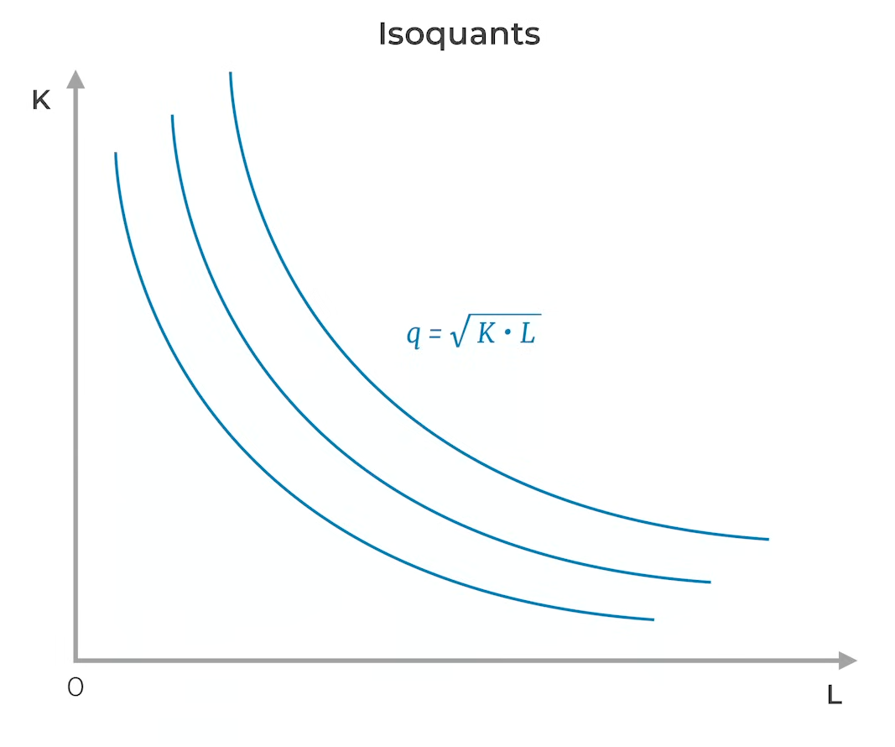
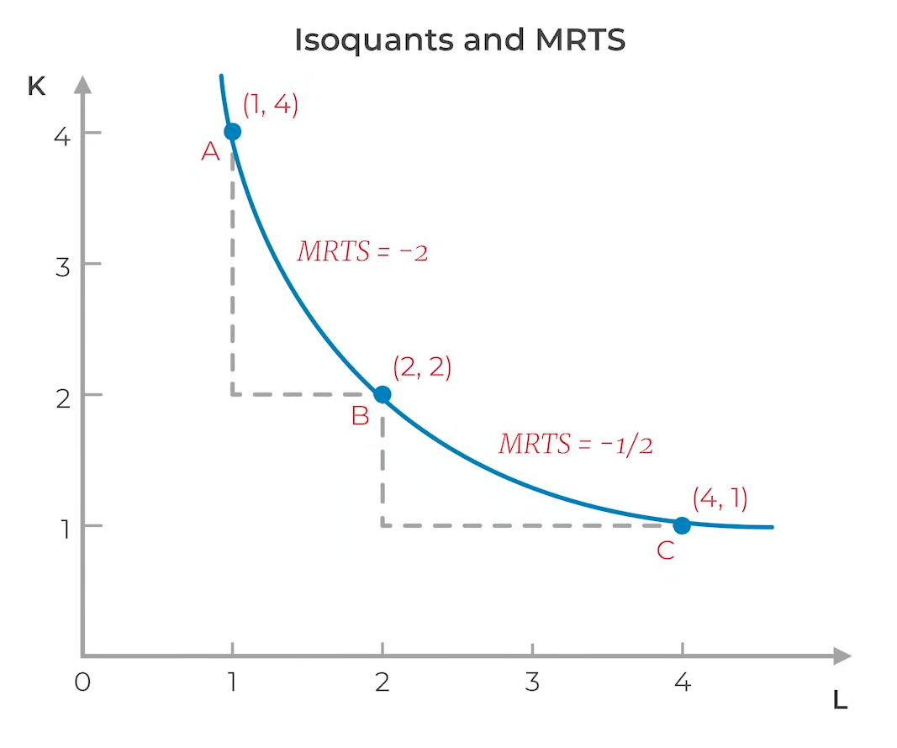
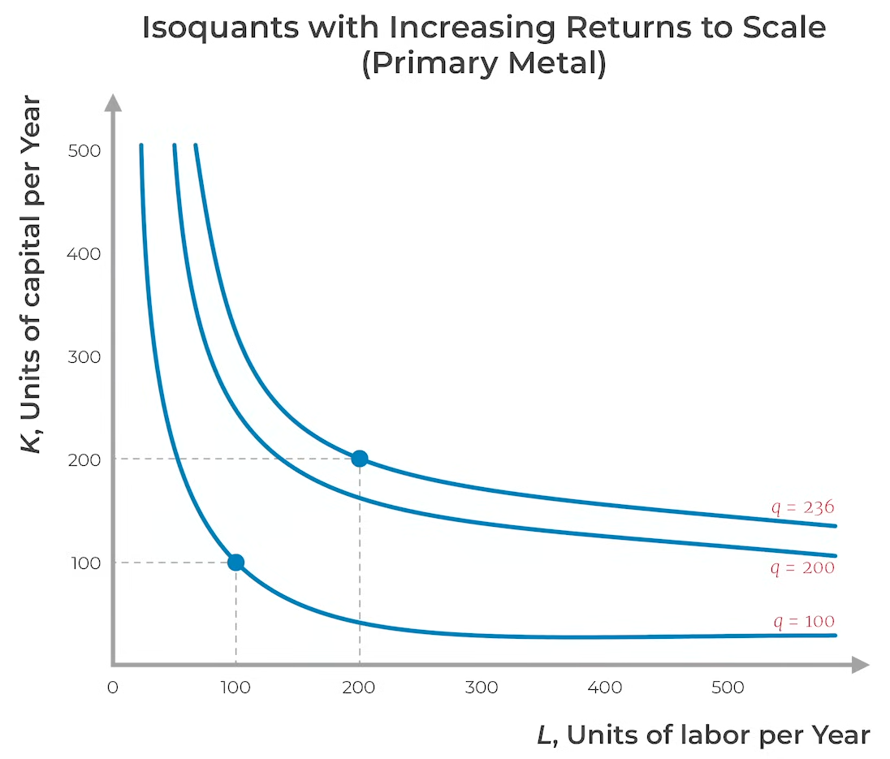
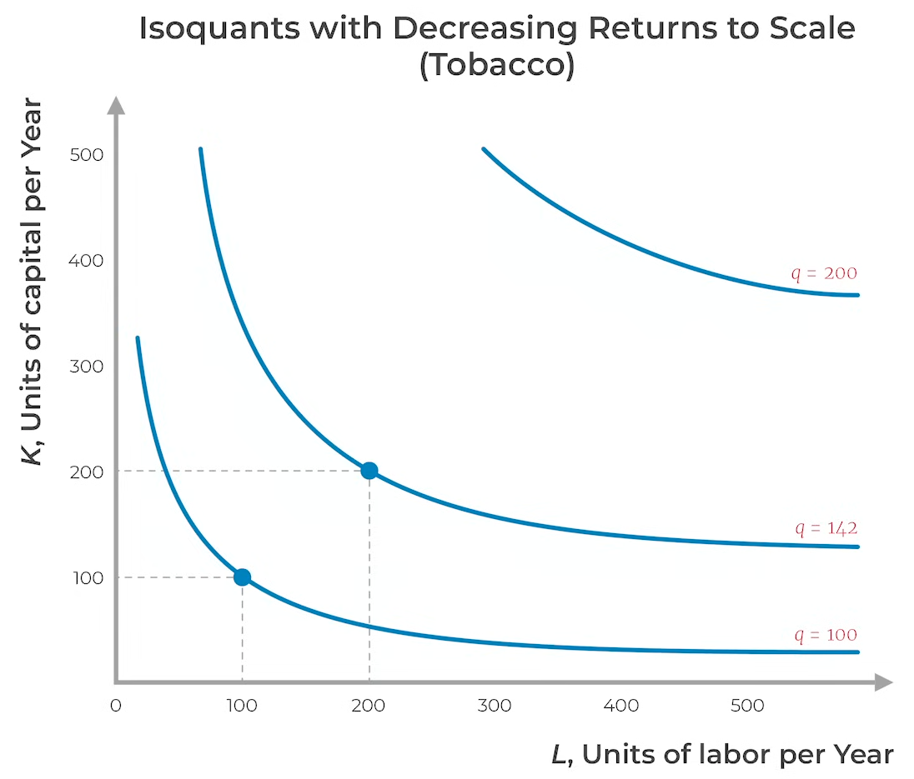
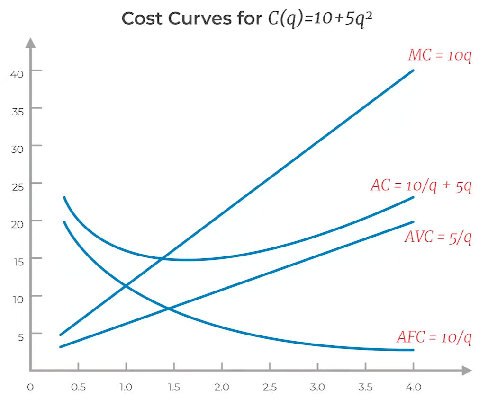
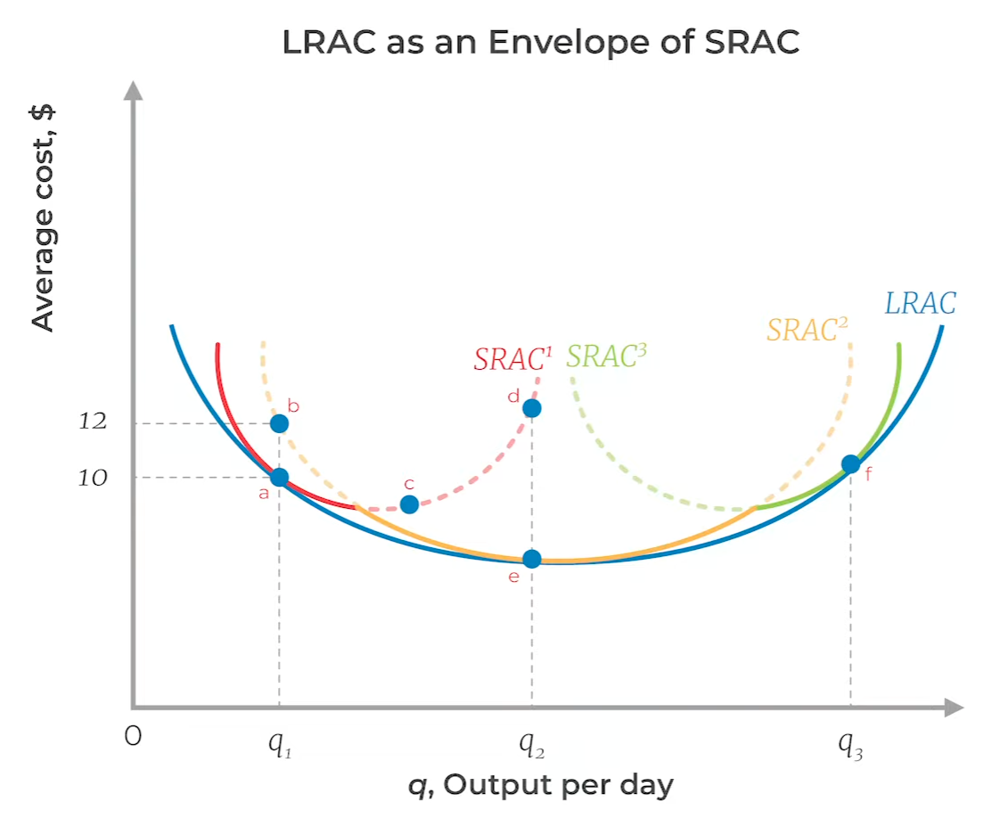
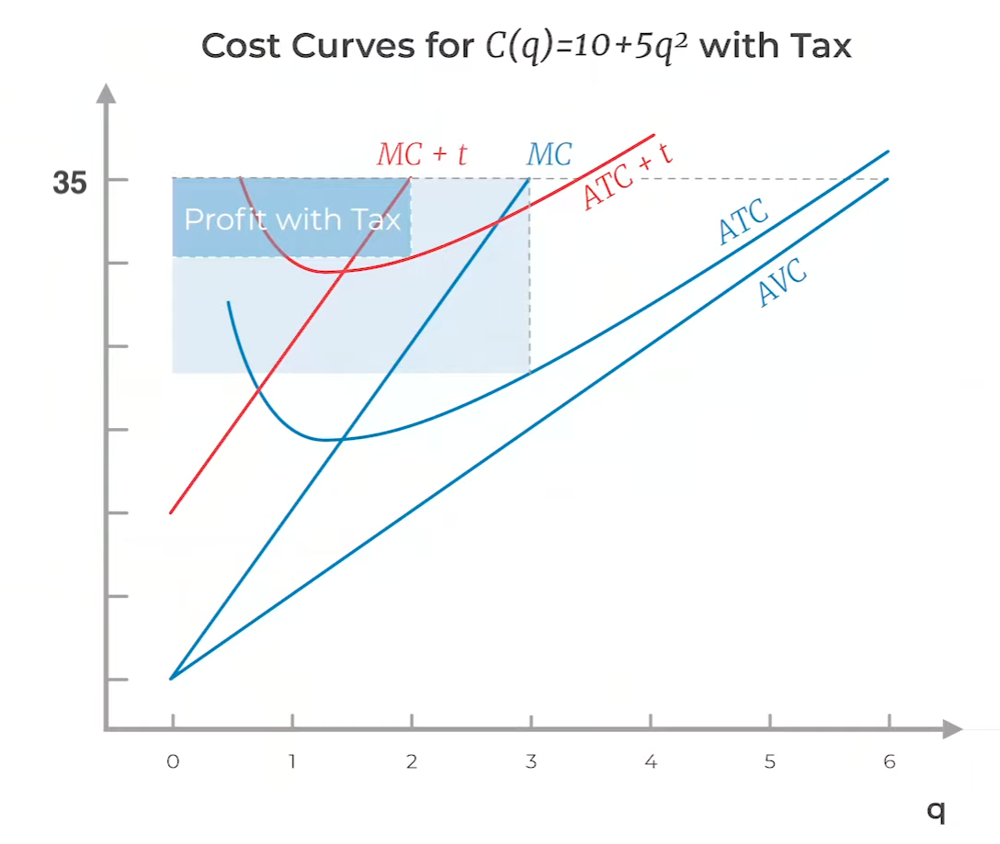

# Production Theory

Constrained optimization: Marginal Benefit = Marginal Cost
1. Maximize objective: Maximize Profit = Revenue - Cost
2. Constraint: Firms get to decide how much to produce

Let
- $q$ be quantity produced by firm
- $Q$ be quantity produced by entire market

## Assumptions
- 
### Assumptions

| Assumption                                                            | Limitation                                                                                   |
| --------------------------------------------------------------------- | -------------------------------------------------------------------------------------------- |
| All firms are identical: Same production quantity and marginal cost   | Not realistic                                                                                |
| Entry & Exit not possible in the short run                            |                                                                                              |
| Entry & Exit is possible in the long run without any barrier of entry | Barriers to entry: Sunk costs,                                                               |
| Input prices $r_k, r_l$ are fixed                                     | Inputs could have upward sloping supply  Wage rate increases with increased production |

## Quantity

### Factors of Production

| Factor                            |     | Example             | Short Run | Long Run |
| --------------------------------- | --- | ------------------- | --------- | -------- |
| Land                              |     |                     | Fixed?    | Fixed?   |
| Labor $l$                         |     |                     | Variable  | Variable |
| Capital $k$                       |     | Machines, buildings | Fixed     | Variable |
| Technological innovation $A_t$ |     |                     |           |          |

Long run is the time period for which all inputs are variable

### Production Function

Function that defines output as a function of input(s)

$$
q = f(A_t, la, l, k)
$$

### Total Factor Productivity

Productivity increase due to technology/innovation, keeping other factors constant

$$
A_t = \dfrac{q}{k^\alpha \times l^\beta}
$$
$\alpha, \beta =$ two inputs' respective shares of output

### Marginal Productivity

$$
\begin{aligned}
\text{MP}_l^q &= \frac{\partial q}{\partial l} \\
\text{MP}_k^q &= \frac{\partial q}{\partial k}
\end{aligned}
$$

#### Diminishing Marginal Productivity

With increase in input
- total productivity increases
- marginal productivity decreases

##### Graph

- y = MP
- x = input (l,k)

The graph will be a straight line with a downward slope

### Isoquants

- Similar concept to indifference curves
- All the assumptions of indifference curves apply

| Inputs                                                      | $q$          |                                                    |                         |
| ----------------------------------------------------------- | ------------ | -------------------------------------------------- | ----------------------- |
| Perfectly Substitutable                                     | $l+k$        |       |                         |
| Perfectly Non-Substitutable Leontief Production Function | $\min(l, k)$ |  | Computers & Programmers |

### MRTS

Marginal Rate of Technical Substitution

Slope of Isoquant at a point, hence depends on the position on the isoquant

$$
\begin{aligned}
\text{MRTS}
&= -\dfrac{\partial k}{\partial l} \\
&= -\dfrac{\partial q}{\partial l} \times \dfrac{\partial k}{\partial q} \\
&= -\dfrac{\partial q}{\partial l} / \dfrac{\partial q}{\partial k} \\
&= -\text{MP}_l / \text{MP}_k
\end{aligned}
$$
 

Diminishing marginal productivity affects this

$$
\Delta l \cdot \text{MP}_l + \Delta k \cdot \text{MP}_k = 0
$$

### Returns to Scale

What happens to production when you increase all inputs proportionally

Not $k$ vs $l$

| Returns to Scale |       $f(a l, a k)$ | Example                                         |                                             |
| ---------------- | ------------------: | ----------------------------------------------- | ------------------------------------------- |
| Constant         |   $a \cdot f(l, k)$ |                                                 |                                             |
| Increasing       | $> a \cdot f(l, k)$ | Firm with increased inputs can specialize more  |  |
| Decreasing       | $< a \cdot f(l, k)$ | Firm with increased inputs means more confusion |  |

### Production Possibility Frontier

deals with the production capacity of an economy

- analyzes available resources
- predicts what can be produced with those resources, with the assumption that time and technology are constant
- analyzes various output mixes (combinations of different commodities)

### Production Possibility curve

Curve that shows the optimal level of production for different combinations of outputs

what is the maximum output that can be produced of various commodities

### Graph

- $y =$ commodity 2
- $x =$ commodity 1

The graph will be a curve

### MRT

When we go from left to right, the slope increases from left to right, ie, cost of production of $x$ increases

- $\text{MP}_k^y, \text{MP}_l^y$ increases
- $\text{MP}_k^x, \text{MP}_l^x$ decreases

Example: if mango’s MP is 2 and apple’s MP is 4, then 4 units of apples are to be sacrificed to produce 2 units of mangoes

$$
\begin{aligned}
x &= l \cdot MP_l + k \cdot MP_k \\
\mathrm{d} y &= \mathrm{d} l_{y}(MP_l^y) + \mathrm{d} k_y(MP_k^y) \\
\mathrm{d} x &= \mathrm{d} l_{x}(MP_l^x) + \mathrm{d} k_x(MP_k^x) \\
\frac{\mathrm{d} y}{\mathrm{d} x} &= \frac{MP_k^y}{MP_k^x} = \frac{MP_l^y}{MP_l^x}
\end{aligned}
$$

### Points on the curve

- inside are inefficient input mix - wasting profit
- on the curve are optimal input mix
- outside is impossible input mix

### Shift of PPC

It depends on type of technological change that occurs

also depends on change in the quantity and productivity of labor and capital

| Type of Change    | increases productivity of labor | increases productivity of capital |                                                                        | Curve expands for                            |
| ----------------- | ------------------------------- | --------------------------------- | ---------------------------------------------------------------------- | -------------------------------------------- |
| Labor-intensive   | ✅                               | ❌                                 | motivates producers to increase labor rather than increasing machines  | labor-intensive good side                    |
| Capital-intensive | ❌                               | ✅                                 | motivates producers to increase machines rather than increasing  labor | capital-intensive good side                  |
| Neutral           | ✅                               | ✅                                 | does not change the proportion in which labor and capital are used     | ==parallel shift== (equal increase/decrease) |

### Output Mix

|                | Efficient                                                                                          | Inefficient                                                                                     | Unattainable                                                                                                        |
| -------------- | -------------------------------------------------------------------------------------------------- | ----------------------------------------------------------------------------------------------- | ------------------------------------------------------------------------------------------------------------------- |
| Curve          | optimal points on the curve                                                                        | points inside the curve                                                                         | points outside the curve                                                                                            |
| Meaning        | Efficient performance                                                                              | Underperformance                                                                                | that level of output may be achieved in the future with the help of development, but not with the current resources |
| Interpretation | it is impossible to increase the output of one commodity without sacrificing the output of another | it is possible to increase the output of one commodity without decreasing the output of another | it is not possible to reach that output, even by using all resources                                                |
| Seen in        | Developed economies                                                                                | Developing economies                                                                            |                                                                                                                     |

## Costs

### Types

| Category | Type     | Meaning                                                                            | Example                                                                                                                                                                                                                                |
| -------- | -------- | ---------------------------------------------------------------------------------- | -------------------------------------------------------------------------------------------------------------------------------------------------------------------------------------------------------------------------------------- |
| IDK      | Fixed    | Independent of quantity produced                                                   | Machinery depreciation cost Land                                                                                                                                                                                                    |
|          | Variable | Dependent on quantity produced                                                     | Wages of employees Utilities bill                                                                                                                                                                                                   |
|          | Sunk     | Cannot be changed/undone regardless of whatever action  Long-Run Fixed Costs | Education                                                                                                                                                                                                                              |
| IDK      | explicit | Direct                                                                             | Raw materials, labor costs                                                                                                                                                                                                             |
|          | implicit | Indirect                                                                           | 1. i work in my own restaurant. I lost my time, which could’ve been used somewhere else like some other restaurant/company 2. investing in your company. I could’ve invested it somewhere else, which could’ve earned me more money |

### Cost Function

$$
c = k r_k + l r_l
$$
where
- $r_k =$ depreciation
- $r_l =$ wage rate

Substituting for $k$ or $l$ from the production function will give the relationship between $C$ and $q$

|                              |                                  |
| ---------------------------- | -------------------------------- |
| Marginal Cost                | $\dfrac{\partial c}{\partial Q}$ |
| Average Cost                 | $\dfrac{c}{q}$                   |
| AVC Average Variable Cost | $\dfrac{c_v}{q}$                 |
| AFC Average Variable Cost | $\dfrac{c_f}{q}$                 |
### Cost Curves

- AC decreases and then increases
	- Increasing quantity helps amortize the fixed cost

|           |                                        |
| --------- | -------------------------------------- |
| Long-run  |                                        |
| Short-run | $\text{MC} = \dfrac{r_l}{\text{MP}_l}$ |

### Isocost Curves

### Efficient Input Mix

Efficient input mix is the tangent of the isocost and isoquant curves

Increase in wages

At the optimal input mix
- MRTS = $-\dfrac{r_l}{r_k}$
- $\dfrac{\text{MP}_l}{r_l} =\dfrac{\text{MP}_k}{r_k}$

Efficient input mix is said to be

- Economically efficient
  if the costs associated with an input mix is minimal
- Technically efficient
  if it is impossible to maintain the same output, without keeping the same inputs
  if any input decreases, the output also decreases
    - in India, we have a technically inefficient agricultural sector. This is proved by the fact that:
      even though many people moved to tertiary sector, it did not affect agricultural output

### Long-Run Cost Curve
#### Expansion Path

How does cost change with production quantity

|                             |                                                    |
| --------------------------- | -------------------------------------------------- |
| $\text{MP}_l = \text{MP}_k$ |  |
| $\text{MP}_l > \text{MP}_k$ |  |
| $\text{MP}_l < \text{MP}_k$ |  |

#### Increasing Cost of Inputs

### Long-Run vs Short-Run

- Long-run operations are always more efficient than short-run
	- You can optimize for both cost and capital in the long-run

## Profit

| Type       | $\pi$                           |
| ---------- | ------------------------------- |
| Accounting | $R - C$                         |
| Economic   | Corrected for opportunity costs |
### Profit Maximization

Every company tries to maximize its profit.

Profits can be maximized by cost minimization through optimization of input mix. The input mix depends on
1. productivity of input factor (high is preffered)
2. price of input factor (low is preffered)

Labor is preferred for lower price; capital is preferred due to higher productivity

Assumption: In the short run, no firm enters/exits; capital is a sunk cost

$$
\begin{aligned}
\pi_\max
&= \max_p \Bigg \{ R - C \Bigg \} \\
&= \max_p \Bigg\{ p q_m - c \Big( q_m(p) \Big) \Bigg\}
\end{aligned}
$$

where
- $p$ is unit sale price
- $q(p)$ is units sold
- $c \Big( q(p) \Big)$ is cost
- $c' \Big( q(p) \Big)$ is the marginal cost

$$
\begin{aligned}
\dfrac{\partial \pi}{\partial q}
&= \dfrac{\partial R}{\partial q} - \dfrac{\partial C}{\partial q}  \\
0 &= \text{MR} - \text{MC} \\
\implies
\text{MR} &= \text{MC}
\end{aligned}
$$
For perfectly-competitive market
- $\text{MR}(Q)$ = $P(Q)$
- Hence, at market equilibrium, $q$ for which $\text{MC}(Q) = P$

### Average Profit

$$
\begin{aligned}
\text{AP}
&= \dfrac{r}{q} - \dfrac{c}{q} \\
&= p - \text{AC}
\end{aligned}
$$
### Taxation

|                  | Fixed Tax | Per-Unit Tax                      |
| ---------------- | --------- | --------------------------------- |
| Optimal Quantity | No change | Reduced                           |
| Profit           | Reduced   | Reduced                           |
| Curves           | No change |  |

### Shutdown Decision

Producer still part of the market, but does not produce anything

Sometimes, producing something is better than nothing, as making low loss is better than extreme loss

Short-run: Only shutdown if
- revenue is lower than variable cost, as you have to pay fixed cost regardless
- $Pq < \text{VC}$
- ie, $P < \text{AVC}$

### Firm vs Market Demand

$$
q(P) = Q(P) - S^0(P)
$$
- $q(P)=$ Firm demand
- $Q(P)=$ Market demand
- $S^0(P) =$ Residual demand = how much competition is selling

Even with inelastic $Q$, $q$ can be elastic

$$
\begin{aligned}
\dfrac{dq}{dP}
&= \dfrac{dQ}{dP} - \dfrac{dS^0}{dP} \\
%% e_{di} &= E_d - E_s
\end{aligned}
$$

$\dfrac{dS^0}{dP} > 0$ as number of suppliers will inc with inc in selling price

If there are $N$ identical firms
- $Q = Nq, S^0 = (N-1)q$
- $e_{di} = N E_d - (N-1)E_s$
	- $e_d =$ Firm demand elasticity
	- $E_d =$ Market demand elasticity
	- $E_d =$ Market supply elasticity

## Firm Entry/Exit

Only in the long-run

Happens when long-run profit > Barrier of entry

|     | Entry                      | Exit                      |
| --- | -------------------------- | ------------------------- |
|     |  |  |

### Outcome of Competition

- Forces each supplier to produce efficiently
- Forces entry and exit of suppliers until

such that
- Price = Marginal Cost = Min of Average Cost
- Total profit of market = 0

### Different Firms

