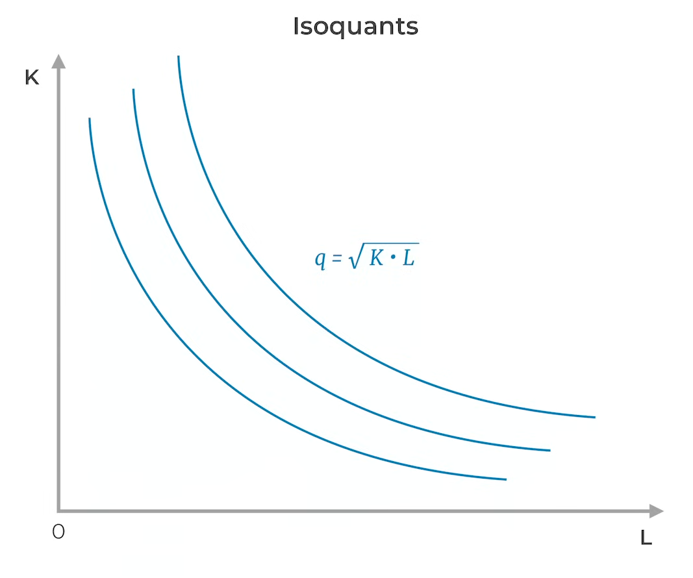
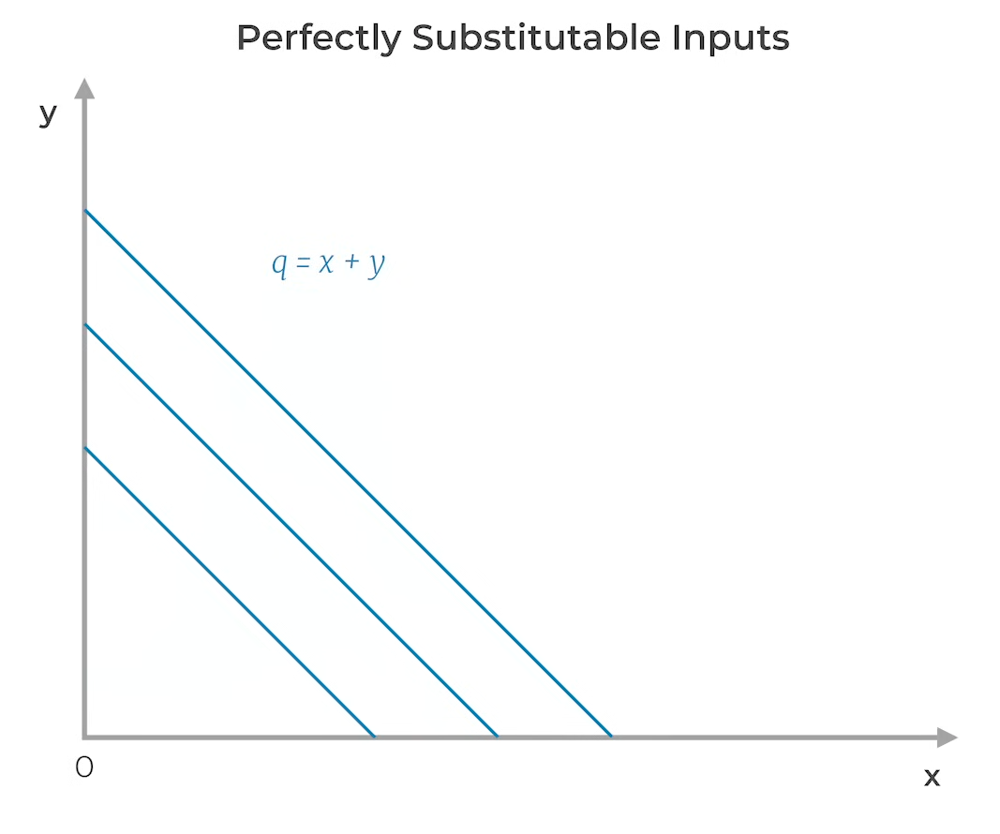
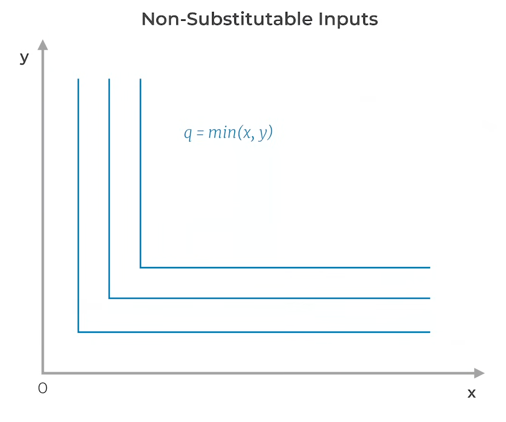
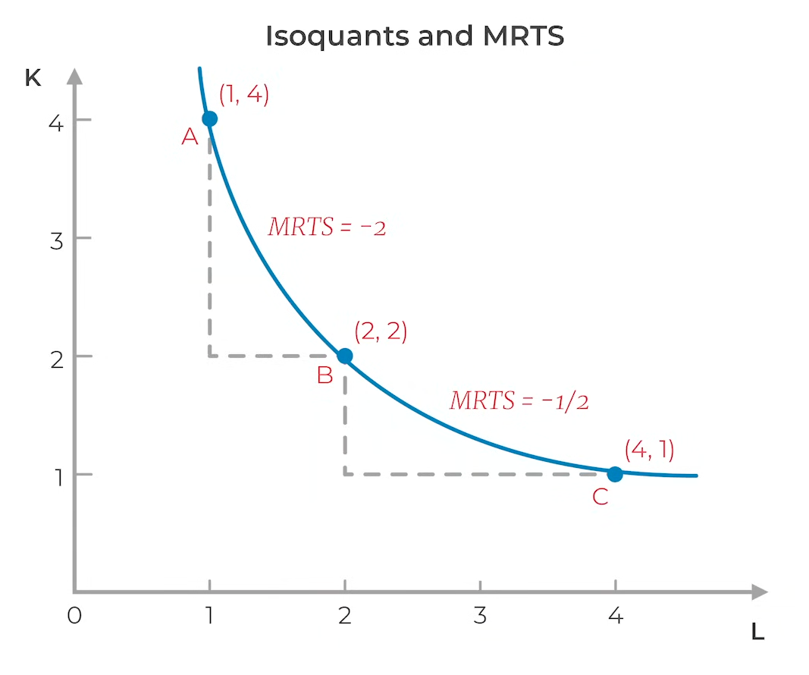
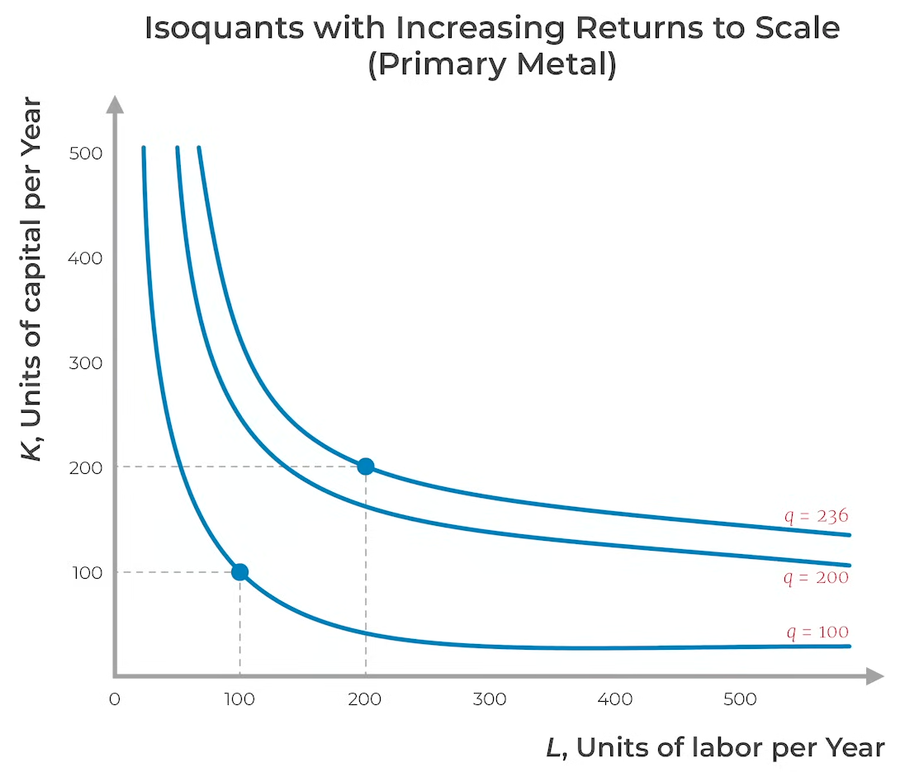
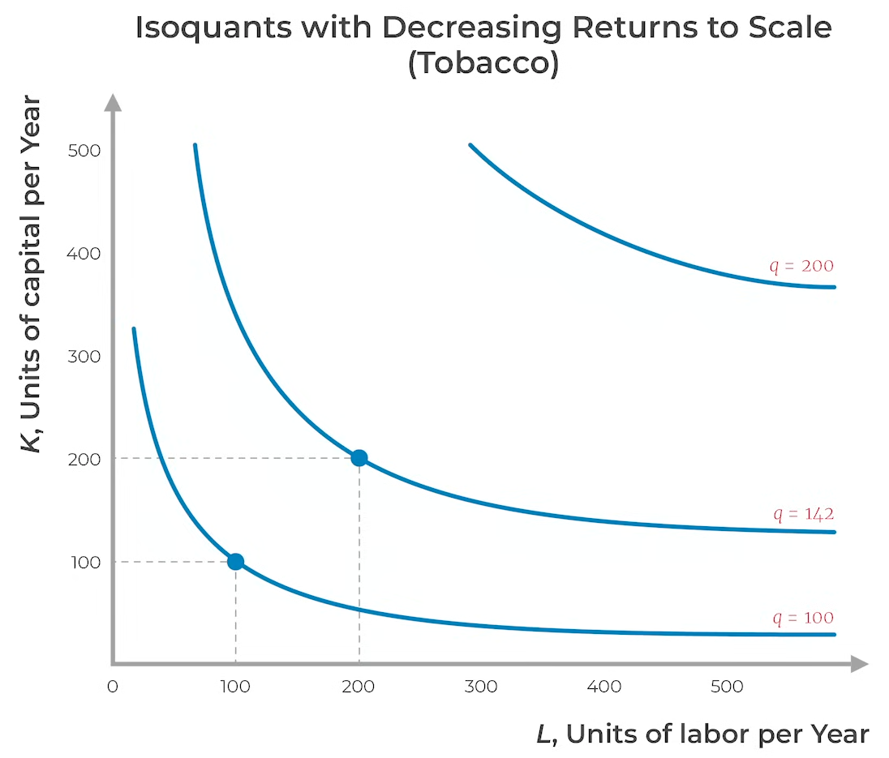

# Production Theory

Constrained optimization: Marginal Benefit = Marginal Cost
1. Maximize objective: Maximize Profit = Revenue - Cost
2. Constraint: Firms get to decide how much to produce

Let
- $q$ be quantity produced by firm
- $Q$ be quantity produced by entire market

## Factors of Production

| Factor                            |     | Example             | Short Run | Long Run |
| --------------------------------- | --- | ------------------- | --------- | -------- |
| Land                              |     |                     | Fixed?    | Fixed?   |
| Labor $l$                         |     |                     | Variable  | Variable |
| Capital $k$                       |     | Machines, buildings | Fixed     | Variable |
| Technological innovation $A_t$ |     |                     |           |          |

Long run is the time period for which all inputs are variable

## Production Function

Function that defines output as a function of input(s)

$$
q = f(A_t, la, l, k)
$$

### Total Factor Productivity

Productivity increase due to technology/innovation, keeping other factors constant

$$
A_t = \dfrac{q}{k^\alpha \times l^\beta}
$$
$\alpha, \beta =$ two inputs' respective shares of output

### Marginal Productivity

$$
\begin{aligned}
\text{MP}_l^q &= \frac{\partial q}{\partial l} \\
\text{MP}_k^q &= \frac{\partial q}{\partial k}
\end{aligned}
$$

#### Diminishing Marginal Productivity

With increase in input
- total productivity increases
- marginal productivity decreases

##### Graph

- y = MP
- x = input (l,k)

The graph will be a straight line with a downward slope

## Isoquants

- Similar concept to indifference curves
- All the assumptions of indifference curves apply

| Inputs                                                      | $q$          |                                                    |                         |
| ----------------------------------------------------------- | ------------ | -------------------------------------------------- | ----------------------- |
| Perfectly Substitutable                                     | $l+k$        |       |                         |
| Perfectly Non-Substitutable Leontief Production Function | $\min(l, k)$ |  | Computers & Programmers |

### MRTS

Marginal Rate of Technical Substitution

Slope of Isoquant at a point, hence depends on the position on the isoquant

$$
\begin{aligned}
\text{MRTS}
&= -\dfrac{\partial k}{\partial l} \\
&= -\dfrac{\partial q}{\partial l} \times \dfrac{\partial k}{\partial q} \\
&= -\dfrac{\partial q}{\partial l} / \dfrac{\partial q}{\partial k} \\
&= -\text{MP}_l / \text{MP}_k
\end{aligned}
$$
 

Diminishing marginal productivity affects this

$$
\Delta l \cdot \text{MP}_l + \Delta k \cdot \text{MP}_k = 0
$$

## Returns to Scale

What happens to production when you increase all inputs proportionally

Not $k$ vs $l$

| Returns to Scale |       $f(a l, a k)$ | Example                                         |                                             |
| ---------------- | ------------------: | ----------------------------------------------- | ------------------------------------------- |
| Constant         |   $a \cdot f(l, k)$ |                                                 |                                             |
| Increasing       | $> a \cdot f(l, k)$ | Firm with increased inputs can specialize more  |  |
| Decreasing       | $< a \cdot f(l, k)$ | Firm with increased inputs means more confusion |  |

## Production Possibility Frontier

deals with the production capacity of an economy

- analyzes available resources
- predicts what can be produced with those resources, with the assumption that time and technology are constant
- analyzes various output mixes (combinations of different commodities)

### Production Possibility curve

Curve that shows the optimal level of production for different combinations of outputs

what is the maximum output that can be produced of various commodities

### Graph

- $y =$ commodity 2
- $x =$ commodity 1

The graph will be a curve

### MRT

When we go from left to right, the slope increases from left to right, ie, cost of production of $x$ increases

- $\text{MP}_k^y, \text{MP}_l^y$ increases
- $\text{MP}_k^x, \text{MP}_l^x$ decreases

Example: if mango’s MP is 2 and apple’s MP is 4, then 4 units of apples are to be sacrificed to produce 2 units of mangoes

$$
\begin{aligned}
x &= l \cdot MP_l + k \cdot MP_k \\
\mathrm{d} y &= \mathrm{d} l_{y}(MP_l^y) + \mathrm{d} k_y(MP_k^y) \\
\mathrm{d} x &= \mathrm{d} l_{x}(MP_l^x) + \mathrm{d} k_x(MP_k^x) \\
\frac{\mathrm{d} y}{\mathrm{d} x} &= \frac{MP_k^y}{MP_k^x} = \frac{MP_l^y}{MP_l^x}
\end{aligned}
$$

### Points on the curve

- inside are inefficient input mix - wasting profit
- on the curve are optimal input mix
- outside is impossible input mix

### Shift of PPC

It depends on type of technological change that occurs

also depends on change in the quantity and productivity of labor and capital

| Type of Change    | increases productivity of labor | increases productivity of capital |                                                                        | Curve expands for                            |
| ----------------- | ------------------------------- | --------------------------------- | ---------------------------------------------------------------------- | -------------------------------------------- |
| Labor-intensive   | ✅                               | ❌                                 | motivates producers to increase labor rather than increasing machines  | labor-intensive good side                    |
| Capital-intensive | ❌                               | ✅                                 | motivates producers to increase machines rather than increasing  labor | capital-intensive good side                  |
| Neutral           | ✅                               | ✅                                 | does not change the proportion in which labor and capital are used     | ==parallel shift== (equal increase/decrease) |

### Output Mix

|                | Efficient                                                                                          | Inefficient                                                                                     | Unattainable                                                                                                        |
| -------------- | -------------------------------------------------------------------------------------------------- | ----------------------------------------------------------------------------------------------- | ------------------------------------------------------------------------------------------------------------------- |
| Curve          | optimal points on the curve                                                                        | points inside the curve                                                                         | points outside the curve                                                                                            |
| Meaning        | Efficient performance                                                                              | Underperformance                                                                                | that level of output may be achieved in the future with the help of development, but not with the current resources |
| Interpretation | it is impossible to increase the output of one commodity without sacrificing the output of another | it is possible to increase the output of one commodity without decreasing the output of another | it is not possible to reach that output, even by using all resources                                                |
| Seen in        | Developed economies                                                                                | Developing economies                                                                            |                                                                                                                     |

## IDK

Proportional ratio = $\frac{\text{capital}}{\text{labor}}$
Greater the ratio, higher the productivity of the country

circular model is more sustainable
