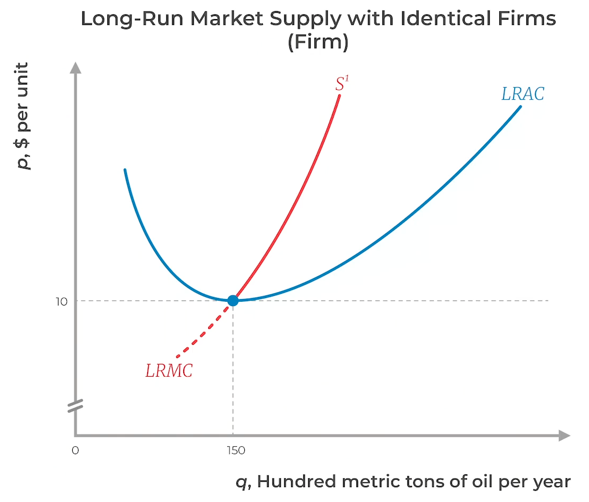

# Supply

is the **optimal** quantity which sellers are willing and able to sell at a given price, in a particular period

# Law of Supply

Assuming that factors are same, supply $\propto$ selling price of commodity

## Contemporary Relation

$S = \beta_1 + \beta_2 P_{t}$

- land
- eggs
- milk

## Lagged Relation

$S = \beta_1 + \beta_2 P_{t-1}$

For commodities with large gestation period, such as agricultural

## Terms

- $\beta_1 =$ minimum selling price for which suppliers are willing to produce commodity
- $\beta_2 =$ sensitivity of supply wrt price

## Graph

- y = P
- x = S

| Shift   | Supply for the same price |
| ------- | ------------------------- |
| Outward | Greater                   |
| Inward  | Lower                     |

All points on the supply curve show the optimal supplies
Any point inside/outside the supply curve will not provide maximum profit

## Individual Supply

Firm's Supply curve
- relationship between market price and the amount that producer decides to produce
- simply its MC curve

$$
q = \text{MC}(P)
$$

Every firm has different supply curve due to difference in cost structures

$$
\text{Cost} \propto \frac{1}{\text{Scale}} \quad (\because \text{Benefits of Scale})
$$

## Market Supply

Total supply for a commodity in a market at a particular price

Summation of supplies of commodity by different firms at particular prices

In the long run
- If any firm prices higher than the long run $P$, they will not able to sell
- If any firm prices lower than the long run $P$, they will lose money

Why don't firms want the entire market
- Marginal cost is upward sloping

Market supply curve is always more elastic that firm supply curve

1. Get production function: $q = f(\bar k, l, r_k, r_l)$
2. Get cost function: $c=f(q)$
3. Get quantity produced: $q=f(p)$ from marginal cost
4. Get market supply curve: $Q=Nq = N f(p)$

# Factors of Supply

$$
S = \beta_1 + \beta_2 P + \beta_3 F + \beta_4 T + \beta_5 E
$$

|                     |                      |                                                                                               |
| ------------------- | -------------------- | --------------------------------------------------------------------------------------------- |
| Efficiency          | Technology           |                                                                                               |
| Cost of Production  | input prices         | if cost inc, supply dec                                                                       |
| Expectations        |                      | - if expected price/returns > current price, then supply increases - else supply decreases |
| Number of Sellers   |                      | $S \propto N$ greater the no of sellers, greater the market supply                         |
| Producer Sentiments | mindset of producers | - if it is positive, then supply increases - else supply decreases                         |
