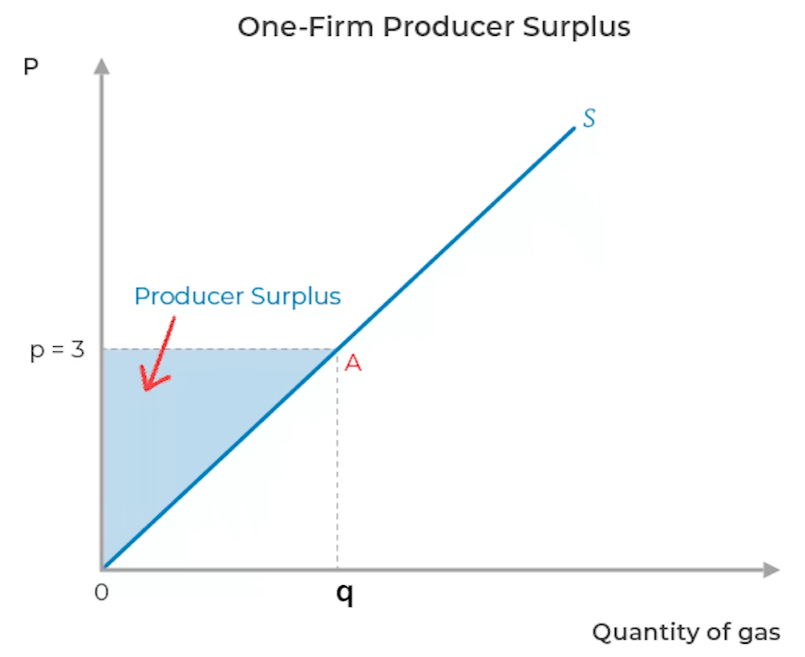

# Welfare Economics

Measure of well-being

Normative (subjective) analysis

## Purpose

### Problem

- Unknown utility function
- Unknown satisfaction

### Solution

- Compensating variation
	- How much would one be willing to pay to increase their satisfaction
	- How much would one be willing to pay not to be worse off

## Surplus

|                                     | Consumer Surplus                                                                                                                                         | Supplier Surplus                                                                                                                                |
| ----------------------------------- | -------------------------------------------------------------------------------------------------------------------------------------------------------- | ----------------------------------------------------------------------------------------------------------------------------------------------- |
| Meaning                             | Benefit that a consumer obtains beyond what they paid                                                                                                    | Benefit that a supplier obtains beyond what they sold                                                                                           |
| Formula                             | Price as per Demand Function - Equilibrium Price = Willingness to Pay - Actual Payment                                                                | Equilibrium Price - Price as per Supply Function = Actual Sale - Willingness to Sell = TR - Cost = Basically the profit                |
| Graphical                           | $\begin{aligned} &= \text{area below demand curve and above equilibrium price line} \\ &= \int \limits_0^{Q} Q_d - \int \limits_0^{P} P_d \end{aligned}$ | $\begin{aligned} &= \text{area above supply curve and below price line} \\ \\ &= \int \limits_0^{Q} Q_s - \int \limits_0^{P} P_s \end{aligned}$ |
| Relationship with elasticity        | $\text{CS} \propto \dfrac{1}{ \vert e_d \vert}$                                                                                                          | $\text{PS} \propto \vert e_s \vert$                                                                                                             |
| Relationship with equilibrium price | $\text{CS} \propto \dfrac 1 {P_{eq}}$  Most affected: People who are inelastic Less affected:  People who are elastic                           | $\text{PS} \propto P_{eq}$                                                                                                                      |
| Individual                          |                                                                                                                          |                                                                                                                 |
| Market                              |                                                                                                                   |                                                                                                          |

### Total Benefit

Sum of producer and consumer surplus
