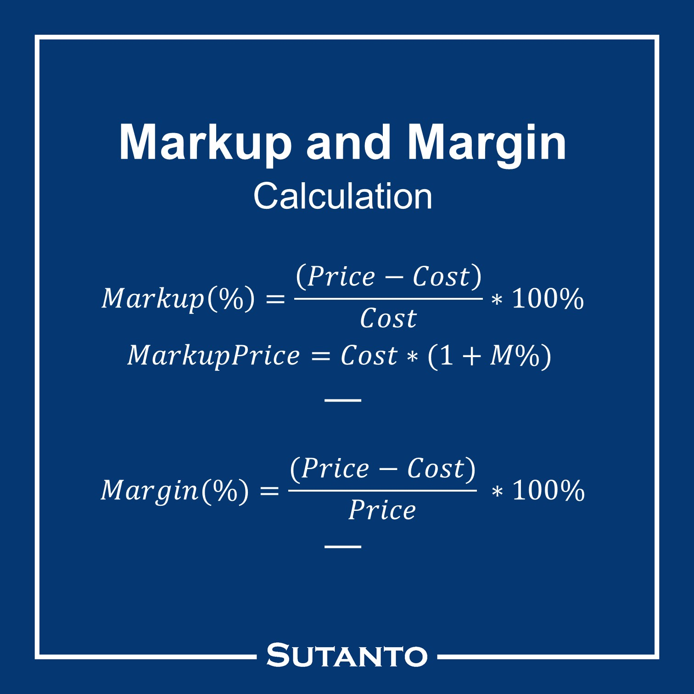

## Types of Analysis

| Analysis                 | Understand           | Values                                                       | Formula                                                      |
| ------------------------ | -------------------- | ------------------------------------------------------------ | ------------------------------------------------------------ |
| Absolute                 |                      | Actual Values                                                |                                                              |
| Horizontal/ Dynamic | Trend over the years | All values compared to a base year                           | $\frac{V}{V_\text{base}} \times 100\%$                       |
| Vertical/ Static    | Particular period    | All values compared to the total assets in the same period   | $\frac{V}{\text{Total Assets}}\times 100\%$ (Balance Sheet) $\frac{V}{\text{Net Cashflow}}\times 100\%$(Cash Flow) $\frac{V}{\text{Total Revenue}}\times 100\%$(Income Statement) |
| Ratio                    |                      | Take ratio to create a combination of values and infer something |                                                              |

All types of analysis is important, as they each may give different inferences.

## Balance Sheet

| Variable                          |                                     | Meaning                                                      |
| --------------------------------- | ----------------------------------- | ------------------------------------------------------------ |
| **SHAREHOLDER'S FUNDS**           | Equity Share Capital                | Ownership stake (increases with Stock split)            |
|                                   | **Total Share Capital**             |                                                              |
|                                   | Reserves and Surplus                | Retained earnings                                            |
|                                   | **Total Reserves and Surplus**      |                                                              |
|                                   | **Total Shareholders Funds**        |                                                              |
|                                   | Equity Share Application Money      |                                                              |
|                                   | Hybrid/Debt/Other Securities        |                                                              |
| **NON-CURRENT LIABILITIES**       |                                     | Pending after a year                                         |
|                                   | Long Term Borrowings                | Loans/Bonds                                                  |
|                                   | Deferred Tax Liabilities [Net]      | Postponed taxes                                              |
|                                   | Other Long Term Liabilities         | Mortgages                                                    |
|                                   | Long Term Provisions                | Conditional Guarantees/Warranties Employment benefits, pensions |
|                                   | **Total Non-Current Liabilities**   |                                                              |
| **CURRENT LIABILITIES**           |                                     | Pending within a year                                        |
|                                   | Short Term Borrowings               |                                                              |
|                                   | Trade Payables                      | What you owe suppliers Other parties will only tolerate if you are dominant in the market |
|                                   | Other Current Liabilities           | Current Portion of Long-Term Debt                            |
|                                   | Short Term Provisions               | Provisions for immediate conditional compensations such as legal issues, etc |
|                                   | **Total Current Liabilities**       |                                                              |
| **Total Capital And Liabilities** |                                     |                                                              |
|                                   |                                     |                                                              |
| **ASSETS**                        |                                     |                                                              |
| **NON-CURRENT ASSETS**            |                                     |                                                              |
|                                   | Tangible Assets                     | Physical                                                     |
|                                   | Intangible Assets                   | Non-Physical                                                 |
|                                   | Capital Work-In-Progress            | Products in progress                                         |
|                                   | Intangible Assets Under Development | R&D                                                          |
| **Fixed Assets**                  |                                     |                                                              |
|                                   | Non-Current Investments             |                                                              |
|                                   | Long Term Loans And Advances        | Giving loans to subsidiaries, as the parent company get cheaper loans Tax evasion |
|                                   | Other Non-Current Assets            | Machinery, Equipment                                         |
| **Total Non-Current Assets**      |                                     |                                                              |
| **CURRENT ASSETS**                |                                     |                                                              |
|                                   | Current Investments                 | Money market (loans between 7 & 365 days)                    |
|                                   | Inventories                         |                                                              |
|                                   | Trade Receivables                   |                                                              |
|                                   | Cash And Cash Equivalents           | Anything that can used as payment, such as Cash/Cheques/Credit slips |
|                                   | Short Term Loans And Advances       |                                                              |
|                                   | Other Current Assets                |                                                              |
| **Total Current Assets**          |                                     |                                                              |
| **Total Assets**                  |                                     |                                                              |

Trenches is when you securitize a loan that you lent, and then trade it to the public. 2008 financial crisis

Sinking fund is the repayment of bond

Generally, steel plants 

## Income Statement

|                                                              | Meaning                                     |
| ------------------------------------------------------------ | ------------------------------------------- |
| **INCOME**                                                   |                                             |
| **Revenue From Operations [Gross]**                          |                                             |
| Less: Excise/Sevice Tax/Other Levies                         |                                             |
| **Revenue From Operations [Net]**                            |                                             |
| Other Operating Revenues                                     |                                             |
| **Total Operating Revenues**                                 |                                             |
| Other Income                                                 |                                             |
| **Total Revenue**                                            |                                             |
|                                                              |                                             |
| **EXPENSES**                                                 |                                             |
| Cost Of Materials Consumed                                   |                                             |
| Purchase of Stock-In Trade                                   | Purchase of ready-made input for production |
| Changes In Inventories Of FG,WIP And Stock-In Trade          |                                             |
| Employee Benefit Expenses                                    |                                             |
| Finance Costs                                                |                                             |
| Depreciation And Amortisation Expenses                       |                                             |
| Other Expenses                                               |                                             |
| Less: Amounts Transfer To Capital Accounts                   |                                             |
| **Total Expenses**                                           |                                             |
|                                                              |                                             |
| **Profit/Loss Before Exceptional, ExtraOrdinary Items And Tax** |                                             |
| Exceptional Items                                            |                                             |
| **Profit/Loss Before Tax**                                   |                                             |
| **Tax Expenses-Continued Operations**                        |                                             |
| Current Tax                                                  |                                             |
| Deferred Tax                                                 |                                             |
| **Total Tax Expenses**                                       |                                             |
| **Profit/Loss After Tax And Before ExtraOrdinary Items**     |                                             |
| **Profit/Loss From Continuing Operations**                   |                                             |
| **Profit/Loss For The Period**                               |                                             |
|                                                              |                                             |
| **OTHER ADDITIONAL INFORMATION**                             |                                             |
| **EARNINGS PER SHARE**                                       |                                             |
| Basic EPS                                                    |                                             |

If total shareholders funds increases over time, the company is very good, regardless if equity share capital dec.

## Cashflow Statement

|                                                        |      |
| ------------------------------------------------------ | ---- |
| **NET PROFIT/LOSS BEFORE EXTRAORDINARY ITEMS AND TAX** |      |
| Net CashFlow From Operating Activities                 |      |
| Net Cash Used In Investing Activities                  |      |
| Net Cash Used From Financing Activities                |      |
| Foreign Exchange Gains / Losses                        |      |
| Adjustments On Amalgamation Merger Demerger Others     |      |
| **NET INC/DEC IN CASH AND CASH EQUIVALENTS**           |      |
| Cash And Cash Equivalents Begin of Year                |      |
| Cash And Cash Equivalents End Of Year                  |      |

## Ratio Analysis

| Aspect         | Ratio                       | Recommended |
| -------------- | --------------------------- | ----------- |
| Liquidity      | Current Ratio               | 2:1         |
|                | Quick Ratio/ Acid Test |             |
|                | Cash Ratio                  |             |
| Profitability  | Gross Profit Ratio          |             |
|                | Operating Profit Ratio      |             |
|                | Net Profit Ratio            |             |
| Solvency Ratio | Debt-Equity Ratio           |             |
|                | Interest Coverage Ratio     |             |
| Turnover Ratio | Fixed Asset Turnover Ratio  |             |
|                | Inventory Turnover Ratio    |             |
|                | Receivable Turnover Ratio   |             |
| Earning Ratio  | Profit-Earning Ratio        |             |
|                | Earning Per Share           |             |

## Misc

### Types of Investments

| Relationship      |    Amount     |
| :---------------- | :-----------: |
| Subsidiary        |     > 50%     |
| Associate         | 20% < A < 50% |
| Minority Interest |     < 20%     |

### Shares

‘Splitting’ shares = fragmentation

Base capital

|                    |      |
| ------------------ | ---- |
| Authorized capital |      |
| Paid-up capital    |      |
| Equity shares      |      |

Reserve and Surplus involves

- Retained earnings
- Overage from premium surplus

|                      |      |
| -------------------- | ---- |
| Face Value           |      |
| Book/Intrinsic Value |      |
| Market Value         |      |

Dividend of 200% means 200% of face value

### Stock Splits

Causes market noise

### Market Noise

Unnecessary oscillation

Herding behavior

### Re-Investment Risk

### Solvency

Ability of a company to cover its long-term financial obligations

### Insolvency

### Financial Distress

When Current assets < Hard Contracts

## Types of Lease

An operating lease is a contract that permits the use of an asset without transferring the ownership rights of said asset. A finance lease is a contract that permits the use of an asset and transfers ownership after the lease period is complete, and the lessor meets all other contract obligations.

## Ratio Analysis

|                           |                                      | Represents |
| ------------------------- | ------------------------------------ | ---------- |
| NI                        | Net Income                           |            |
| TE                        | Total Equity                         |            |
| **IDK**                   |                                      |            |
| $\tau$ Effective Tax Rate | Current Tax/PBT                      |            |
| Working Capital           | Current Assets - Current Liabilities |            |
| Cash Expenses per Day     | Total Expenses/365                   |            |

|                                                |                                                          |
| ---------------------------------------------- | -------------------------------------------------------- |
| **Overall Performance Ratio**                  |                                                          |
| ROA/ROTA (Before Tax)                          | EBIT/TA                                                  |
| ROA/ROTA (After Tax)                           | EBIT*(1-$\tau$)/TA                                       |
| ROE                                            | NI/Equity                                                |
| ROCE (Before Tax)                              | EBIT/TA-CL                                               |
| ROCE (After Tax)                               | EBIT(1-t)/TA-CL                                          |
| Profit Margin Ratios                           |                                                          |
| EBITDA Margin                                  | EBITDA/Sales                                             |
| EBIT Margin/OPM                                | EBIT/Sales                                               |
| EBT Margin                                     | EBT/Sales                                                |
| Net Profit Margin                              | NI/Sales                                                 |
| Asset Turnover Ratio                           | Sales/Total Assets                                       |
|                                                |                                                          |
| **Two Factor Dupont Analysis**                 |                                                          |
| ROA                                            | EBIT margin * ATR                                        |
|                                                |                                                          |
| **Three Factor DuPont**                        |                                                          |
| NPM                                            | NI/Sales                                                 |
| ATR                                            | Sales/Total Assets                                       |
| Total Leverage                                 | Total Assets/Equity                                      |
| ROE                                            | NPM * ATR * TL                                           |
|                                                |                                                          |
| **Five Factor Dupont**                         |                                                          |
| Tax Factor                                     | NI/EBT                                                   |
| Interest Factor                                | EBT/EBIT                                                 |
| EBIT Margin                                    | EBIT/Sales                                               |
| ATR                                            | Sales/TA                                                 |
| TL                                             | TA/Equity                                                |
| ROE                                            | TF * IF * EM * ATR * TL                                  |
|                                                |                                                          |
| **Turnover or Efficiency Ratios**              |                                                          |
| Non-Current Asset Turnover Ratio               | Sales/NCA                                                |
| PPE Utilisation Ratio/ Capital Intensity Ratio | Sales/PPE                                                |
| Current Asset Turnover Ratio                   | Sales/CA                                                 |
| Equity Turnover Ratio                          | Sales/Equity                                             |
|                                                |                                                          |
| **Working Capital Ratios**                     |                                                          |
| Working Capital Turnover Ratio                 | Sales/Working Capital                                    |
| Inventory Turnover Ratio (ITR)                 | Sales/Inventory                                          |
| Days Inventory                                 | 365/ITR                                                  |
| Debtors Turnover Ratio (DTR)                   | Sales/Accounts Receivable                                |
| Days receivable or Average Collection Period   | 365/DTR                                                  |
| Days Cash                                      | Cash/ Cash Expenses per Day                              |
| Creditor Turnover Ratio (CTR)                  | Material Consumed/Accounts Payable                       |
| Days Creditors/Average Payment Period          | 365/CTR                                                  |
| Cash Conversion Cycle (Days)                   | Days inventory + Days debtors + Days Cash - Days Payable |
|                                                |                                                          |
| **Insolvency Ratio**                           |                                                          |
| Debt                                           | All interest bearing liabilites are debt                 |
| Debt/Equity Ratio                              | Total Debt/ Equity                                       |
| Debt Ratio /Debt Capitalisation Ratio          | Debt/ (Debt + Equity)                                    |
| Equity Ratio/ Equity Capitalisation Ratio      | Equity/(Debt + Equity)                                   |
| Interest Coverage Ratio                        | EBIT/ Interest                                           |
| Total Debt Service Ratio                       | EBIT/ (Interest + Debt)                                  |
|                                                |                                                          |
| **Test of Dividend Policy**                    |                                                          |
| Dividend Per Share                             | Dividend Declared/ No. of share outstanding              |
| Earning Per Share                              | NI/ No of share outstanding                              |
| Dividend Yeild Ratio                           | Dividend/ Current Market Price                           |
| Dividend Payout Ratio (D/P Ratio)              | DPS/EPS = Dividend Declared/NI                           |
| Retension Ratio                                | 1 - D/P Ratio                                            |
|                                                |                                                          |
| **Liquidity Ratios**                           |                                                          |
| Current Ratio                                  | Current Assets/ Current Liabilities                      |
| Quick Ratio/ Acid Test Ratio                   | (CA-Inventory)/ CL                                       |
|                                                |                                                          |
| **Valuation Ratios**                           |                                                          |
| Book Value per Share                           | Total Equity/ No. of Share Outstanding                   |
| Market Value Per Share (on balance sheet date) | market value of share                                    |
| Earning Per share                              | NI/ No of share outstanding                              |
| Price Earning Ratio (P/E)                      | MPS/EPS                                                  |
| Price to Book Value Ratio (P/B)                | MPS/BVPS                                                 |

## Margin vs Markup

## Return vs Yield

|                        | Return                   | Yield                |
| ---------------------- | ------------------------ | -------------------- |
| Calculated relative to | Initial invested capital | Current Market Price |
|                        |                          |                      |

