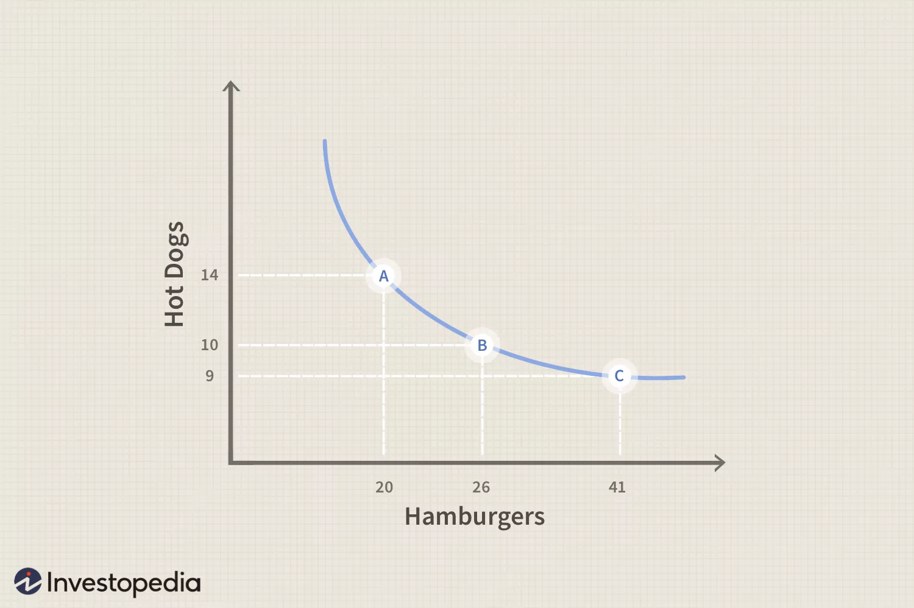

# Time Preferences

Most non-trivial economic choices involve 

1. Determine tradeoffs between costs and benefits that occur **across time points**
2. Determine values (utility) of costs and benefits, by weighing costs & benefits against each other

## Present Bias

Humans have a tendency to put more weight into the present rather than the future when making decision

## Indifference Curves

At any point on the curve, the combination of the two will leave the consumer equally well off or equally satisfied—hence indifferent.

|                                  | Shows various combinations of __ that consumers can choose |                                                              |
| -------------------------------- | ---------------------------------------------------------- | ------------------------------------------------------------ |
| Goods-Indifference Curve         | two commodities at the same time point                     |  |
| Fisher’s Time-Indifference Curve | same commodity at different time points                    |  |

## Utility Function

$$
\begin{aligned}
\max U_t &= \sum_{t = 0}^\infty D(t) \cdot u_{t_0 + t} \\
u_t &= u(c_t, l_t, \dots)
\end{aligned}
$$

where

|           |                       |                                                              |                        |
| --------- | --------------------- | ------------------------------------------------------------ | ---------------------- |
| $u_t$     | Instantaneous utility | Captures how person feels at a specific moment Function of consumption, leisure |                        |
| $U_t$     | Discounted utility    | Captures total utility obtained until a specific moment      |                        |
| $D(t)$    | Discount Function     | Specifies weights on utility derived in $t$ time periods Measures how utility in alter periods is discounted relative to earlier periods Replaces complex psychology of how people think about future Usually $\in (0, 1]$ |                        |
| $\rho(t)$ | Discount Rate         | Rate of decline in the discount function Specifies rate at which value of $u$ declines with delay | $\dfrac{-D'(t)}{D(t)}$ |

## Standard Utility Models

|           | Samuelson’s Exponential                                                                                                                     | Quasi-Hyperbolic|
|---        | ---                                                                                                                                         | ---|
|           | Non-graphical model of Fisher’s Time-Indifference Curve Developed as a simple approximation as a first start, not meant to be accurate | |
|$D(t)$     | $\delta^t$ $\delta \in [0, 1]$                                                                                                         | $\beta \delta^t$ $\delta \to 1 \ (0.\bar{9})$ $\beta \in [0, 1]$|
|$\rho(t)$  | $- \log \vert \delta \vert \approx 1-\delta$                                                                                                | |
|Advantages | Not affected by awareness issue | - Separate short & long-run discounting - Great patience for tradeoffs in the future than for tradeoff in present - Deals with preference reversals|
|Limitation | Constant discount rate  1. Short vs Long-Run impatience 2. Preference reversals 3. Commitment devices                   | Affected by awareness issue |

### Estimating $\delta$

Ask the person the following question

> What $X$ makes you indifferent between receiving `$15` today and `$X` at various time point $t$
>
> - $t=1$ day
> - $t=1$ month
> - $t=1$ year

Assumes that utility is linear in money, ie marginal utility is constant, ie $u(X) = X$

## IDK

### Short vs Long-Run Impatience

People tend to be more patient in the long-run than in the short-run

Eg: Credit card loans

### Preference Reversals

In reality, dynamic consistency is **not** followed. People don’t always follow through with their plans.

Hence

- When thinking ahead to the future, we **want** to be patient
- When the time actually comes, we are impatient
- People are over-confident about their self-control

Eg: Dieting, Gym membership

#### Dynamic/Time Consistency

- The action a person thinks they should take in the future always coincides with the action that they actually prefer to take once the time comes
- A person’s preferences at different points in time are consistent with each other; there are no “intra-personal conflicts” 

### Commitment Devices

Arrangement taken upon by agent to restrict their future choice set, by making certain choices more costly

Demand for commitment requests (at least partial) sophistication

When you know that your future preferences will be different from present preferences, you may engage in commitment devices to penalize (and hence eliminate) few options from the future. We disapprove of the tendency for instant gratification beforehand, but struggle to actually follow through

### Requirements for effectiveness of commitment device

- Person needs to have a self-control problem: $\beta < 1$
- Person needs to at least partly be sophisticated: $\hat \beta < 1$
- Commitment devices needs to be effective
- Person needs to believe that the commitment device is effective

### Things that worsen effectiveness of commitment devices

- Time-inconsistent preferences: Each time period’s self restrict set of choices for their future selves, and hence there may be difference in assessment of best action at each time period
- Substitution: Substitution across temptation goods worsens effectiveness of commitment devices. Avoiding one temptation good may lead to increases consumption of another
- Naivete: Person underestimates their present bias, and might
  - Naive: Not demand a helpful commitment device
  - Partial naive: Demand a unhelpful commitment device

## Goods Types

|                                         | Leisure          | Investment|
|---                                          | ---              | ---|
|Example                                      | Eating Candy     | Going to Gym Finishing assignments Quitting bad habits Finding a job |
|Costs                                        | Delayed          | Immediate|
|Rewards                                      | Immediate        | Delayed|
|Result Consumption relative to long-run | Over-consumption | Under-consumption|

## Behavior Types

|                                                           | Perfect Exponential Discounter | Naïveté                                                      | Partial Naïveté                                     | Sophistication                                               |
| --------------------------------------------------------- | ----------------------------------- | ------------------------------------------------------------ | --------------------------------------------------- | ------------------------------------------------------------ |
| $\beta$                                                   | $1$                                 | $< 1$                                                        | $<1$                                                | $< 1$                                                        |
| $\hat \beta$ What you think $\beta$ is in the future | $\beta$                             | $1$                                                          | $> \beta$ Measures belief about future $\beta$ | $\beta$                                                      |
| Optimism                                                  | Perfect                             | Over-optimistic (Assumes future self will through on optimal plan) | Underestimate degree of future present bias         | Pessimistic                                                  |
| Person self-aware of preference reversal                  | N/A (No preference reversal)   | ❌                                                            | ✅                                                   | ✅                                                            |
| Overcommitment/ Self-control problem                 | ❌                                   | ❌                                                            | ✅                                                   | ❌                                                            |
| Set deadlines optimally                                   | ✅                                   | ❌ (No perceived need to choose deadlines)               | ⚠️ (Tries, but fails)                           | ✅                                                            |
| Deadlines help                                            | Deadline not required               | ✅                                                            | ⚠️                                                   | ✅                                                            |
| Take advantage of commitment devices                      | Not required                        | ❌                                                            | ⚠️ (Tries, but fails)                           | ✅                                                            |
| No surprises of future present bias                       | No present bias                     | ❌                                                            | ❌                                                   | ✅                                                            |
| Overcomes short-run impatience                            | No impatience                       | ❌                                                            | ❌                                                   | ✅                                                            |
| Utility evaluation                                        | Both ways gives same result         | Forwards                                                     | Forwards and backwards                              | Backwards                                                    |
| Investment Goods: Behavior                                | No procrastination                  | Naïve Procrastination                                        |                                                     | Sophisticated Procrastination                                |
| Investment Goods: Welfare Cost                            | 0                                   | Large                                                        |                                                     | Low                                                          |
| Leisure Goods: Behavior                                   | No precrastination                  | Naïve precrastination                                        |                                                     | Sophisticated precrastination (self-aware about impatience, and hence consumes earlier) |
| Leisure Goods: Welfare Cost                               | 0                                   | Low                                                          |                                                     | ==**Large**== (does not wait until max enjoyment)       |

## Utility Evaluation

| Forward                                                      | Backward                                                     |
| ------------------------------------------------------------ | ------------------------------------------------------------ |
| 1. Start at **beginning** 2. Solve for optimal plan, assuming future self follows plan 3. Person takes first step in that plan 4. Go to next period 5. Go to step 2 | 1. Start at **end** 2. Solve for optimal action 3. Go back to previous period 4. Solve for optimal action, considering what happens in next period 5. Go to step 3 |

### Example

Consider the following table showing the utilities associated with watching a movie

|                    | Naïveté                                                      | Sophistication                                               |
| ------------------ | ------------------------------------------------------------ | ------------------------------------------------------------ |
| Utility Evaluation | t=0: Plans to go at t=3, so doesn’t go t=1: Plans to go at t=3, so doesn’t go t=2: Goes | t=2: goes if she hasn’t t=1: realizes she won’t wait until t=3, she goes t=0: realizes she won’t wait until t=2 or 3, she goes |
| Conclusion         | Goes at t=2, even though she planned to go at t=3            | Just goes at t=0                                             |

### Indicators of Behavior Types

- Naivete: Person mis-predicting future behavior
- Sophistication: Person’s use of commitment devices

## Uncertainties about Future

- Present bias
- Planning Fallacy

## Planning Fallacy

Under-estimation of effort costs of tasks, leading to people always under-performing compared to original plan, even if they are aware of this.
