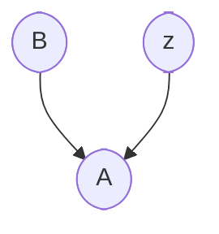
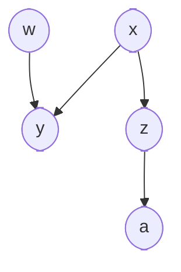
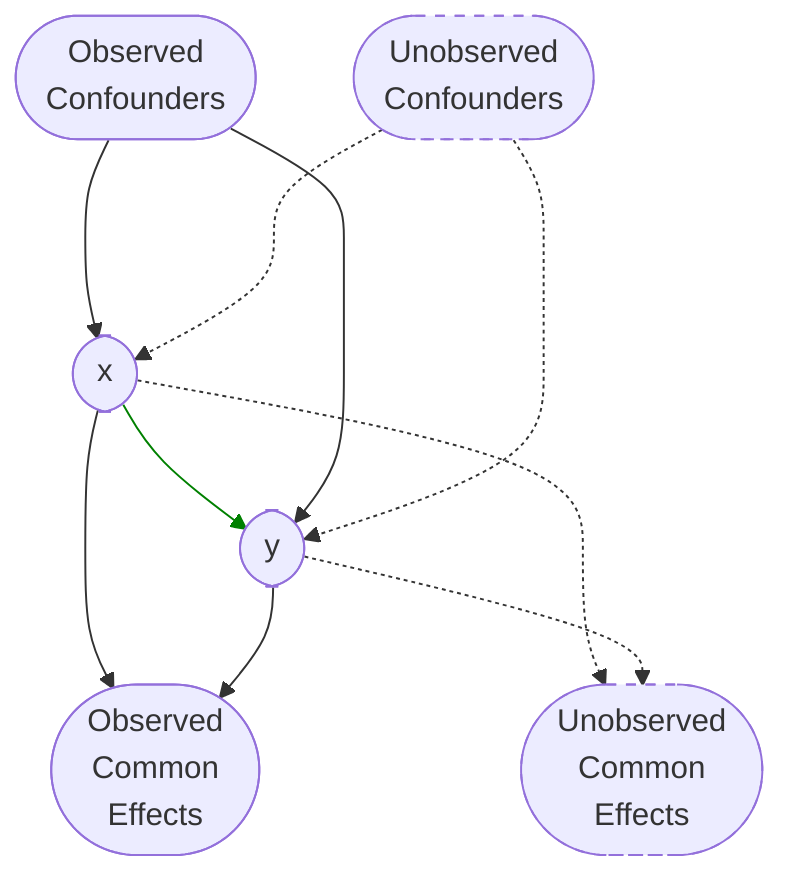
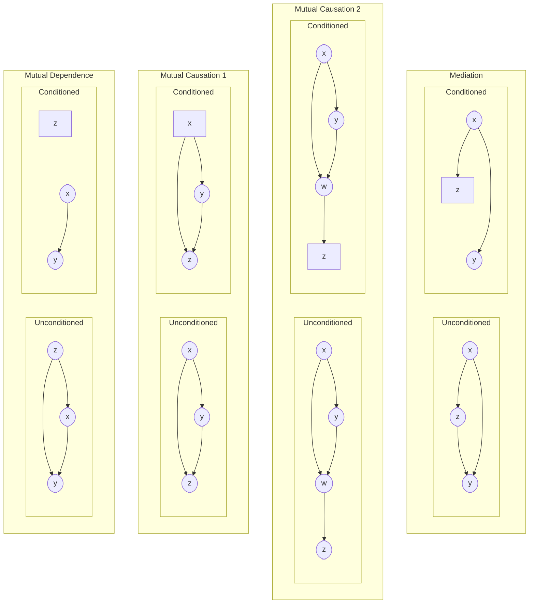
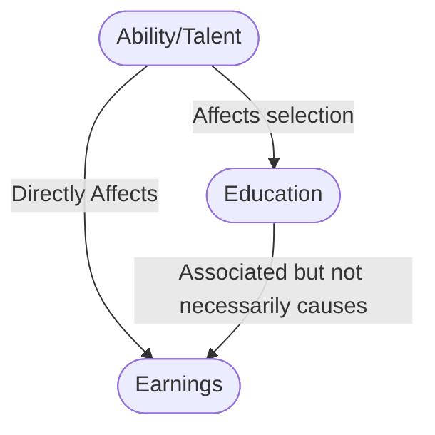
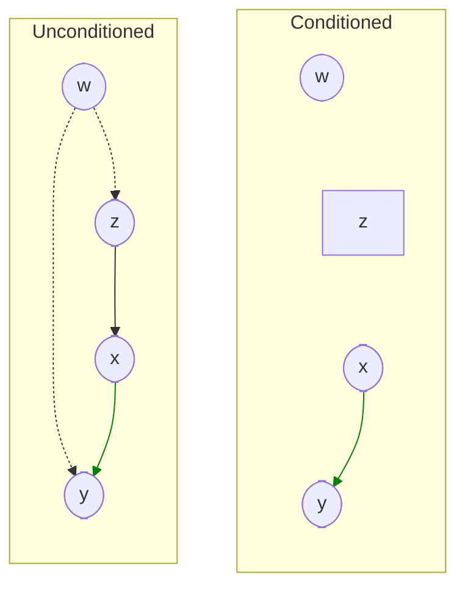
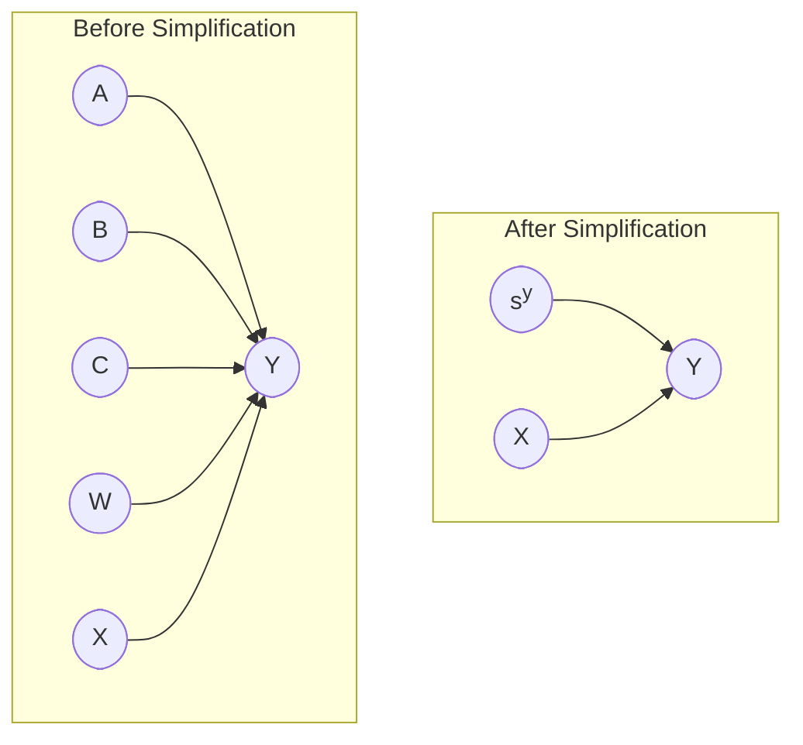
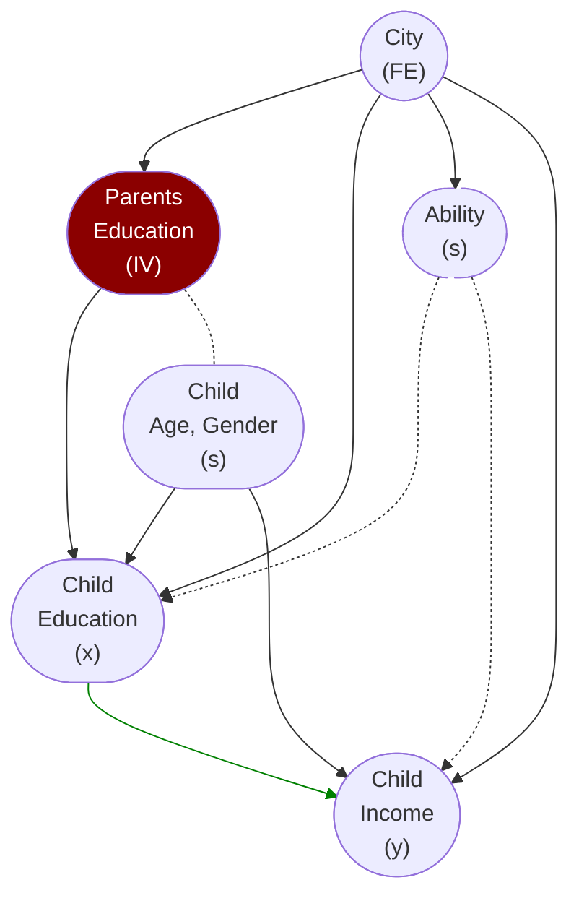

# Causal Graphical Model

Causal model that uses a causal graph to represent the model. It is also called as Causal Bayesian network.

While RCM was developed in statistics, causal graphical model is derived from Computer Science and AI.

### Parts of Causal Model

1. Joint distribution function (statistical model)
2. What causes what (causal structure)

### Example

Consider a model $y = 2x$. This is a statistical model.

If $y \leftarrow 2x$, then it means that $x$ causes $y$. This is a causal model.

Let’s analyze the $x,y$ pairs for the following sequential changes.

| Model       | 1. do$(x=2)$ | 2. do$(x=3)$ | 3. do$(y=2)$ |
| ----------- | ------------ | ------------ | ------------ |
| Statistical | 2, 4         | 3, 6         | ==1, 2==     |
| Causal      | 2, 4         | 3, 6         | ==3, 2==     |

This is because, $x$ causes $y$; not the other way around.

## Causal Diagram/Graph

Directed graph that represents the causal structure of a model.

It is represented using a bayesian network is a DAG (Directed Acyclic Graph) in which each node has associated conditional probability of the node given in its parents. 

$$
P(A, B, C) =
P(A | B, C) \cdot P(B) \cdot P(C)
$$

### Why DAG?

- Directed, because we want causal effects directions
- Acyclic, because a variable cannot cause itself.

my question is: What about recursive loops, such as our body’s feedback loops

### Parts

1. Nodes - Variables
   - Rounded - Unconditioned
   - Square - Conditioned
2. **Directed** Edges - Causal directions

| Term                                         | Condition                                                    | Above Example                              |
| -------------------------------------------- | ------------------------------------------------------------ | ------------------------------------------ |
| Parent                                       | Node from which arrow(s) originate                           | $x$ is parent of $y$ and $z$               |
| Child                                        | Node to which arrow(s) end                                   | $y$ and $z$ are children of $x$            |
| Descendants                                  |                                                              |                                            |
| Ancestors                                    |                                                              |                                            |
| Exogenous                                    | Variables with no parent                                     | $w, x$                                     |
| Endogenous                                   | Variables having atleast one parent                          | $y, z, a$                                  |
| Causal Path                                  | Uni-directional path                                         | $x z a$ $z a$  $x y $ $w y$ |
| Non-Causal Path                              | Bi-directed path                                             | $x y w$                                    |
| Collider                                     | Node having a multiple parents, where path ‘collides’        | $y$ in the path $x y w$                    |
| Blocked Path                                 | Path with a collider node, or Path with a node that is conditional |                                            |
| d-separated variables                        | all paths between the variables are blocked                  |                                            |
| d-connected variables                        | $\exists$ path between the variables which isn’t blocked     |                                            |
| conditionally-independent variables          | If 2 variables are d-separated after conditioning on a set of variables |                                            |
| conditionally-dependent/associated variables | If 2 variables are d-connected after conditioning on a set of variables  (Without faithfulness condition, this may not be true) |                                            |

### Properties

1. Causal Markov Condition
2. Completeness
3. Faithfulness

## Causal Relations

### General Framework

### Types

| Type                                                   | $x, y$ are statistically-independent  Correlation $=$ Causation $E[y \vert x] = E[y \vert \text{do}(x)]$ | $E[y \vert \text{do}(x)]$                                    | Path ‘__’ by collider $c$ | Example $x$                       | Example $y$                                      | Example $c$                                             |
| ------------------------------------------------------ | ------------------------------------------------------------ | ------------------------------------------------------------ | ------------------------- | -------------------------------------- | ----------------------------------------------------- | ------------------------------------------------------------ |
| Mutual Dependence/ Confounding/ Common Cause | ❌                                                            |                                                              |                           | Cancer                                 | Carrying a lighter                                    | Smoking                                                      |
| Conditioned Mutual Dependence                          | ✅                                                            | $\sum_i E[y \vert \text{do}(x), c_i] \cdot P(c_i)$ $=\sum_i E[y \vert x, c_i] \cdot P(c_i)$ | blocked                   | Cancer                                 | Carrying a lighter                                    | Smoking=FALSE                                                |
| Mutual Causation/ Common Effect                   | ✅                                                            |                                                              | blocked                   | Size of company                        | Revenue of company                                    | Survival of company                                          |
| Conditioned Mutual Causation                           | ❌                                                            |                                                              | opened                    | Size of company                        | Revenue of company                                    | Survival of company=TRUE (we usually only have data for companies that survive)  (Survivorship bias) |
| Mediation                                              | ❌                                                            |                                                              |                           |                                        |                                                       |                                                              |
| Conditioned Mediation                                  | ✅                                                            |                                                              | blocked                   | 1. Smoking 2. Economic conditions | 1. Tar deposits in lung 2. Economic consequences | 1. Cancer 2. Tax                                        |

### Back-Door Paths

Non-causal paths between $x$ and $y$, which if left open, induce correlation between $x$ and $y$ not due to $x$ causing $y$

### Confounding

#### Self Selection Bias

Special case of confounding, when $c$ affects the selection of $a$ and also has a causal effect on $b$, then $c$ is confounder.

Here, education may **not necessarily** causally affect earnings.

#### Unmeasured Confounding

We need to find new ways to identify causal effect

|                           |                            | $z$ fully observed |
| ------------------------- | -------------------------- | ------------------ |
| No unmeasured confounding | Selection on observables   | ✅                  |
| unmeasured confounding    | Selection on unobservables | ❌                  |

However, in some cases, there can exist a set of observed variables conditioned such that it satisfies the back-door
criterion, by blocking all non-causal paths
b/w $x$ and $y$

$w$ is a confounder to $x$ and $y$, but we do not need to observe it, as causal effect of $x$ on $y$ is identifiable by conditioning on $z$

## Conditioning

- Condition common causes
- Do **not** condition common effects

If we condition on a set of variables $z$ that block
all open non-causal paths between treatment $x$ and outcome $y$, then

- the causal effect of $x$ on $y$ is identified (estimated from observed data)
- $z$ is said to satisfy the ‘back-door criterion’
- Conditioning on z makes $x$ exogenous to $y$

### Covariate Balance

In a sample where is $z$ is a conditioned confounder
$$
P(z \vert x = x_i) = P(z \vert x = x_j) \quad \forall i, j
$$

If $x$ is binary
$$
\begin{aligned}
& x \in \{ 0, 1 \} \\
\implies & P(z \vert x=1) = P(z \vert x=0)
\end{aligned}
$$

### Matching

Converting non-RCT observed sample into a sample that satisfies Covariate Balance, ie behaves similar to a RCT sample through control of observed confounding.

## Effect Modifiers

Confounders $s$ that change the causal effect of a treatment $x$, since their causal effect on the outcome $y$ interacts with treatment’s causal effect on $y$

Controlling them help control conditionally randomized experiments.

Consider the following causal diagram.

where $s^y$ is anything other than $x$ that can causally affect $y$; ie, the set of potential effect modifiers

An example could be gender, temperature, etc.

Mathematically, $s$ is an effect modifier if
$$
\begin{aligned}
P(y) &\ne P(y \vert s) \\
E[y \vert \text{do}(x)] &\ne E(y \vert \text{do}(x), s)
\end{aligned}
$$

## Instrumental Variable

Variable $iv$ that satisfies

1. $iv$ correlated with $x$
2. Every open path connecting $iv$ w/ $y$ has an arrow to $x$
   - $iv$ exogenous to $y$ (desired but not strictly necessary)
   2. $iv$ affects $y$ only though correlation with $x$

If we use a model
$$
\begin{aligned}
\hat y &= \beta_0 + \beta_1 x + u\\
\implies \beta_1 &= \dfrac{\text{Cov}(y, iv)}{\text{Cov}(x, iv)}
\end{aligned}
$$

## Fixed Effects

Variable that captures effect of unobserved confounders
$$
\hat y = \tau + \beta_0 + \beta_1 x + u \\
\implies \widehat{\text{ATE}} = \beta_1
$$

## Example

### Parent’s education is an instrument variable for child’s wage through child education.

College-educated parents have +ve impact on children’s
college attainment, either through better home education or because
they are more capable of affording college education.

If we assume that more educated parents

- don’t produce children with higher unobserved abilities/preferences that affect education and wages
- don’t directly help children obtain higher wage jobs

The statement holds true as the only way parent’s education affects individual’s earnings is through effect on child’s education.

### City is a Fixed Effect

City captures ability, school quality, productivity and other unobserved factors

