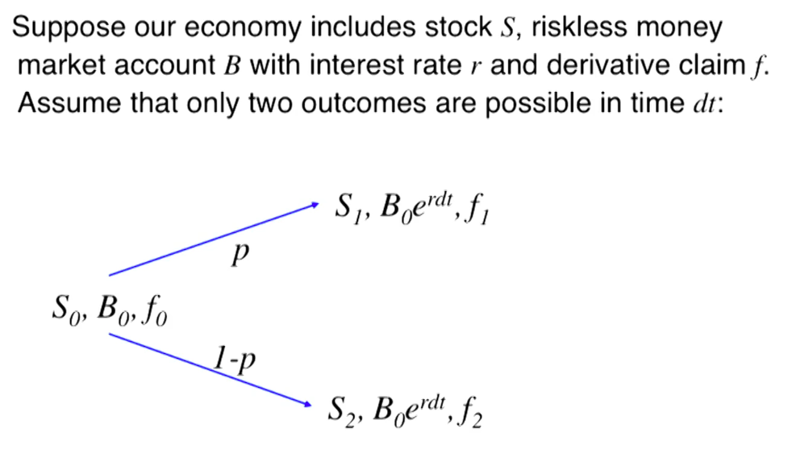
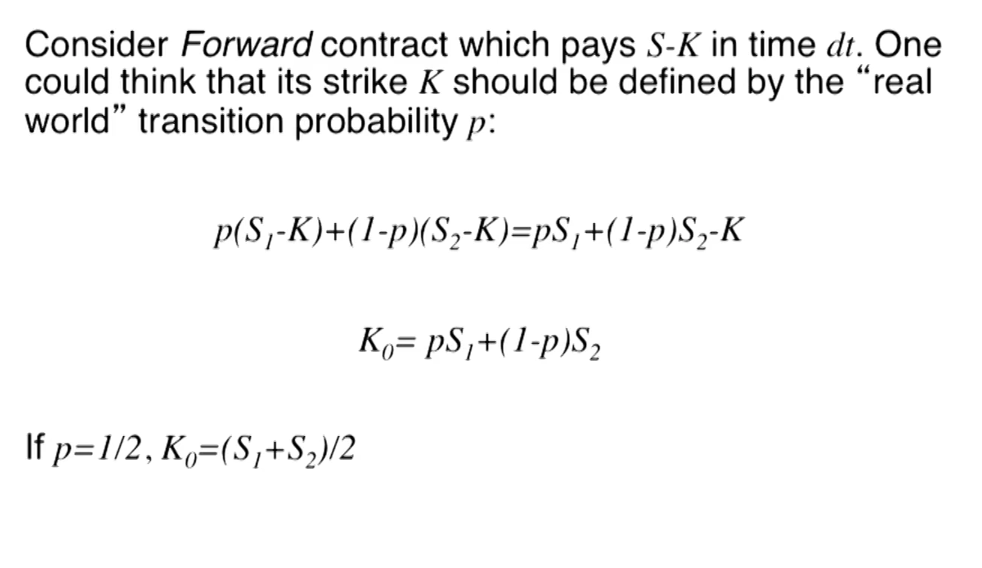
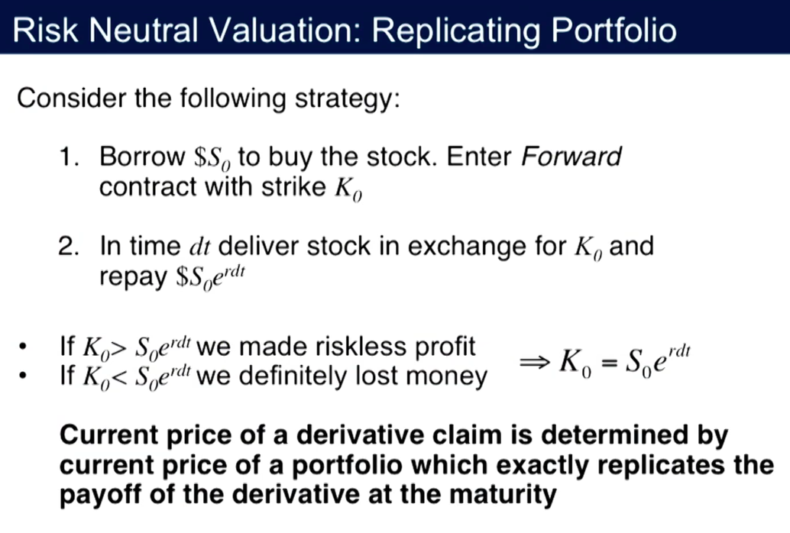

## Risk Neutral Valuation

### Naive Approach

1. Borrow $S_0$ to buy stock. Enter forward contract with strike $k_0$
2. In time $dt$ deliver stock in exchange for $k_0$ and repay $S_0 e^{r \ dt}$
