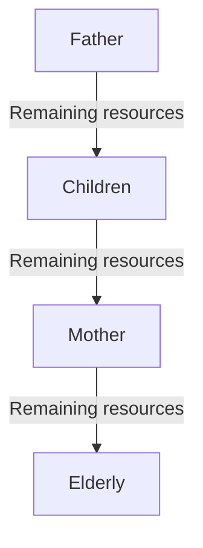

# Poverty Traps

Does being poor keep you poor?

## The S-curve

This clearly shows that where you start affects where you end.
$$
\text{Economic Status}_\text{present} = \beta_0 + \beta_1 \text{Economic Status}_\text{past}
$$
So, the poorest of the poorest need enough direct income transfers to push them up, else they will go back to their past state.

The mistake in some models is that they assume upward concave curve rather than the S-curve, thereby missing the existence of the Poverty Trap.

## Capacity Curve

Relationship between work capacity and income.

> Piece-rate, or piecemeal pay, means that employees are paid by the unit when completing a particular task, for instance, bushels harvested, trees pruned, or acres mowed. In this case, a worker is compensated by individual output and **not** by an hourly rate

Higher the income, more food calories. The first few calories are required as a minimum to function actively; however, after a certain point, there is decreased return.

$v^*$ represents the smallest possible wage at which people meaningful work. It is **not** an economy-wide parameter, but an individual parameter depending on the amount of non-labor income (I suppose passive income?)

## Aggregate Labor Supply

Involuntary unemployment occurs when the economics forces maintain equilibrium due to balancing labor demand and labor supply.

The capacity curve changes whether or not the person had food the previous day. So, we can conclude that being today’s employment helps in continued employment tomorrow.

## Distribution of Land

## Effective Reservation Wage

The thick curve is the effective reservation wage, as you need to be

- **willing** to work
- **able** to work

## Equilibria

When the wage is very low, very few people can work

## Policies

|                        |                                                              |
| ---------------------- | ------------------------------------------------------------ |
| Land reform            | - May improve production and employment - Can improve production without reducing involuntary unemployment |
| Loans to poor          | This does not happen, as the poor will first focus on getting basic needs rather than investing in increasing their wealth sufficient to repay, and hence will default on their loans |
| Minimum wage           |                                                              |
| Direct income transfer | - The poorest people get empowered by getting cash - Others would get lazy |
| Investment in the poor | As nutrition plays a big role in working productivity, employers of long-term contracts tend to invest in their workers. But this does not happen for short-term contracts.  Due to this reasoning, slaves were better fed than poor workers. |

An economy is **Pareto efficient**. Hence, it is not possible to improve the welfare of someone without decreasing the welfare of someone else.

## Intra-Family Resource Allocation

In a poor family, the most efficient way is to invest more resources into the person who is employed so that they can thereby bring in more income, rather than equally. Unfortunately, this may lead to malnourishment of the other person. Sometimes, this may be the only way possible for poor families.

In most cases, this is how it goes

## Poverty Traps Characteristics

Strong relationships
$$
\begin{aligned}
\text{Income}_{t+1} &\propto \text{Nutrition}_t \\
\text{Productivity}_{t+1} &\propto \text{Nutrition}_t
\end{aligned}
$$

$$
y_{t+1} = (f \circ g)(y_t)
$$
where

- $f =$ Capacity Curve
- $g =$ Decision to consume curve

Multiple equilibrium points exist when the curve intersects the 45deg line at multiple points

Intersection happens where slope = slope of 45deg line = $\tan 45$ = 1

When $y_{t+1} = y_t$, the convolution $(f \circ g)$ has a slope > 1. This happens when the product of the elasticity of $f$ and $g$ curve > 1

In some cases, food is affordable, so $g$ won’t be steep.

## Calories wrt Per capita expenditure

As you can see, as people get richer, they eat more expensive calories. This means that they don’t feel the pain of poverty trap, as they would rather than get **more calories** rather than expensive calories, with the same budget.

Even though the number of extremely poor people has gone down in India, the per capita consumption has not increased, as the Calorie Engel curve has moved rightward.

## IDK

In a log-log relationship, the slope is the elasticity