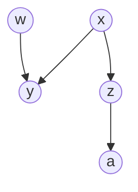
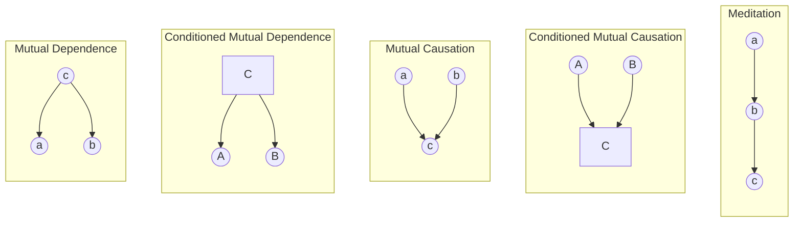
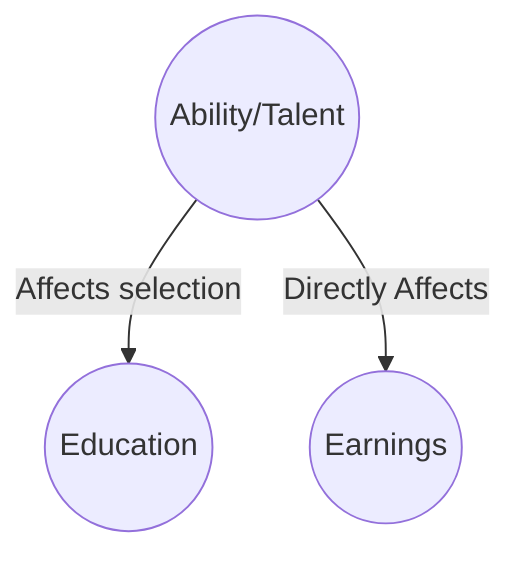
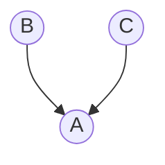
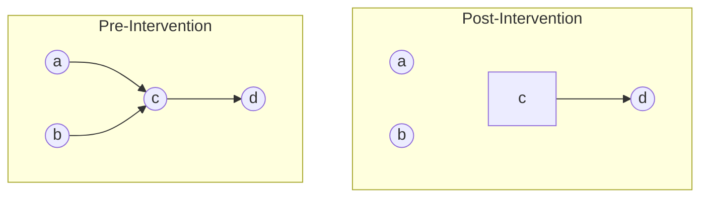
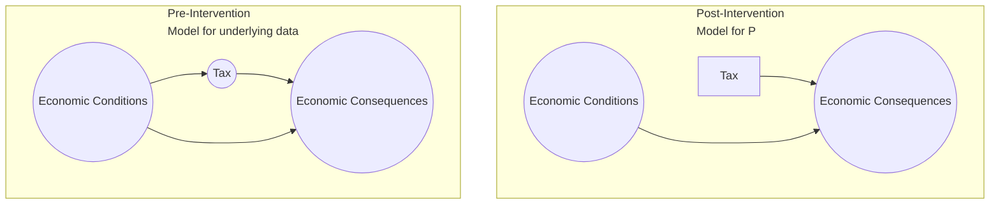

# Causal Graphical Model

is a causal model that uses a causal graph to represent the model. It is also called as Causal Bayesian network.

While RCM was developed in statistics, causal graphical model is derived from Computer Science and AI.

A Structural Economic Model is a causal model with economic theory.

## Parts of Causal Model

1. Joint distribution function (statistical model)
2. What causes what (causal structure)

## Example

Consider a model $y = 2x$. This is a statistical model.

If $y \leftarrow 2x$, then it means that $x$ causes $y$. This is a causal model.

Let’s analyze the $x,y$ pairs for the following sequential changes.

| Model       | 1. do$(x=2)$ | 2. do$(x=3)$ | 3. do$(y=2)$ |
| ----------- | ------------ | ------------ | ------------ |
| Statistical | 2, 4         | 3, 6         | ==1, 2==     |
| Causal      | 2, 4         | 3, 6         | ==3, 2==     |

This is because, $x$ causes $y$; not the other way around.

# Causal Diagram/Graph

directed graph that represents the causal structure of a model.

## Parts

1. Nodes - variables
2. **Directed** Edges - Causal directions

| Term                                         | Condition                                                    | Above Example                              |
| -------------------------------------------- | ------------------------------------------------------------ | ------------------------------------------ |
| Parent                                       | Node from which arrow(s) originate                           | $x$ is parent of $y$ and $z$               |
| Child                                        | Node to which arrow(s) end                                   | $y$ and $z$ are children of $x$            |
| Descendants                                  |                                                              |                                            |
| Ancestors                                    |                                                              |                                            |
| Exogenous                                    | Variables with no parent                                     | $w, x$                                     |
| Endogenous                                   | Variables having atleast one parent                          | $y, z, a$                                  |
| Causal Path                                  | Uni-directional path                                         | $x z a$ $z a$  $x y $ $w y$ |
| Non-Causal Path                              | Bi-directed path                                             | $x y w$                                    |
| Collider                                     | Node having a multiple parents, where path ‘collides’        | $y$ in the path $x y w$                    |
| Blocked Path                                 | Path with a collider node, or Path with a node that is conditional |                                            |
| d-separated variables                        | all paths between the variables are blocked                  |                                            |
| d-connected variables                        | $\exists$ path between the variables which isn’t blocked     |                                            |
| conditionally-independent variables          | If 2 variables are d-separated after conditioning on a set of variables |                                            |
| conditionally-dependent/associated variables | If 2 variables are d-connected after conditioning on a set of variables  (Without faithfulness condition, this may not be true) |                                            |

Conditioning is represented by a box(square) node.

## Properties

1. Causal Markov Condition
2. Completeness
3. Faithfulness

# Types of Causal Relations

## Mutual Dependence

the multiple effects will be dependent on a common cause; but they will be correlated with each other, but not necessarily cause each other
the correlation between the 2 effects will not give us the causal effect on **each other**
$$
E[B|\text{do}(A)] \ne E[B|A]
$$
but if C is conditional (ie, we only look at non-smokers), then the 2 effects will be indepenent on each other
$$
E[B|\text{do}(A), \ C] = E[B|A, \ C]
$$

Let’s say that cause C is smoking. Then, the effects of smoking A=cancer and B=Carrying a ligher are **correlated**.

In the graph, $c$ is the common cause; a & b are associated/correlated, as they are d-connected. This means that $a$ and $b$ can help predict each other. But they do not cause each other.

## Conditioned Mutual Dependence

Let’s say that [C] is conditioned that we are only looking at people who don’t smoke. Then, the effects of smoking A=cancer and B=Carrying a ligher are now **no longer correlated** - they are independent.

In the graph, $c$ is the common cause; however, a & b are conditionally-independent, as they are d-separated since c is conditioned. This means that $a$ and $b$ can help predict each other. But they do not cause each other.

## Mutual Causation

The common effect will be dependent on multiple causes; these causes are independent.

Hence, the correlation between the 2 causes will give us the causal effect between them.

$$
E[B|\text{do}(A)] = E[B|A]
$$

In the graph, $c$ is the common effect; a & b are independent, as they are d-separated. This means that $a$ and $b$ can help predict each other. But they do not cause each other.

## Conditioned Mutual Causation

In the graph, $c$ is the common effect; a & b are now conditionally-correlated/associated, as they are d-connected since $c$ is conditioned. This means that $a$ and $b$ can help predict each other. But they do not cause each other.

I think this is the reason for Simpson’s paradox?

Survival bias is an example of this.

Let’s say that $c$ is survival of a company, $a$ is the size of company and $b$ is the revenue of a company. If we analyze the effect of size on the revenue of only currently surviving companies, then we are basically conditioning survival = 1. Then the size and revenue of company will be correlated, even though size may not cause revenue. The result you will get is that $\text{Revenue} \propto \frac{1}{\text{Size}}$

# 3 Scenarios give us correlation

1. one variable causes the other
   - directly/through a mediating variable
   - $\exists$ an open causal path that connects the 2 variables
2. both variables share a common cause
3. the analysis is conditioned on the variables’ common effects/consequences of common effects
   - common descendants

# 2 Things give us causation from observational data

1. prior knowledge of underlying mechanism for the causal graph
2. express causation in terms of causation

# Confounding

When $a$ and $b$ share a common cause $c$, then correlation $x, y$ $\ne$ causation $x \to y$. This situation is called as confounding and $c$ is called as confounder.
$$
P(y|x) \ne P(y| \text{do(x)} )
$$

## Self Selection Bias

Special case of confounding, when $c$ affects the selection of $a$ and also has a causal effect on $b$, then $c$ is confounder.

Here, education may **not necessarily** causally affect earnings.

## Unmeasured Confounding

When $z$ is fully observed, there is selection on observables (no unmeasured confounding).

When $z$ is not fully observed, there is selection on unobservables (there exists unmeasured confounding).

# Bayesian Network

A DAG (Directed Acyclic Graph) in which each node has associated conditional probability of the node given in its parents. 

$$
P(A, B, C) =
P(A | B, C) \cdot P(B) \cdot P(C)
$$

## Why DAG?

- Directed, because we want causal effects directions
- Acyclic, because a variable cannot cause itself.

my question is: What about recursive loops, such as our body’s feedback loops

# Effect of Intervention/Experiments

Let’s say we have $a, b, c, d$. Now, for the purpose of the experiment, I `do(c)`. Then the graph completely changes. $c$ is now determined by me - no longer by $a$ or $b$; $c$ goes from endogenous to exogenous in the graph.

$$
\begin{aligned}
&P(A, B, C, D) &= 
P(D|C) \cdot P(C|A, B) & \cdot P(A) \cdot P(B) \\

& \downarrow \\

&P(A, B, C, D | \text{do(C=c)}) &= 
P(D|C=c) & \cdot P(A) \cdot P(B)
\end{aligned}
$$

$$
\begin{aligned}
\text{Clearly, } &&
P(D|C) &\ne P(D) \\
\text{but } &&
P(D| \text{do(C)}) &= P(D)
\end{aligned}
$$

## Example - Policy Analysis

