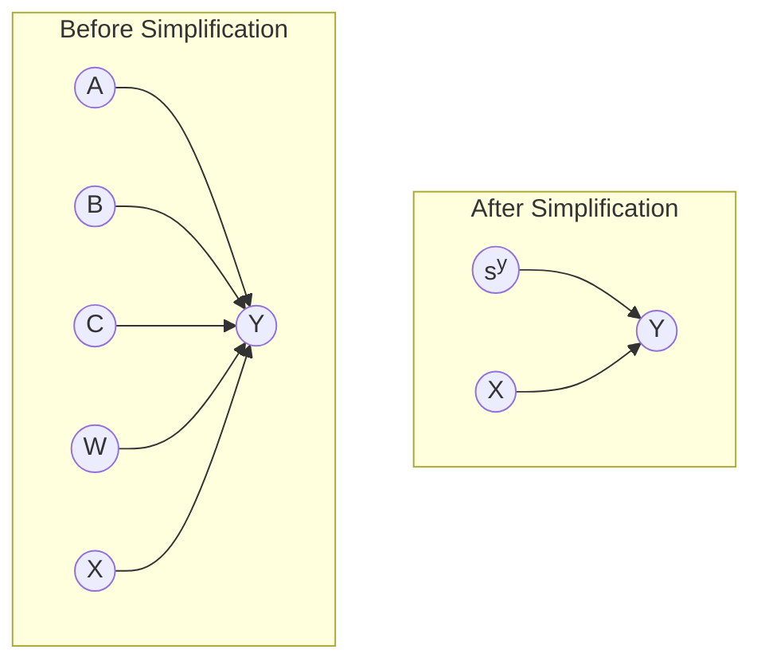
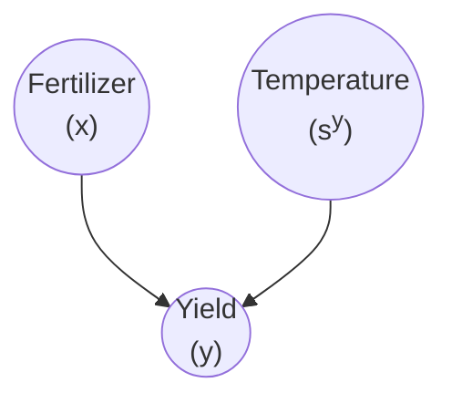

Let’s say we want to find the causal effect of $x \to y$.

We need to find $P(y| \ \text{do}(x) \ )$ or $E(y| \ \text{do}(x) \ )$.

Consider the following causal diagram.

where $s^y$ is any other thing that can causally affect $y$; ie, the set of potential effect modifiers.

# Causal Effect Formula

$$
P(y| \ \text{do}(x) \ ) =
\int P(y| \ \text{do}(x), s^y \ )
P(s^y)
ds^y
$$

# Limitation of Causal Graph

There is no way for causal graph to represent the causal effect of input $x$ on output $y$ due to some effect modifier. For example

Temperature does not affect how much usage of fertilizer, but we know that the temperature affects the **effectiveness** of the fertilizer, but we have no way of representing that here. However, the [Causal Effect Formula](#Causal Effect Formula) will take care of that.

# Stages of Causal Effect Learning

1. Identification of causes  - Causal Reasoning
   Just reasoning and understanding; no math, statistics
2. Estimation - Statistical Reasoning

# Identification

Question:

> 1. Is it possible to learn the causal effect of our interest from the available observable variables.
> 2. What causal assumptions do we need to make to do so?

## Identification Types of causal effect

Let $v$ is the set of observed variables $\{ x, y, \dots \}$

### Non-Parametric

If we can create a causal model such that we can express $P(y| \ \text{do}(x) \ )$ in terms of $P(v)$, without any parametric assumptions on the relationships among the variables.

## Parametric

Statistical and functional form assumptions are involved in expressing $P(y| \ \text{do}(x) \ )$ in terms of $P(v)$.

# Estimation
