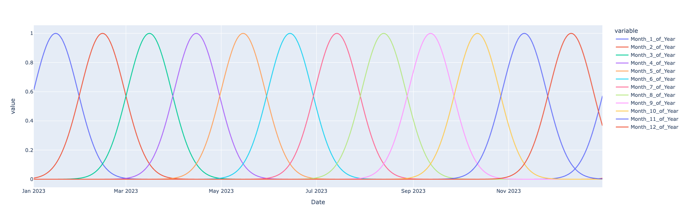

# Time Series Processes

## Time Series

Observation of random variable ordered by time

Time series variable can be

- Time series at level (absolute value)
- Difference series (relative value)
    - First order difference $\Delta y_t = y_t - y_{t-1}$
    - Called as ‘returns’ in finance
    - Second order difference $(\Delta y_t)_2 = \Delta y_t - \Delta y_{t-1}$

## Univariate Time Series

Basic model only using a variable’s own properties like lagged values, trend, seasonality, etc

## Why do we use different techniques for time series?

This is due to

- behavioral effect
- history/memory effect
    - Medical industry always looks at the records of your medical history
- Inertia of change
- Limited data

## Components of Time Series Processes

|                  | Characteristic          | Frequency              | Example        |
| ---------------- | ----------------------- | ---------------------- | -------------- |
| Level            | Average value of series | Constant               |                |
| Trend            | Gradual                 | Low                    |                |
| Drift            | Exogeneous              | Constant               |                |
| Cycles           |                         | > 1 year               | Economy cycle  |
| Seasonality      |                         | Daily, Weekly, Monthly |                |
| Structural Break |                         |                        |                |
| Holidays         |                         |                        | Eid, Christmas |
| Auto-Correlation | Relationship with past  |                        |                |
| Shocks           |                         |                        | Power outage   |
| Noise            | Random                  | High                   |                |

### Auto-correlation

Sometimes just auto-correlation is enough to learn the values of a value

$$
y_t = \beta_0 + \beta_1 y_{t-1} + e_t
$$

If we take $j$ lags,

$$
y_t = \beta_0 + \sum_{i=1}^j \beta_i y_{t-i} + e_t
$$

Generally, $i>j \implies \beta_i < \beta_j$

Impact of earlier lags is lower than impact of recent lags

### Shock

‘Shock’ is an abrupt/unexpected deviation(inc/dec) of the value of a variable from its expected value

This incorporates influence of previous disturbance

They cause a structural change in our model equation. Hence, we need to incorporate their effect.

$$
\text{Shock}_t = y_t - E(y_t)
$$

Basically, shock is basically $u_t$ but it is fancily called as a shock, because they are large $u$

Can be

|          | Temporary                                                    | Permanent                                                    |
| -------- | ------------------------------------------------------------ | ------------------------------------------------------------ |
| Duration | Short-term                                                   | Long-Term                                                    |
|          |                                                              | Causes structural change                                     |
| Examples | Change in financial activity due to Covid                    | Change in financial activity due to 2008 Financial Crisis    |
|          | Heart rate change due to minor stroke Heart rate change due to playing | Heart rate change due to major stroke Heart rate change due to big injury |
|          | Goals scored change due to small fever                       | Goals scored change due to big injury                        |

Model becomes

$$
y_t = \beta_0 + \beta_1 y_{t-1} + \beta_2 u_{t-1}
$$

### Structural Breaks

Permanent change in the variable causes permanent change in relationship

We can either use

- different models before and after structural break
- binary ‘structural dummy variable’ to capture this effect

For eg, long-term injury

$$
y_t = \beta_0 + \beta_1 y_{t-1} + \beta_2 B_t
$$

### Trend

Tendency of time series to change at a certain expected rate.

Trend can be

- deterministic/systematic (measurable)
- ==random/stochastic (not measurable $\implies$ cannot be incorporated)==

For eg: as age increases, humans have a trend of

- growing at a certain till the age of 20 or so
- reducing heart rate

Model becomes

$$
y_t = \beta_0 + \beta_1 y_{t-1} + \beta_2 t
$$

### Seasonality/Periodicity

$$
y_t = \beta_0 + \beta_1 y_{t-1} + \beta_2 \textcolor{hotpink}{S} + \beta_3 \textcolor{hotpink}{t S}
$$

Tendency of a variable to change in a certain manner at regular intervals.

For eg

- demand for woolen clothes is high every winter
- demand for ice cream is high every summer

Finance industry has ‘anomalies’

Two ways to encode

| Type       | Advantage | Disadvantage | Example             | $S$                                                          |                                                         |                                                              |
| ---------- | --------- | ------------ | ------------------- | ------------------------------------------------------------ | ------------------------------------------------------- | ------------------------------------------------------------ |
| Binary     | Simple    | Unrealistic  | Dummy               | $\{0, 1\}$                                                   |                                                         |                                                              |
| Continuous | Realistic | Complex      | Cyclic Linear Basis | $\exp{\left[\frac{- 1}{2 \alpha^2} (x_i - \text{pivot})^2\right]}$ - Pivot is the center of the curve | Preferred, as more control over amplitude and bandwidth |  |
|            |           |              | Fourier series      | $\alpha \cos \left(\frac{2 \pi}{\nu} + \phi \right) + \beta \sin \left( \frac{2 \pi}{\nu} + \phi\right)$, where $\nu =$ Frequency of seasonality, and $\phi$ is the offset - Quarterly = 4 - Monthly = 12 |                                                         |                                                              |

### Volatility

Annualized standard deviation of change of a random variable

Measure of variation of a variable from its expected value

If the variance is heteroskedastic (changes over time), the variable is volatile

$$
\begin{aligned}
\sigma^2_{y_t}
&= E \Big [\Big(y_t - E(u_t) \Big)^2 \Big] \\
&= E \Big [\Big(y_t - \textcolor{hotpink}{0} \Big)^2 \Big] \\
&= E [y_t^2 ] \\
&= y_t^2 \\
\end{aligned}
$$

$$
y_t = \beta_0 + \beta_1 y_{t-1} + \beta_2 \sigma^2_{t-1}
$$

## Lag Terms

$$
\begin{aligned}
\text{Let's say} \to
y_t &= f(y_{t-2}) \\
y_t &= f(y_{t-1}) \\
y_{t-1} &= f(y_{t-2})
\end{aligned}
$$

$$
y_t = \rho_1 y_{t-1} + \rho_2 y_{t-2} + u_t
$$

Here, $\rho_1$ and $\rho_2$ are partial-autocorrelation coefficient of $y_{t-1}$ and $y_{t-2}$ on $y_t$

$$
y_t = \rho_1 y_{t-2} + u_t
$$

Here, $\rho_1$ is total autocorrelation coefficient of $y_{t-2}$ on $y_t$

We choose the number of lags by trial-and-error and checking which coefficients are significant ($\ne 0$)

## Stochastic Data-Generating Processes

Stochastic process is a sequence of random observations indexed by time

### Markov Chain

Stochastic process where effect of past on future is summarized only by current state
$$
P(y_{t+1} = a \vert x_0, x_1, \dots x_t) = P(x_{t+1} = a \vert x_t)
$$
If possible values of $x_i$ is a finite set, MC can be represented as a transition probability matrix

### Martingale

Stochastic processes which are a “fair” game
$$
E[y_{t+1} \vert y_t] = y_t
$$
Follow optimal stopping theorem

### Subordinated

### Stationarity

| Type                  | Meaning                                                      |
| --------------------- | ------------------------------------------------------------ |
| Stationary            | Constant mean: $E(y_t) = \mu$ Constant variance: $\text{Var}(y_t) = \sigma^2$ |
| Covariance Stationary | Constant mean: $E(y_t) = \mu$ Constant variance: $\text{Var}(y_t) = \sigma^2$ Constant auto-covariance: $\text{Cov}(y_{t+h}, y_t) = \gamma(\tau)$ |
| Non-Stationary        | Will have either ==**one/both**== of the following  - Mean at each time period is ==**different**== across all time periods   - Mean of distribution of possible outcomes corresponding to each time period is different - Variance at each time period is ==**different**== across all time periods   - Variance of distribution of possible outcomes corresponding to each time period is different  We need to transform this somehow, as OLS and [GMM](#GMM) cannot be used for non-stationary processes, because the properties of OLS are violated - heteroskedastic variance of error term |

## Types of Stochastic Processes

Consider $u_t = N(0, \sigma^2)$

| Process                                          | Characteristics                                  | $y_t$                                                        | Comments                                                     | Mean                                       | Variance     | Memory | Example                                                      |
| ------------------------------------------------ | ------------------------------------------------ | ------------------------------------------------------------ | ------------------------------------------------------------ | ------------------------------------------ | ------------ | ------ | ------------------------------------------------------------ |
| White Noise                                      | Stationary                                       | $u_t$                                                        | PAC & TAC for each lag = 0                                   | 0                                          | $\sigma^2$   | None   | If a financial series is a white noise series, then we say that the ‘market is efficient’ |
| Ornstein Uhlenbeck Process/ Vasicek Model   | Stationary Markov chain                     | $\beta_1 y_{t-1} + u_t; \ 0 < \vert \beta_1 \vert < 1$       | Series has Mean-reverting Earlier past is less important compared to recent past. Less susceptible to permanent shock Series oscilates | 0/non-zero                                 | $\sigma^2$   | Short  | GDP growth Interest rate spreads Real exchange rates Valuation ratios (divides-price, earnings-price) |
| Covariance Stationary                            |                                                  | $y_t = V_t + S_t$ (Wold Representation Theorem) $V_t$ is a linear combination of past values of $V_t$ with constant coefficients $S_t = \sum \psi_i u_{t-i}$ is an infinite moving-average process of error terms, where $\psi_0=1, \sum \psi_i^2 < \infty$; $\eta_t$ is linearly-unpredictable white noise and $u_t$ is uncorrelated with $V_t$ |                                                              |                                            |              |        |                                                              |
| Simple Random Walk                               | Non-Stationary Markov chain Martingale | $\begin{aligned} &= y_{t-1} + u_t \\ &= y_0 + \sum_{i=0}^t u_i \end{aligned}$ | PAC & TAC for each lag = 0 $y_{t+h} - y_t$ has the same dist as $y_h$  | $y_0$                                      | $t \sigma^2$ | Long   |                                                              |
| Explosive Process                                | Non-Stationary                                   | $\beta_1 y_{t-1} + u_t; \  \vert \beta_1 \vert > 1$          |                                                              |                                            |              |        |                                                              |
| Random Walk w/ drift                             | Non-Stationary                                   | $\begin{aligned} &= \beta_0 + y_{t-1} + u_t \\ &= t\beta_0 + y_0 + \sum_{i=0}^t u_i \end{aligned}$ |                                                              | $t \beta_0 + y_0$                          | $t \sigma^2$ | Long   |                                                              |
| Random Walk w/ drift and deterministic trend     | Non-Stationary                                   | $\begin{aligned} &= \beta_0 + \beta_1 t + y_{t-1} + u_t \\ &= y_0 + t \beta_0 + \beta_1 \sum_{i=1}^t i + \sum_{i=1}^t u_t \end{aligned}$ |                                                              | $t \beta_0 + \beta_1 \sum_{i=1}^t i + y_0$ | $t \sigma^2$ | Long   |                                                              |
| Random Walk w/ drift and non-deterministic trend | Non-Stationary                                   | Same as above, but $\beta_1$ is non-deterministic            |                                                              |                                            |              |        |                                                              |

Impulse Response Function of covariance stationary process $y_t$ is
$$
\begin{aligned}
\text{IR}(j)
&= \dfrac{\partial y_t}{\partial \eta_{t-j}} \\
&= \psi_j \\
\implies \sum \text{IR}(j) &= \phi(L), \text{with L=}1 \\
&\text{ (L is lag operator)}
\end{aligned}
$$

## Differentiation

When converting a non-stationary series $y_t$ into a stationary series $y'_t$, we want

- Obtain stationarity: ADF Stat at 95% CL as $-2.8623$
- Retain memory: Similarity to original series; High correlation b/w original series and differentiated series

$$
y'_t = y_t - d y_{t-1} \\
d \in [0, 1] \\
d_\text{usual} \in [0.3, 0.5]
$$

| $d$                                        | Stationarity | Memory |
| ------------------------------------------ | ------------ | ------ |
| 0                                          | ❌            | ✅      |
| $(0, 1)$ (Fractional differentiation) | ✅            | ✅      |
| 1                                          | ✅            | ❌      |

## Integrated/DS Process

Difference Stationary Process

A non-stationary series is said to be integrated of order $k$, if mean and variance of $k^\text{th}$-difference are time-invariant

If the first-difference is non-stationary, we take second-difference, and so on

### Pure random walk is DS

$$
\begin{aligned}
y_t &= y_{t-1} + u_t \\
\implies \Delta y_t &= \Delta y_{t-1} + u_t
\quad \text{(White Noise Process = Stationary)}
\end{aligned}
$$

### Random walk w/ drift is DS

$$
\begin{aligned}
y_t &= \beta_0 + y_{t-1} + u_t \\
\implies \Delta y_t &= \beta_0 + \Delta y_{t-1} + u_t \quad \text{(Stationary)}
\end{aligned}
$$

## TS Process

Trend Stationary Process

A non-stationary series is said to be …, if mean and variance of de-trended series are time-invariant

Assume a process is given by

$$
y_t = \beta_0 + \beta_1 t + y_{t-1} + u_t
$$

where trend is deterministic/stochastic

Then

- Time-varying mean
- ==Constant variance ???==

We perform **de-trending** $\implies$ subtract $(\beta_0 + \beta_1 t)$ from $y_t$

$$
(y_t - \beta_0 - \beta_1 t) = y_{t-1} + u_t
$$

If

- $\beta_2 = 0$, the de-trended series is white noise process
- $\beta_2 \ne 0$, the de-trended series is a stationary process

**Note**
Let’s say $y_t = f(x_t)$

If both $x_t$ and $y_t$ have equal trends, then no need to de-trend, as both the trends will cancel each other

## Unit Root Test for Process Identification

$$
y_t = \textcolor{hotpink}{\beta_1} y_{t-1} + u_t
$$

| $\textcolor{hotpink}{\beta_1}$ | $\gamma$ | Process        |
| ------------------------------ | :------: | -------------- |
| $0$                            |          | White Noise    |
| $(0, 1)$                       |          | Stationary     |
| $[1, \infty)$                  |          | Non-Stationary |

### Augmented Dicky-Fuller Test

- $H_0: \beta_1=1$
- $H_0: \beta_1 \ne 1$

Alternatively, subtract $y_{t-1}$ on both sides of main equation

$$
\begin{aligned}
y_t - y_{t-1} &= \beta_1 y_{t-1} - y_{t-1} + u_t \\
y_t - y_{t-1} &= (\beta_1-1) y_{t-1} + u_t \\
\Delta y_t &= \gamma y_{t-1} + u_t & (\gamma = \beta_1 - 1)
\end{aligned}
$$

- $H_0: \gamma=1$ (Non-Stationary)
- $H_1: \gamma \ne 1$ (Stationary)

If p value $\le 0.05$

- we reject null hypothesis and accept alternate hypothesis
- Hence, process is stationary

We test the hypothesis using Dicky-Fuller distribution, to generate the critical region

| Model           | Hypotheses $H_0$ | Test Statistic |
| --------------- | ---------------- | -------------- |
| $\Delta y_t =$  |                  |                |
|                 |                  |                |
|                 |                  |                |

## Long memory series

Earlier past is as important as recent past

## Q Statistic

Test statistic like $z$ and $t$ distribution, which is used to test ‘joint hypothesis’

## Inertia of Time Series Variable

Persistance of value due to Autocorrelation

Today’s exchange rate is basically yesterday’s exchange rate, plus-minus something

