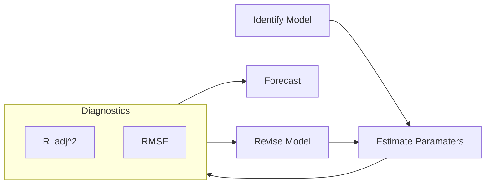

For all the following models

- The variable has to be stationary model
    - Else, use non-stationary $\to$ stationary transformation
- We drop parameters if they are significantly equal to 0

## AR Model/Process

AutoRegressive Model

Variable is regressed using its own lagged values; we assume $y_t$ depends only on its own lagged values

==More lags $\implies$ we lose more date points $\implies$ low degree of freedom==

### Types

AR$(p)$ model means that there are $p$ lags involved in the AR model

$$
\text{AR}(p) =
\sum_{i=1}^{p} \alpha_i u_{t-i} +
u_t
$$

| Model   | Order (No of lags involved)                             | Example                                                      |
| ------- | ------------------------------------------------------------ | ------------------------------------------------------------ |
| AR$(1)$ | 1 There is only $1$ particular lag (not necessarily $y_{t-1}$) | $y_t = \beta_1 y_{t-\textcolor{hotpink}{1}} + u_t \\
 \text{or} \\ y_t = \beta_1 y_{t-\textcolor{hotpink}{2}} + u_t \\ \text{or} \\ \dots \\ y_t = \beta_1 y_{t-\textcolor{hotpink}{100}} + u_t$ |
| AR$(2)$ | 2                                                            | $y_t = \beta_1 y_{t-\textcolor{hotpink}{1}} + u_t,  y_{t-\textcolor{hotpink}{2}} + u_t \\
 \text{or} \\ y_t = \beta_1 y_{t-\textcolor{hotpink}{1}} + u_t,  y_{t-\textcolor{hotpink}{100}} + u_t$ |

## MA Model

Moving Averages Model

MA$(q)$ model means that there are $q$ lags involved in the MA model

$$
\text{MA}(q) =
\sum_{i=1}^{q} \beta_i u_{t-i} +
u_t
$$

| Model   | Order (No of lags involved)                             |                           Example                            |
| ------- | ------------------------------------------------------------ | :----------------------------------------------------------: |
| MA$(1)$ | 1 There is only $1$ particular lag (not necessarily $u_{t-1}$) | $y_t = \beta_1 u_{t-\textcolor{hotpink}{1}} + u_t \\
 \Big(\text{ie, } y_t = \beta_1 (y_{t-\textcolor{hotpink}{1}}-E[y_{t-\textcolor{hotpink}{1}}]) + u_t \Big)$ |
| MA$(2)$ | 2                                                            | $y_t = \beta_1 u_{t-\textcolor{hotpink}{1}} + \beta_2 u_{t-\textcolor{hotpink}{2}} + u_t$ |

## ARMA

Autoregressive Moving Average Model

ARMA$(p, q)$ model means that there are __ involved in the ARMA model

- $p$ autoregressive lags
- $q$ moving averages lags

$$
\text{ARMA}(p, q) =
\sum_{i=1}^{p} \alpha_i y_{t-i} +
\sum_{i=1}^{q} \beta_i u_{t-i} +
u_t
$$

## ARIMA Process

ARIMA$(p, d, q)$ model means

- $p$
- $d$
- $q$

$$
\Delta^d y_t =
\sum_{i=1}^p \alpha_i \Delta^d y_{t-1} +
\sum_{i=1}^q \beta_i u_{t-1} +
u_t
$$

If $y_t$ is an integrated series of order($\textcolor{hotpink}{1}$), then we can use ARIMA$(1, \textcolor{hotpink}{1}, 1)$

$$
\Delta y_t =
\alpha_1 y_{t-1} + \beta_1 u_{t-1} + u_t
$$

## Box-Jenkins Decision Tree

for ARIMA Model Building

|                | ACF Correlogram             | PACF Correlogram          |
| -------------- | --------------------------- | ------------------------- |
| White Noise    | No significant spikes       | No significant spikes     |
| AR$(p)$        | Damps out                   | Spikes cut off at lag $p$ |
| MA$(q)$        | Spikes cut off at lag $q$   | Damps out                 |
| ARMA$(p, q)$   | Damps out                   | Damps out                 |
| Non-Stationary | Spikes damp out very slowly | Spikes cut off at lag $p$ |

## Best Model Evaluation

1. Most Significance of coefficients
2. Highest ${R^2}_\text{adj}$
3. Highest log likelihood
4. Lowest AIC, SC, HQ values

## Durbin-Watson Stat

Kinda like $t$ value

|   DWS   | Accepted? | Reason                        |
| :-----: | :-------: | ----------------------------- |
|  $< 2$  |     ❌     | $u_t$ has auto-correlation    |
| $\ge 2$ |     ✅     | $u_t$ has no auto-correlation |

## Correlogram

| If the correlogram of error term wrt previous lags has | Accepted? | Reason                            |
| ------------------------------------------------------ | :-------: | --------------------------------- |
| all bars inside the marked lines                       |     ✅     | $u_t$ has **no** auto-correlation |
| one/more bars outside marked lines                     |     ❌     | $u_t$ has auto-correlation        |

## ARIMA Forecast Confidence Interval

Range = $\pm 2\sigma$

It shows the deviations upto which the forecast is expected to deviate

## Inflation-Welfare Cost Relation

{ loading=lazy }

|                      | Optimal Inflation Rate |
| -------------------- | ---------------------- |
| Developed Countries  | 2%                     |
| Developing Countries | 4-6%                   |

## VAR

Vector AutoRegression

Simultaneous equations

Consider the following regression

$$
y_t = \alpha_1 x + u_t
$$

## Spurious Regression

Occurs when we perform regression between

- 2 non-stationary variables
  and/or
- 2 independent variables

You may get $R^2$ and $t$ values, but $u_t$ is not white noise (it is non-stationary)

Variance of error term becomes infinite as we go further in time

### Identification

If $R^2 >$ DW Statistic

## Cases

$$
y_t = \alpha_1 z_t + u_t
$$

| $y_t$ | $z_t$ | Conclusion                                                   |
| ----- | ----- | ------------------------------------------------------------ |
|       |       | OLS is valid                                                 |
|       |       | OLS is not valid Spurious regression                    |
|       |       | Take difference series $\Delta y_t = \alpha_1 \Delta z_t + \Delta e_t$ |
| I(1)  |       | Appropriate model                                            |
