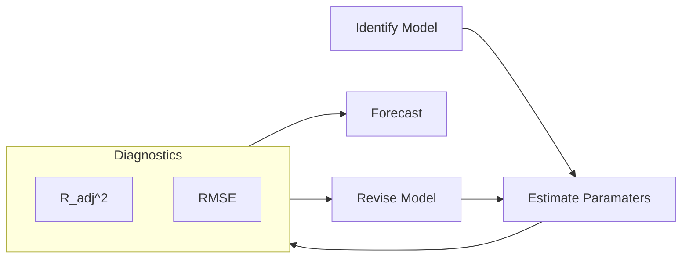

For all the following models

- The variable has to be stationary model
    - Else, use non-stationary $\to$ stationary transformation
- We drop parameters if they are significantly equal to 0

## Simple/Baseline Models

| Method         |                                                              | $\hat y_{t+h}, \ h>=0$                                | Appropriate for                                              |
| -------------- | ------------------------------------------------------------ | ----------------------------------------------------- | ------------------------------------------------------------ |
| Average        | Average of past values                                       | $\overline{ \{ y_{t-k} \} }$                          |                                                              |
| Naive          | Last value                                                   | $y_{t-1}$                                             | Random walk process (Consequence of efficient market hypothesis) |
| Seasonal Naive | Last seasonal value                                          | ${\large y}_{t+h-mk}$ where $m=$ seasonal period |                                                              |
| Drift Method   | Last value plus average change Equivalent to extrapolating line between first and last point | ${\large y}_{t-1} + \overline{ \{ y_t - y_{t-1} \} }$ |                                                              |

Where $k > 0$

## Simulation Models

We do not use the observed values of the process as inputs

Preferred for long-term forecasts

### ETS Model

Errors, Trend, Seasonality

$$
\hat y_t = f(t, S, u_t)
$$

### Monte-Carlo Simulation

$$
\hat y_t = f(\hat y_{t-1}, u_t)
$$

### FIR Model

Only using input features

$$
\hat y_t = f(X_{t-k}, u_t)
$$

$k$ is the no of lagged input features

### Output Error Model/Recursive Forecasting

FIR model using past estimations also. Ideally you should develop a model for this (infinite-step forecasting), and then work on using the same model for multi-step forecasting.

$$
y_t =
\sum_{i=p} \hat y_{t-i} +\sum_{i=\textcolor{hotpink}{0}} \hat X_{t-k} + u_t
$$

## AR Model/Process

AutoRegressive Model

Variable is regressed using its own lagged values; we assume $y_t$ depends only on its own lagged values

==More lags $\implies$ we lose more date points $\implies$ low degree of freedom==

### Types

AR$(p)$ model means that there are $p$ lags involved in the AR model

$$
\text{AR}(p) =
\sum_{i=1}^{p} \alpha_i y_{t-i} +
u_t
$$

| Model   | Order (No of lags involved)                             | Example                                                      |
| ------- | ------------------------------------------------------------ | ------------------------------------------------------------ |
| AR$(1)$ | 1 There is only $1$ particular lag (not necessarily $y_{t-1}$) | $y_t = \beta_1 y_{t-\textcolor{hotpink}{1}} + u_t \\ \text{or} \\ y_t = \beta_1 y_{t-\textcolor{hotpink}{2}} + u_t \\ \text{or} \\ \dots \\ y_t = \beta_1 y_{t-\textcolor{hotpink}{100}} + u_t$ |
| AR$(2)$ | 2                                                            | $y_t = \beta_1 y_{t-\textcolor{hotpink}{1}} + u_t,  y_{t-\textcolor{hotpink}{2}} + u_t \\ \text{or} \\ y_t = \beta_1 y_{t-\textcolor{hotpink}{1}} + u_t,  y_{t-\textcolor{hotpink}{100}} + u_t$ |

## MA Model

Moving Averages Model

MA$(q)$ model means that there are $q$ lagged error differences involved in the MA model

$$
\text{MA}(q) =
\sum_{i=1}^{q} \beta_i u_{t-i} +
u_t
$$

$u_{t-i}$: This is a multiple regression with past errors
as predictors. ==**Don’t confuse this with moving average smoothing!**==

| Model   | Order (No of lags involved)                             |                           Example                            |
| ------- | ------------------------------------------------------------ | :----------------------------------------------------------: |
| MA$(1)$ | 1 There is only $1$ particular lag (not necessarily $u_{t-1}$) | $y_t = \beta_1 u_{t-\textcolor{hotpink}{1}} + u_t \\ \Big(\text{ie, } y_t = \beta_1 (y_{t-\textcolor{hotpink}{1}}-E[y_{t-\textcolor{hotpink}{1}}]) + u_t \Big)$ |
| MA$(2)$ | 2                                                            | $y_t = \beta_1 u_{t-\textcolor{hotpink}{1}} + \beta_2 u_{t-\textcolor{hotpink}{2}} + u_t$ |

## ARMA

Autoregressive Moving Average Model

ARMA$(p, q)$ model means that there are __ involved in the ARMA model

- $p$ autoregressive lags
- $q$ moving averages lags

$$
\text{ARMA}(p, q) =
\sum_{i=1}^{p} \alpha_i y_{t-i} +
\sum_{i=1}^{q} \beta_i u_{t-i} +
u_t
$$

## ARIMA Process

ARIMA$(p, d, q)$ model means

- $p$
- $d$
- $q$

$$
\Delta^d y_t =
\sum_{i=1}^p \alpha_i \Delta^d y_{t-1} +
\sum_{i=1}^q \beta_i u_{t-1} +
u_t
$$

If $y_t$ is an integrated series of order($\textcolor{hotpink}{1}$), then we can use ARIMA$(1, \textcolor{hotpink}{1}, 1)$

$$
\Delta y_t =
\alpha_1 y_{t-1} + \beta_1 u_{t-1} + u_t
$$

## Box-Jenkins Decision Tree

for ARIMA Model Building

| ACF Correlogram             | PACF Correlogram          | ->   | Conclusion                      | Model                                       |
| --------------------------- | ------------------------- | ---- | ------------------------------- | ------------------------------------------- |
| No significant spikes       | No significant spikes     |      | White Noise                     |                                             |
| Damps out                   | Spikes cut off at lag $p$ |      | Stationary                      | AR$(p)$                                     |
| Spikes cut off at lag $q$   | Damps out                 |      | Stationary                      | MA$(q)$                                     |
| Damps out                   | Damps out                 |      | Stationary                      | ARMA$(p, q)$                                |
| Spikes damp out very slowly | Spikes cut off at lag $p$ |      | Random Walk Non-Stationary | Monte-Carlo Simulation Take difference |

## Correlogram

| If the correlogram of error term wrt previous lags has | Accepted? | Reason                            |
| ------------------------------------------------------ | :-------: | --------------------------------- |
| all bars inside the marked lines                       |     ✅     | $u_t$ has **no** auto-correlation |
| one/more bars outside marked lines                     |     ❌     | $u_t$ has auto-correlation        |

## Forecast Confidence Interval

It shows the range upto which the forecast is expected to deviate

$$
\text{CI }{y_{t+h}} = \hat y_{t+h} \pm h \sigma_{y+h}
$$

If standard deviation remains constant across all time points, $\sigma_{y+h} = \sigma_y$

## VAR

Vector AutoRegression

Simultaneous equations

Consider the following regression

$$
y_t = \alpha_1 x + u_t
$$

## Cases

$$
y_t = \alpha_1 z_t + u_t
$$

| $y_t$ | $z_t$ | Conclusion                                                   |
| ----- | ----- | ------------------------------------------------------------ |
|       |       | OLS is valid                                                 |
|       |       | OLS is not valid Spurious regression                    |
|       |       | Take difference series $\Delta y_t = \alpha_1 \Delta z_t + \Delta e_t$ |
| I(1)  |       | Appropriate model                                            |

## Multi-Step Forecasting

Rather than building a model for each step, you can define the model as

$$
\Delta^d y_{t+h} =
f(h) +
\sum_{i=1}^p \alpha_i \Delta^d y_{t-1} +
\sum_{i=1}^q \beta_i u_{t-1} +
u_t
$$

where
- $h$ is the horizon
- $f(h)$ is the captured mapping for $h$. You may have to perform binary encoding (such as one-hot, etc).

## Further Reading

[Forecasting Principles Practice](https://github.com/AhmedThahir/Forecasting-Principles-Practice)
