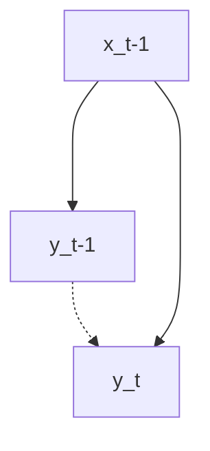
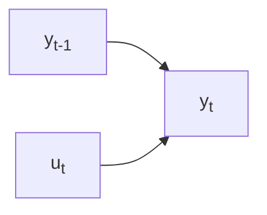
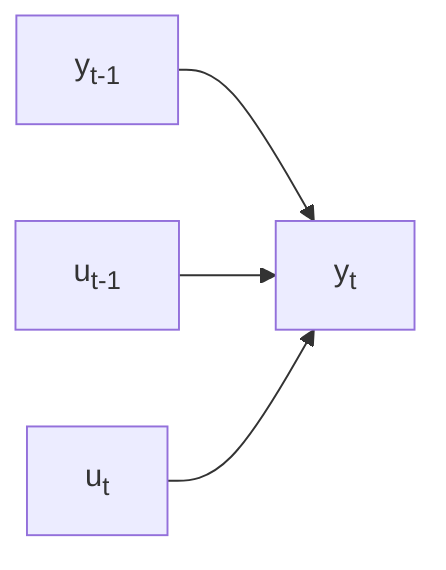
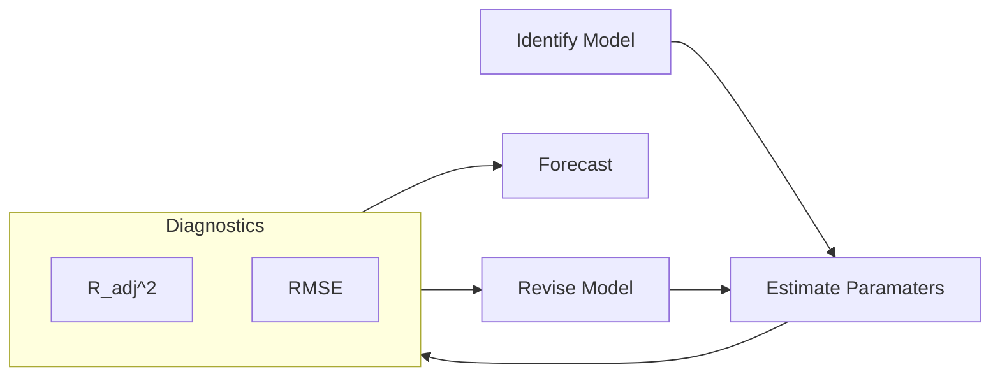

# Auto-Regressive Models

## Limitations

- Assumes that factors will affect in the same manner throughout
- Temporal confounding: Makes learning of exogenous effects harder

## AR Model/Process

AutoRegressive Model

Variable is regressed using its own lagged values; we assume $y_t$ depends only on its own lagged values

==More lags $\implies$ we lose more date points $\implies$ low degree of freedom==

### Types

AR$(p)$ model means that there are $p$ lags involved in the AR model

$$
\text{AR}(p) =
\sum_{i=1}^{p} \alpha_i y_{t-i} +
u_t
$$

| Model   | Order (No of lags involved)                             | Example                                                      |
| ------- | ------------------------------------------------------------ | ------------------------------------------------------------ |
| AR$(1)$ | 1 There is only $1$ particular lag (not necessarily $y_{t-1}$) | $y_t = \beta_1 y_{t-\textcolor{hotpink}{1}} + u_t \\ \text{or} \\ y_t = \beta_1 y_{t-\textcolor{hotpink}{2}} + u_t \\ \text{or} \\ \dots \\ y_t = \beta_1 y_{t-\textcolor{hotpink}{100}} + u_t$ |
| AR$(2)$ | 2                                                            | $y_t = \beta_1 y_{t-\textcolor{hotpink}{1}} + u_t,  y_{t-\textcolor{hotpink}{2}} + u_t \\ \text{or} \\ y_t = \beta_1 y_{t-\textcolor{hotpink}{1}} + u_t,  y_{t-\textcolor{hotpink}{100}} + u_t$ |

## MA Model

Moving Averages Model

MA$(q)$ model means that there are $q$ lagged error differences involved in the MA model

$$
\text{MA}(q) =
\sum_{i=1}^{q} \beta_i u_{t-i} +
u_t
$$

$u_{t-i}$ is a multiple regression with past errors
as predictors. ==**Don’t confuse this with moving average smoothing!**==

| Model   | Order (No of lags involved)                             |                           Example                            |
| ------- | ------------------------------------------------------------ | :----------------------------------------------------------: |
| MA$(1)$ | 1 There is only $1$ particular lag (not necessarily $u_{t-1}$) | $y_t = \beta_1 u_{t-\textcolor{hotpink}{1}} + u_t \\ \Big(\text{ie, } y_t = \beta_1 (y_{t-\textcolor{hotpink}{1}}-E[y_{t-\textcolor{hotpink}{1}}]) + u_t \Big)$ |
| MA$(2)$ | 2                                                            | $y_t = \beta_1 u_{t-\textcolor{hotpink}{1}} + \beta_2 u_{t-\textcolor{hotpink}{2}} + u_t$ |

## ARMA

Autoregressive Moving Average Model

ARMA$(p, q)$ model means that there are __ involved in the ARMA model

- $p$ autoregressive lags
- $q$ moving averages lags

$$
\text{ARMA}(p, q) =
\sum_{i=1}^{p} \alpha_i y_{t-i} +
\sum_{i=1}^{q} \beta_i u_{t-i} +
u_t
$$

## ARIMA Process

ARIMA$(p, d, q)$ model means

- $p$
- $d$
- $q$

$$
\Delta^d y_t =
\sum_{i=1}^p \alpha_i \Delta^d y_{t-1} +
\sum_{i=1}^q \beta_i u_{t-1} +
u_t
$$

If $y_t$ is an integrated series of order($\textcolor{hotpink}{1}$), then we can use ARIMA$(1, \textcolor{hotpink}{1}, 1)$

$$
\Delta y_t =
\alpha_1 y_{t-1} + \beta_1 u_{t-1} + u_t
$$

## Box-Jenkins Decision Tree

for ARIMA Model Building

| ACF Correlogram             | PACF Correlogram          | ->   | Conclusion                      | Model                                       |
| --------------------------- | ------------------------- | ---- | ------------------------------- | ------------------------------------------- |
| No significant spikes       | No significant spikes     |      | White Noise                     |                                             |
| Damps out                   | Spikes cut off at lag $p$ |      | Stationary                      | AR$(p)$                                     |
| Spikes cut off at lag $q$   | Damps out                 |      | Stationary                      | MA$(q)$                                     |
| Damps out                   | Damps out                 |      | Stationary                      | ARMA$(p, q)$                                |
| Spikes damp out very slowly | Spikes cut off at lag $p$ |      | Random Walk Non-Stationary | Monte-Carlo Simulation Take difference |

## VAR

Vector AutoRegressive Model

Each input variable time series should also be stationary

$\text{VAR}(p) \equiv \text{VAR}(1)$ where
$$
\begin{aligned}
z_t &= \{ X_t, X_{t-1}, \dots, X_{t-p+1} \} \\
z_{t-1} &= \{ X_{t-1}, X_{t-2}, \dots, X_{t-p} \} \\
D &= \begin{bmatrix}
c \\
0_m \\
\vdots \\
0_m
\end{bmatrix},
A = \begin{bmatrix}
\phi_1	& \phi_2	& \cdots & \phi_p \\
I_m			& 0				& \cdots & 0 \\
\vdots	& \ddots	& \ddots & \vdots \\
I_m			& 0				& I_m & 0
\end{bmatrix},
F = \begin{bmatrix}
u_t \\
0_m \\
\vdots \\
0_m
\end{bmatrix}
\\
\implies z_t &= D + A y_{t-1} + F
\end{aligned}
$$

### Stationary VAR(p)

A VAR(p) model is stationary if one/both of the following

- All eigen values of the companion matrix $A$ have modulus less than 1
- All roots of $\text{det} ( \ I_m - \sum_{i=1}^p \phi_i z^p \ ) = 0$ as a function of the complex variable $z$ are **outside** the complex unit circle $\vert z \vert \le 1$

Mean:
$$
\begin{aligned}
C
&= (I - \sum_i^p \phi_i) \mu \\
E[y_t] \implies
\mu
&= (I - \sum_i^p \phi_i)^{-1} C \\
y_t - \mu &= \sum_i^p \phi_i[y_{t-i} - \mu]  + u_t
\end{aligned}
$$

## Optimality

Component-wise OLS estimates are equal to the GLS estimates accounting for the general case of innovation covariance matrix with possibly unequal comment variance and non-zero correlations 

## VARMA

Vector AutoRegressive Moving Averages

Simultaneous equations

Consider the following regression

$$
y_t = \alpha_1 {x_1}_t + \alpha_2 {x_2}_t + u_t
$$

## VECM

Vector Error-Correction Model

Useful when you want to perform VARMA without losing the “structure” associated with differencing to enforce stationarity