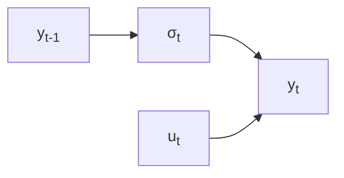
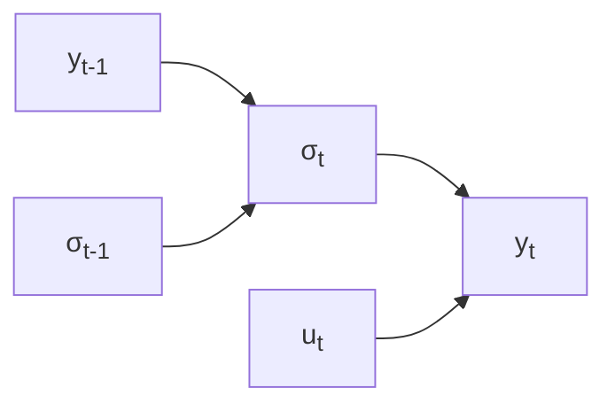
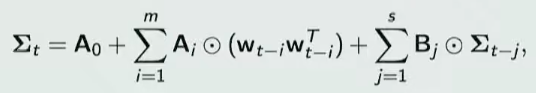

# Volatility Modelling

## Historical/Sample Volatility Measures

Annualized Vol
$$
\text{Annualized Vol} = \begin{cases}
s \sqrt{365.25} & \text{Daily data} \\
s \sqrt{52} & \text{Weekly data} \\
s \sqrt{12} & \text{Monthly data}
\end{cases}
$$

- Simple Moving average of volatility
- Exponential Moving average of volatility
- Simple regression of volatility

## Geometric Brownian Motion Model

Assumes that volatility over time is stationary
$$
\begin{aligned}
dy_t &= \mu y_t \ dt + \sigma y_t  \ dW_t \\
\implies \dfrac{dy_t}{y_t} &= \mu \ dt + \sigma \ dW_t
\end{aligned}
$$

- $dy_t$ is infinitesimal increment in series
- $\mu$ is mean difference (per unit team) [drift term]
- $\sigma$ is volatility of series
- $dW_t$ is infinitesimal increment of standard Brownian motion/Wiener process
  - $dW_t = N(0, t'-t)$
  - $dW_i$ and $dW_j$ are independent

$$
\begin{aligned}
\text{Let } R_j &= \log(y_j/y_{j-1}) \\
R_j &\sim N(\mu \Delta_j, \sigma^2 \Delta_j), \Delta_j = t_j - t_{j-1}
\end{aligned}
$$

This is general case, to incorporate the possibility that the observations are at equal or unequal time intervals

- If $\Delta j = 1$
  - $\hat \mu = \bar R$
  - $\hat \sigma^2 = E[(R_t - \bar R)^2]$
- else
  - 

### Garman-Klass Estimator

More information than just closing

Sample information of

- Period-close (last)
- Period-high (max)
- Period-low (min)
- Period-open (first)

Assume that

- $\mu=0, \Delta_j = 1$
- $f \in (0, 1)$ denote the fraction of the day prior to the market open
  - $f \times T$ between the previous day’s closing and the current day’s opening, and an interval of length
  - $(1-f) \times T$ between the current opening and the current closing, during which the market is open for trading
  - $T$ is the time frame between two consecutive closing prices

$$
\begin{aligned}
C_j &= \log \vert y_{t_j} \vert \\
O_j &= \log \vert y_{t_{j-1}+f} \vert \\
H_j &= \max_{t_{j-1} + f \le t \le t_j} \log \vert y_t \vert \\
L_j &= \min_{t_{j-1} + f \le t \le t_j} \log \vert y_t \vert
\end{aligned}
$$

| Return Series                                           | Denotation             | Estimate                                                     | E[Estimate] | Var(Estimate) | Efficiency of estimate compared to close-close |
| ------------------------------------------------------- | ---------------------- | ------------------------------------------------------------ | ----------: | ------------: | ---------------------------------------------- |
| Close-Close                                             | $\hat \sigma_{cc}^2$   | $(C_1 - C_0)^2$                                              |  $\sigma^2$ |  $2 \sigma^4$ |                                                |
| Close-Open                                              | $\hat \sigma_{co}^2$   | $\dfrac{(O_1 - C_0)^2}{f}$                                   |  $\sigma^2$ |  $2 \sigma^4$ | 1                                              |
| Open-Close                                              | $\hat \sigma_{oc}^2$   | $\dfrac{(C_1 - O_1)^2}{1-f}$                                 |  $\sigma^2$ |  $2 \sigma^4$ | 1                                              |
| Combining close-open & open-close                       | $\hat \sigma_*^2$      | $\frac{1}{2}(\hat \sigma^2_{co} + \hat \sigma^2_{oc})$       |  $\sigma^2$ |    $\sigma^4$ | 2                                              |
| Parkinson                                               | $\hat \sigma^2_{p}$    | $\dfrac{(H_1-L_1)^2}{4 \cdot \log 2}$ $f=0$             |             |               | 5.2                                            |
| Garman & Klass w/ $\hat \sigma^2_p$                     | $\hat \sigma^2_{gkp}$  | $a \hat \sigma^2_{co} + (1-a) \hat \sigma^2_p$ $a \approx 0.17; 0 < f < 1$ |             |               | 6.2                                            |
| “Best Analytic Scale-Invariant Estimator” of Volatility | $\hat \sigma^2_{**}$   | $0.511(u_1-d_1)^2 - 0.019[ \ c_1(u_1+d_1) - 2 u_1 d_1 \ ] - 0.383 c_1^2$ $u_j = H_j - O_j; d_j = L_j-O_j; c_j = C_j - O_j$ are the normalized high/low/close values |             |               | 7.4                                            |
| Garman & Klass w/ $\hat \sigma^2_{**}$                  | $\hat \sigma^2_{gk**}$ | $a \dfrac{(O_1 - C_0)^2}{f} + (1-a)\dfrac{\sigma^2_{**}}{1-f}$ $a \approx 0.12; 0<f<1$ |             |               | 8.4                                            |

$$
\hat \sigma^2_{co} \text{ and } \hat \sigma^2_{oc} \text{ are independent}
$$

These expectations & variances of volatility estimate are obtained as standard deviation follows $\chi^2$ distribution

## Poisson Jump Diffusion Model

Assumes that volatility over time is stationary

Over time, a Brownian motion process is fully-continuous. It experiences shocks according to a Poisson process.

- Model is a Poisson mixture of Gaussian distributions
- Moment-Generating function derived as that of random sum of independent random values
- EM Algorithm expressible in closed form
  - Shocks treated as latent variables which simplify computations
  - Algo provides posterior estimates of number of shocks per time period

$$
\dfrac{dy_t}{t} = \mu dt + \sigma dW_t + \gamma \sigma Z_t d \Pi_t
$$

-  $dy_t$ = infinitesimal increment in series
-  $\mu =$ mean return (per unit time)
-  $\sigma =$ diffusion volatility of process
-  $dW_t =$ increment in standard Wiener process
-  $d \Pi_t =$ increment of a Poisson process with rate $\lambda$ modelling the shock process
-  $(\gamma \sigma) \times Z_t$ is the magnitude of a return shock
   - $Z_t = N(0, 1)$
   - $\gamma =$ scale ($\sigma$ units) of shock magnitudes

## ARCH

AutoRegressive Conditional Heteroskedacity models

- Handles time-dependent volatility
- Specifies relative to discrete-time process for time series
- Implies that $(u_t)^2$ is an AR process

Basically AR model of variance

Type of Volatility Clustering

$$
\begin{aligned}
y_t &= \sigma_t u_t \\
\implies R_t
&= \log \vert y_t/y_{t-1} \vert \\
&= \mu_t + u_t \\
u_t &= Z_t \times \sigma_t; Z_t = N(0, 1) \\
\implies \sigma^2_t
&= \text{Var}(R_t | F_{t-1}) \\
&= \alpha_0 + \sum_{i=1}^p \alpha_i (u_{t-i})^2 & (\alpha_i \ge 0; \sum_{i=1}^p \alpha_i < 1)
\end{aligned}
$$

where

- $\mu_t$ is the mean return conditional on $F_{t-1}$
- $F_{t-1}$ is the information available till time $t-1$

Adding $(u_t)^2 - \sigma^2_t$ to both sides of ARCH model
$$
(u_t)^2 = \alpha_0 + \sum_{i=1}^p \alpha_i (u_{t-i})^2 + (u_t)^2 - \sigma^2_t
$$
where

- $E[(u_t)^2 - \sigma^2_t \vert F_t] = 0$
- $\text{Var}[(u_t)^2 - \sigma^2_t \vert F_t] = \text{Var}[{(u_t)^2}] = 2 \sigma^4_t$

### Lagrange Multiplier Test

$$
H_0: \alpha_i = 0 , \forall i \in [1, p]
$$

1. Fit $AR(p)$ on $(u_t)^2$

   The $AR(p)$ estimates of parameters are not MLEs under gaussian assumptions; they correspond to quasi-MLE

2. LM test statistic = $nR^2$, where $R^2=$ R-Squared of fitted $AR(p)$

3. Under $H_0$, $n R^2 \approx {\chi^2}_p$

### Limitation

It can be “bursty”: Sudden jumps in volatility rather than smooth ones. Hence, it cannot effectively model persistent volatility

## GARCH

Generalized AutoRegressive Conditional Heteroskedacity models

Basically ARMA model of variance

Type of Volatility Clustering

$$
\begin{aligned}
y_t &= \sigma_t u_t \\
\sigma^2_t &= \alpha_0 + \sum_{i=1}^p \alpha_i (u_{t-i})^2 + \sum_{j=1}^q \beta_j \sigma^2_{t-j} \\
& (\alpha_i \ge 0; \beta_j \ge 0)
\end{aligned}
$$

$$
\text{Garch}(p, q) = \text{ARMA}( \ \max(p, q) \ , q  \ )
$$

### GARCH(1, 1)

$$
\sigma^2_t = \alpha_0 + \alpha_1 (u_{t-1})^2 + \beta_1 \sigma^2_{t-1}
$$

- Fits most financial time-series
- Implies a ARMA(1, 1) with $(u_t)^2 - \sigma^2_t \sim WN(0, 2 \sigma^4)$

## Diagonal Vectorization

$\Sigma_t$ is conditional covariance

Advantage

- Simple element-wise GARCH model

Disadvantage

- $\Sigma_t$ not guaranteed to be positive-definite
- Prone to overfitting, so dimensionality reduction required

## Stochastic Volatility Models

## Implied Volatility

From options/derivatives

## Volatility Clustering

- Large $u_t^2$ follow large $u_{t-1}^2$
- Small $u_t^2$ follow large $u_{t-1}^2$

GARCH Models can prescribe

- Large $\sigma_t^2$ follow large $\sigma_{t-1}^2$
- Small $\sigma_t^2$ follow small $\sigma_{t-1}^2$

## Extended GARCH

- EGARCH
- TGARCH
- PGARCH
- GARCH-In-Mean
