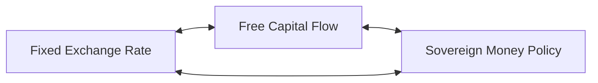

# Policies

Method to affect consumer behavior

## The Impossible Trinity

It is not possible to achieve all 3 simultaneously

## Common Types

1. Price control
2. Incentives

   1. Taxes
   2. Subsidies

      Many companies give lower prices for online booking, to reduce waiting times at queues
      this is kinda like a subsidy. eg: in global village

3. Laissez-faire (no intervention)
4. Educational intervention

   Not very effective, as just providing information to humans does not guarantee that they will act on this information. According to classical economic assumption, this is perfect; refer [Behavioral Economics](./../Behavioral_Economics)

## Government Intervention

Sometimes, govt may not be satisfied with the market outcome

great where market is *not* perfectly competitive

## Price Control

when govt believes that market price is unfair to buyers/sellers

|                        | Price Ceiling                                                | Price Floor      |
| ---------------------- | ------------------------------------------------------------ | ---------------- |
| price limit            | legal maximum                                                | legal minimum    |
| govt believes price is | high                                                         | low              |
| to protect             | buyers                                                       | sellers          |
| binding policy         | below equi price                                             | above equi price |
| effects of binding     | 1. shortage 2. non-price rationing 3. creation of black market :( 4. discrimination by sellers | surplus          |

## Price Ceiling

{ loading=lazy }

sometimes, price ceiling may be 0 for illegal transactions such as prostitution, sale of organs

### Non-price rationing

restore equilibrium through imposing limits on buying

help solve shortages

eg:

1. purchasing limit for gas cylinders
2. issue tokens
3. long wait times cause the buyers to rethink if they need to buy

### Oil Ceiling

case study

### Rent Ceiling

- in short run, it is fine
- in the long run, causes a huge shortage in houses

> “the best way to destory a city, other than bombing” 🤭

1. people pay lower rents
   1. both rich and poor tenants gain
   2. landlords lose
2. maintainence worsens
3. (more points)

### Alternative to Rent Control

Housing subsidies

effects

1. no shortage
   1. equilibrium does not change
2. helps only those in need
3. however, the problem is funding the subsidies; which ends up increasing taxes

## Price Floor

{ loading=lazy }

if the surplus is not taken care of, the sellers will be unsatisfied

1. this will cause a black market
2. and consumers will buy from there

The surplus is taken care of through non-price rationing by creating

1. artificial demand
   1. the govt purchases huge stock of agricultural produce and store in times of natural disasters
2. limitation on production quantity

eg:

- MSP for agriculture
- minimum wage
    - pro
    - child labor dec
    - income of workers inc
    - cons
    - causes unemployment
    - students drop out cuz they get tempted by the salary
    - on-job training reduces, as the companies are paying a lot, so cannot afford to waste time
    - some benefit goes to teens from rich families

### Alternative to minimum wage

wage subsidies for low earners

the funding comes from taxing the rich

but taxes de-incentives the rich, cuz they don’t like it

(i zoned out for this part 😞)

## Case Study: Sugar

US Sugar sellers faced a problem with repaying loans

govt created a artificial demand for sugar

purchased sugar at high price and sold to ethanol producers at lower price

govt faced huge losses

but helped farmers pay their loans

## Taxes

compulsory payment citizens give the govt

1. raise revenue/funds
   1. public projects, infrastucture, police
2. discourage harmful activities
   1. (like sugary items)
3. to make society less unfair and reduce income inequality

### Implementation

Taxes can be imposed on

- buyers
- sellers
- both

in all 3 cases of taxation, the money buyers pay and sellers receive is the same

Taxes = consumer payment - seller receiving

$P_b = P_s + T$

## Types of Taxes

### Direct Tax

imposed on direct income of consumers

eg: Wealth, Income Tax

### Indirect Tax

imposed on purchases/transactions

#### Specific Tax

imposed on quantity/volume of commodity

eg: 

#### Ad volrem/Sales Tax

imposed on price of commodity

eg: GST, VAT

##### VAT

Tax imposed on the added value

## Effects of Taxes

1. quantity bought and sold reduces
2. both buyers and sellers are affected adversely, regardless of who’s taxed
3. govt earns revenue
4. price that buyers pay $\ne$ the amount the sellers get

### Effects on equi

equilibrium is maintained, but the equi quantity reduces
$Q' < Q$

==geogebra==

1. Find the quantity at which
   demand-supply = tax (on the left side)
2. Find new points on the supply and demand curve

### Tax Shifting

the situation when burden of taxation is shifted from supplier to consumer, or vice-versa

## Tax Burden/Incidence

burden $\Delta P = |P' - P|$

loss for supplier = $\Delta Q \times \Delta P$

$B \propto \frac 1 {|e|}$

the relative burden depends on elasticity of supply and demand
burden is heavier on inelastic side

### Cases

| Elasticity      | Elastic | Inelastic | Who’s affected more |
| --------------- | ------- | --------- | ------------------- |
| $\vert  e_d \vert  = \vert  e_s  \vert$ | -       | -         | both equally        |
| $\vert  e_d \vert  > \vert  e_s  \vert$ | demand  | supply    | sellers             |
| $\vert  e_d \vert  < \vert  e_s  \vert$ | supply  | demand    | consumer            |

this is why basic necessities are not taxed, as

1. demand is inelastic
2. supply is elastic
3. the burden of the taxes is borne by the farmers
4. this would cause a shortage

## Case Study

in 1990, US imposed a new luxury tax, such as on yachts, with the objective of raising funds from the rich

didn’t work and repealed after a few years, because

1. demand for yachts is elastic
   1. firstly, it is a luxury good
   2. there are many substitutes and $|e| \propto n_s$
2. supply for yachts is inelastic, or atleast in the short run
3. hence, the producers felt the burden of the tax, rather than the rich consumers

## Subsidies

compulsory payment citizens receive from the govt

it is the exact opposite of tax

uses

1. help people in need
2. +ve incentive, used to encourage certain actions

Subsidies can be given to

1. buyers
2. sellers
3. both

price received by sellers = price paid by buyers + subsidies

$P_s = P_b + S$

### Effects

1. Price received by $\ne$ Price paid by buyers
2. Buyers pay less, sellers receive more
3. Govt spending and investment increases

### Effects on Equilibrium

equilibrium is maintained, but the equi quantity increases
$Q' > Q$

==Geogebra==

1. Find the quantity at which
   supply-demand = tax (on the right side)
2. Find new points on the supply and demand curve

### Benefit

depends on the elasticity

$B \propto \frac 1 {|e|}$ (same like taxes)

benefit is more for inelastic side

$B_b + B_s = S$

if both are inelastic, the benefits depends on the ratio of elasticity

- eg: For agricultural subsidies, it depends
- eg: For oil,

## Best Policies

- subsidies for basic necessities
- taxes for luxuries

## Types of Policies

| Policy        |                            | Incorporates   |
| ------------- | -------------------------- | -------------- |
| Monetary      | Central Bank               | Interest Rates |
| Fiscal policy | Ministry of Finance (Govt) | Budget, Tax    |
