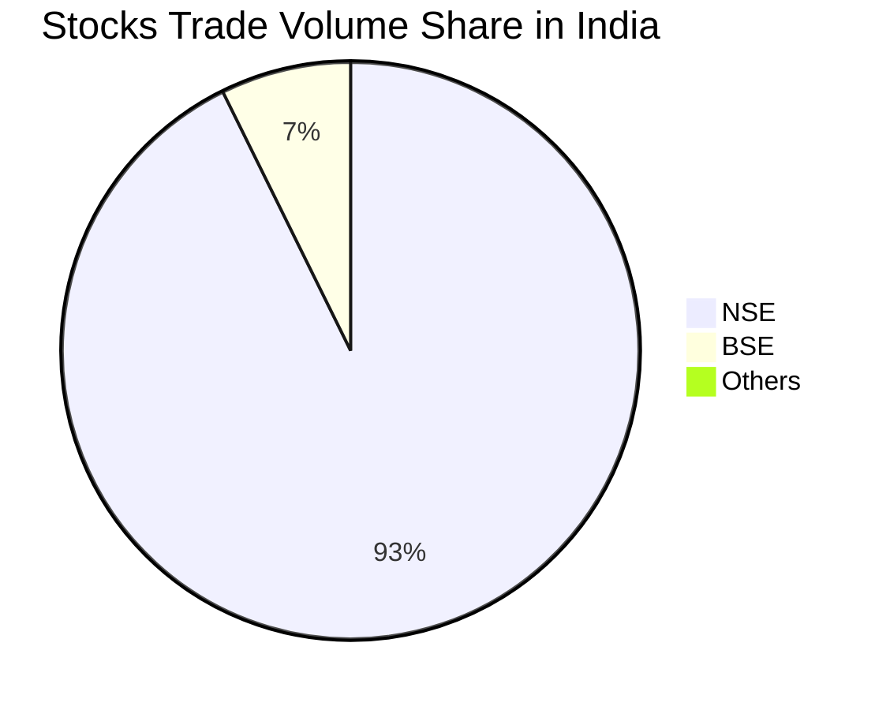
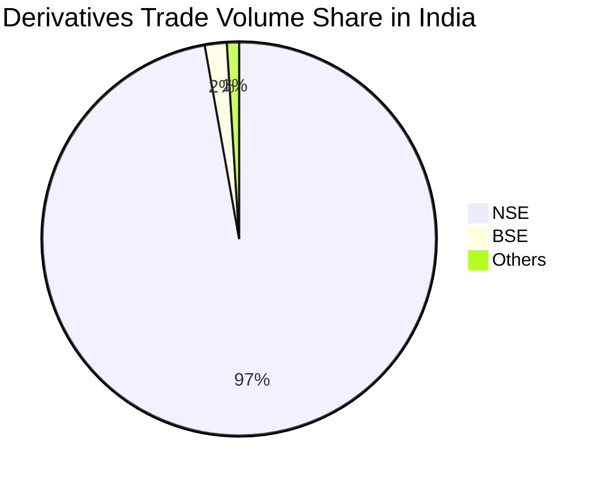
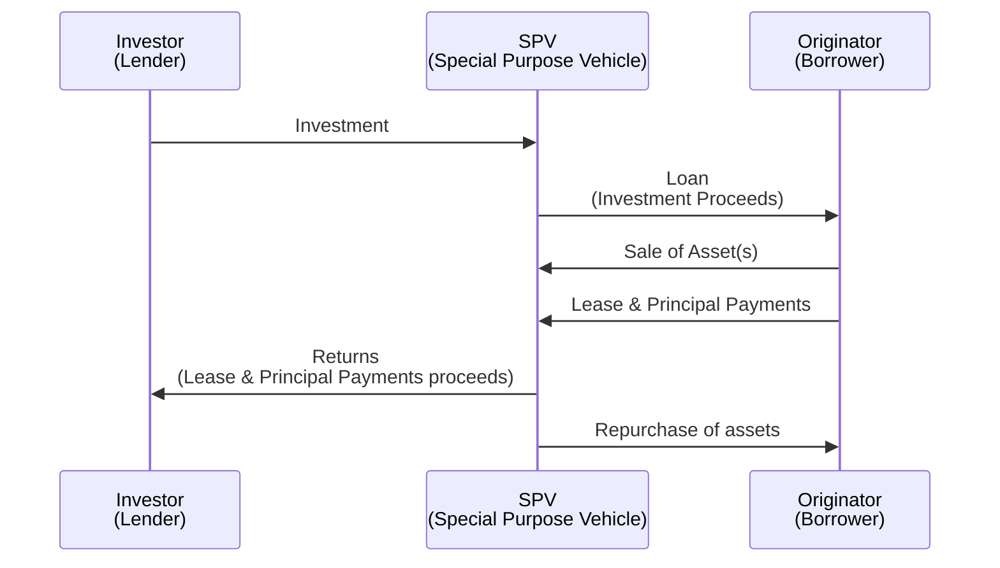

# Financial Markets

Mechanism that facilitates trade of financial securities between

- savers/investors/lenders (have money, need return)

  and

- borrowers (need money, have risks)

Zero-sum game

## Functions

- Provide liquidity (key function)

- Avoids need for coincidence of wants

- Price discovery

- Reduce total costs due to benefits of scale

- Base for capital formation

- Economic stability

- Innovation

- Helps in continuous flow of money

## Type

### Idk

|                   |      |
| ----------------- | ---- |
| Bond Market       |      |
| Stock Market      |      |
| Derivative Market |      |
| Forex Market      |      |

### Idk

|             | Money Market                                              | Capital Market|
|---          | ---                                                       | ---|
|Maturity Duration     | Short-term (< 1 yr)                               | Long-term (>= 1 yr) |
|Volume | High | Low/High |
|Regulator | Central Bank | Capital Market Regulator/SEC (except for Govt Bonds)  Central bank (for cross-border transactions) |
|Cost of capital         | Cheaper (lower risk)                               | Expensive|
|Participants | Central bank Large corporations                     | Commercial Banks Retail investors/borrowers |
|Purpose | Borrowers: Working capital Lenders: Investing temporary overage | Borrowers: Expenditure Lenders: Long-term investments |
|Comment | Interest-bearing instruments are usually zero-coupon bonds |  |
|Comment | Money doesn’t actually flow, it’s just recorded on financial statements | |

Why are bonds preferred over equity

- Retaining ownership & control
- Equity may cause noise in valuation, due to large number of players
- Tax deductibility

Call money

### Money Market Instruments

| Instrument                | Participant                                 | Comment                                                      |
| ------------------------- | ------------------------------------------- | ------------------------------------------------------------ |
| Call & Notice             | Commercial banks                            | Central bank audits every 2 weeks to check for reserves, so commercial banks take short-term loans to maintain liquidity for the inspection |
| Treasury Bill             | Central govt Exercised by Central bank | Short-term bond Helps maintain short-term liquidity     |
| Commercial bills          | 2 businesses                                | Unpaid invoice that can be traded                            |
| Commercial Paper          | 2 businesses                                | Promissory note                                              |
| Money-Market Mutual Funds | Public                                      | Synthetically-created Pool funds to take different positions in money market |
| Repo/ Reverse-Repo   | Central bank Commercial bank           | Short-term loan Re-purchase agreement                   |

### IDK

### Sources of Corporate Debt

- Sorted in order of least risky to more risky
- Also, Sorted in order of least return to highest return

| Source                                          | Duration   | Market |
| ----------------------------------------------- | ---------- | ------ |
| Treasury Bill (T-Bill)                     | Short term | Money  |
| Govt Bond                                       | Long term  |        |
| Corporate Bond (Zero Coupon) (More traded) | Long-term  |        |
| Corporate Bond (Coupon)                         | Long-term  |        |
| Commercial Paper                                | Short-term |        |
| CD (Certificate of Deposit)                     |            |        |
| Rapport                                         |            |        |

### IDK

|                      | Primary Market   | Secondary Market (Stock change) |
| -------------------- | ---------------- | ------------------------------------ |
| Investors trade with | Company directly | Each other                           |
|                      |                  |                                      |
|                      |                  |                                      |

### Primary Market

- Initial Public Offering
- Follow-up public offering

| Instrument        | Participants                                                 |                           | Requirements                                                 | Advantages                                                   | Limitations                                                  |
| ----------------- | ------------------------------------------------------------ | ------------------------- | ------------------------------------------------------------ | ------------------------------------------------------------ | ------------------------------------------------------------ |
| Public Issue      | General public                                               |                           | High transparency Prospectus (detailed document of company) Under-writer |                                                              | No filtering High costs Large number of people to convince Potential under-subscription |
| Private placement | Selected subset of new investors                             |                           |                                                              | Overcomes limitations of public issue                        |                                                              |
| Right issue       | Existing shareholders preferred Then only general public |                           |                                                              | Prefer dedicated investors                                   |                                                              |
| Bonus issue       | Existing shareholders                                        | Give instead of dividends |                                                              | Maintain share price Broadening of shares through distributing bonus shares makes it harder for Hostile Takeover |                                                              |
| Base Rate         | Central bank Commercial Bank                            |                           |                                                              |                                                              |                                                              |

### Secondary Market Instruments

Exchanges may be order-driven and quote-driven

|                     | Order-Driven   | Quote-Driven        |
| ------------------- | -------------- | ------------------- |
|                     | Direct         | Indirect            |
| Party               | Buyer & Seller | Buyer-Dealer-Seller |
| Settlement credited | $t+1$ basis    |                     |
| Advantages          |                |                     |
| Example             | NSE            | NASDAQ              |

#### Indian Stock Exchanges

- Volume of trades: 92.7%, 7.3% BSE
- Volume of trades market: 97.2% NSE, 1.8% BSE

#### International

|           | Value of Stocks (not volume)  (Trillions) |
| --------- | -------------------------------------------------------- |
| NYSE      | 26.64                                                    |
| NASDAQ    | 23.46                                                    |
| Shanghai  | 7.63                                                     |
| Euronext  | 7.33                                                     |
| Japan     | 6.79                                                     |
| Hong Kong | 6.13                                                     |
| Shenzhen  | 5.74                                                     |
| London    | 4.05                                                     |
| BSE       | 3.96                                                     |
| NSE       | 3.77                                                     |

### US Stock Market

- Stock Exchanges
  - New York Stock Exchange (Blue Chip Industrial Companies, 2800, hybrid-both broker and dealer market)
  - Nasdaq (Technology-driven Companies, 3300, totally electronic, dealer market)
- Stock Indices
  - Dow Jones Industrial Average (DJIA, Top 30 Comp from NYSE and Nasdaq, Price Weighted)
  - S&P 500 (Top 500 Comp headquartered in the US, Market Weighted)
  - Nasdaq Composite (Top 2500 Comp of Nasdaq, be it headquartered in the US or Outside, Market Weighted)
  - Russell 2000 (Small Cap Companies)

#### Advantages of US Market

- Fractional investment: Mutual funds are basically from this idea
- Selection effect: The fact that these companies are on the US stock market means they have already been successful on their local domestic market
- Geographical diversification
- US and US-listed companies tend to have global operations
- US market has outperformed other markets
- Exposure to high tech companies
- Avoid currency depreciation wrt the global principal reserve currency (which is currently US Dollars)

#### Disadvantages of US Market

- Set
- High charges
  - Bank’s fixed remittance charges
    (1500 - 2000)
  - GST
  - Exchange Rates
- High brokerage and maintenance charges
- Tax Issues (DTAA)
- STCG within 24 months: 30%
- LTCG after 24 months: 20%.

### UAE Stock Market

- Abu Dhabi Securities Exchange (ADX) (2000)
  - ADX General Index is a capitalization-weighted index which represents the performance of all the listed companies (92 securities) on the exchange (A base value of 1000 as of June 2001)
  - Regulated by the Securities and Commodities Authority (SCA)
- Dubai Financial Market (DFM) (2000)
  - Dubai Financial Market General Index (DFMGI) (119 securities)
  - Modified capitalization-weighted index (maximum capitalization cap of 20%)
- NASDAQ Dubai (2005)
  - Middle East's international financial exchange (70 securities)
  - Dubai Financial Market holds two-thirds and Borse Dubai holds one-third of the shares in NASDAQ Dubai
  - Regulated by Dubai Financial Services Authority (DFSA)

## Sukuk

"sharia compliant" bonds

Sukuk is an Islamic instrument that provides the same commercial equivalent to a conventional bond, the difference being that it is structured in a sharia compliant manner and represents proportionate undivided ownership in the underlying asset or investment.

## Trading Platforms

- IND
- Money
- Vested
- Groww
- Stockal
- Winvesta

## Capital Market Participants

|                                          | Meaning                                                      | Ownership in India | Daily Trading Volume in India | Daily Trading Volume in Developed Countries |
| ---------------------------------------- | ------------------------------------------------------------ | ------------------ | ----------------------------- | ------------------------------------------- |
| Retail Investors                         | Individuals                                                  | 18%                | 42-45%                        | 18-20%                                      |
| Mutual Funds                             |                                                              |                    |                               |                                             |
| Institutional Investors                  | Professional institutions whose career are investing (such as Investment Banks) Corporates that invest (Shark Tank) |                    |                               |                                             |
| FIIs (Foreign Institution Investor) |                                                              |                    |                               |                                             |
| Hedge Funds                              |                                                              |                    |                               |                                             |

### Retail investment in Developed nations > in India, but trade volume is lower

Indian stocks have lower return than risk-free returns, so Indian retail investors actually incur losses. India is still a developing country, and hence stock investing is being popular.

In developed nations, they prefer investing **indirectly** through mutual funds.

## Participant Objectives

|              | Run Duration | Focus                                    | Look for            |
| ------------ | ------------ | ---------------------------------------- | ------------------- |
| Investors    | Long         | Business Value Capital appreciation | Under-Valued stocks |
| Speculators  | Short        | Volatility                               |                     |
| Arbitrageurs |              |                                          | Mis-pricing         |

Arbitrage is the ‘invisible hand of market’ that corrects the 

## Bond Market

|                                            |                   |
| ------------------------------------------ | ----------------- |
| G-Secs Market                              | Maturity: 1-30yrs |
| PSU Market Public Sector Undertakings |                   |
| State Govt/Municipal Bonds                 |                   |
| Corporate Debentures/Bonds                 |                   |

Terms of the bond are called as ‘bond indenture’

Thinking point: The share of corporate bonds in India in bond market is very low compared to other countries.

## Indian Stock Markets

|                                    | Index  |
| ---------------------------------- | ------ |
| BSE (Bombay Stock Exchange)   | Sensex |
| NSE (National Stock Exchange) | Nifty  |

LPG: Liberalization, Privatization, Globalized

## Ponzi Schemes

Financial schemes 

## Why are US markets & institutions the best

- Entrepreneurial ambitions; no societal discouraging like in India
- Supportive financial system, such as supportive [IBC](#IBC)

## IBC

IBC: Insolvency & Bankruptcy Code

Defines the liberty for corporates

If a company is insolvent and you are not able to repay loans, within a period of 90 days, the lenders can request for the company’s liquidation.

## Stock Market Indices

| Types                 | Preferred for       | Limitations                                     |
| --------------------- | ------------------- | ----------------------------------------------- |
| Market Value-Weighted | Company Performance |                                                 |
| Price-Weighted        | Price Performance   | Can be manipulated by changing number of stocks |

### Indian

|            | Number | Characteristic                          |
| ---------- | ------ | --------------------------------------- |
| BSE Sensex | 30     | Largest and most-actively traded stocks |
| NSE Nifty  | 50     | Largest and most liquid                 |

Both are Market Value-Weighted

### Trading Schedules

|             |                     |
| ----------- | ------------------- |
| 09:00-09:08 | Request Bulk Trades |
| 09:08-09:12 | Clear Bulk Trades   |
| 09:12-09:15 | Buffer              |
| 09:15-15:30 | Trading Session     |

### Transaction Process

- Trading
- Post Trading Activities: Clearing & Settlement

Agencies

|                                                         |      |
| ------------------------------------------------------- | ---- |
| NSCCL National Securities Clearing Corporation Ltd | NSE  |
| ICCL Indian Clearing Corporation Ltd               | BSE  |

## Orders

|        |      |
| ------ | ---- |
| Bids   | Buy  |
| Offers | Sell |

### Order Types

|               |                                                              |
| ------------- | ------------------------------------------------------------ |
| Limit Orders  | Specifies price - Sell Limit Order - Buy Limit Order |
| Market Orders | Does not specify price                                       |
| Stop Orders   | - Sell–stop order - Buy–stop order                       |

## Depository

- Demat Account
- Depository Services
  - NSDL: National Securities
    Depository Ltd
  - CDSL: Central Depository Services
    (India) Ltd

## Bear vs Bull

|                        | Bull     | Bear    |
| ---------------------- | -------- | ------- |
| Stock prices are       | rising   | falling |
| Market Momentum Effect | Stronger | Weaker  |

> The origin of these expressions is unclear, but one reason could be that bulls attack by bringing their horns upward, while bears attack by swiping their paws downward

## Broker vs Dealer Market

|                        | Dealer (Over-the-counter)                               | Broker                                          | Exchanges                                                    |
| ---------------------- | ------------------------------------------------------------ | ----------------------------------------------- | ------------------------------------------------------------ |
|                        | Counterparty for both buyers and sellers                     | Finds a counterparty to both buyers and sellers | Most automated                                               |
|                        | Dealer sets bid and asks prices for the security in question, and will trade with any investor willing to accept those prices |                                                 | The advantage of the exchange is the provision of a central location for buyers and sellers to find their own counterparties |
| Intermediary Ownership | ✅                                                            | ❌                                               |                                                              |
| Intermediary Risk      | ✅                                                            | ❌                                               |                                                              |
| Barriers to entry      | High                                                         | Low                                             |                                                              |
|                        | dealer provides liquidity in the market at the cost of a small premium |                                                 |                                                              |
|                        | often set bid prices lower than the market and ask prices higher |                                                 |                                                              |

## IDK

|                   |                                                              | Example   |
| ----------------- | ------------------------------------------------------------ | --------- |
| Adverse Selection | Sub-optimal selection of borrower by lenders, which may lead to default |           |
| Moral Hazard      | Incurred                                                     | Satyam IT |
| Debt collections? |                                                              |           |

## Financial Year

Why does financial year in India start in April: This is to follow the agricultural cycles
