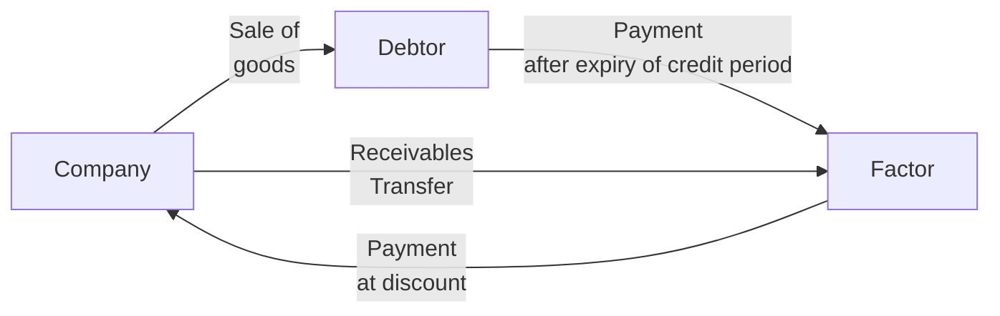

# Financial Service

The process of holding shares in electronically is Dematerialisation

## Factoring

Service for a business redeem its accounts receivable from a 3rd party at a discount, to improve current liquidity

### Types

|                         | Risk Bearer |
| ----------------------- | ----------- |
| Full-Recourse Factoring | Company     |
| Non-Recourse Factoring  | Factor      |

## Foreign Exchange Services

- Currency exchange
- Wire transfer
- Remittance
