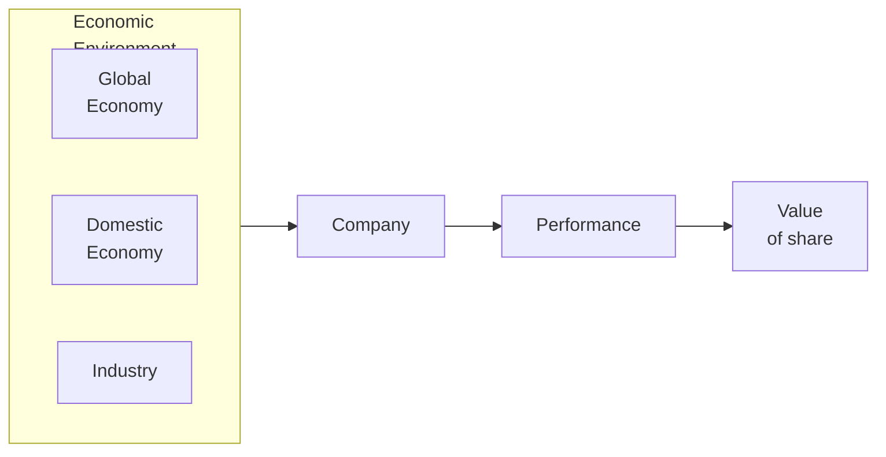

# Fundamental Analysis

Examines various factors affecting supply and demand conditions, thereby influencing future income from and value of an investment

Studies fundamental factors that determine earnings and risks associated with a share

Suitable for

- Long-term investing: value of share that should prevail in capital market
- Determining intrinsic worth of share
- Explaining price-behavior of shares in terms of underlying fundamental factors

## Why invest in assets with low P/E ratio?

- Store of value
- Expected future earnings

## GEIC Model

- **G**lobal economy
- Domestic **e**conomy
- **I**ndustry
- **C**ompany

## Global Economy

- Prospects for Exports
- Price competition
- Cost of foreign inputs
- Profits through foreign investments
- Exchange rate fluctuations
- Risk of changing political environment in world
- Increasing/decreasing peace in international scenario

Stronger globalization and international collaboration, higher the importance of monitoring global economy. Eg: sub-prime crisis

## Economy

Shocks: Change in macro-economic vars provide a force that goes against inertia inherent in the performance of firms, and hence the share prices

Types of shocks

- Supply
- Demand
- Financial market

### PEST

| Dimension     | Factors                                                      |
| ------------- | ------------------------------------------------------------ |
| Political     | Political stability Tax Policy Employment laws Environment regulations Trade restrictions & tariffs |
| Economic      | Economic growth Interest rates Exchange rates Inflation rate Unemployment |
| Social        | Health consciousness Population growth rate Age distribution Career attitudes Emphasis on safety Cultural dimensions of society |
| Technological | R&D Activity Automation Technological incentives Rate of technological change |

### SWOT

Strengths, Weaknesses, Opportunities, Threats

## Industry

An industry is set of companies that serves a particular niche of consumers

### Industry Phase

Identify which phase of the life cycle the industry belongs to

| Phase                   |                                                 |
| ----------------------- | ----------------------------------------------- |
| Pioneering              | Trial phase Potential to be commercialized |
| Expansion               | Starting to be commercialized                   |
| Stabilized/ Mature | Fully commercialized                            |
| Decay                   | Being abandoned                                 |

### Structural Analysis

Intensity of competition among firms in the same industry determines its profitability

Michael Porter’s Model: Rivalry among existing competitors depends on

- Threat of entry: New supplier
- Threat of substitution: New industry
- Bargaining powers of consumers
- Bargaining powers of suppliers

## Company

- Quantitative: Financial
- Qualitative: Non-Financial
  - Quality of mgmt
  - Product portfolio/range
  - Collaborations
  - Shareholders pattern and listing
  - R&D, Innovation
  - Diversification
  - Does this company fall under strict Govt regulations
  - Disputes & contingent liabilities
  - Availability of inputs
  - Industrial relations

## Equity Valuation

[07_Equity_Valuation.md](../Corporate_Finance/07_Equity_Valuation.md) 

Check if stock is under-valued/over-valued

## Ratios

### P/E Ratio 

Price that market is willing to pay for one unit of earning

Lower is better; extreme P/E ratios are not desirable

Provides a benchmark in determining the value of a share and hence the value of shareholders

There is a strong connection between P/E, dividend discount models, and fundamentals
$$
\begin{aligned}
\text{P/E}
&= \dfrac{P_\text{Dividend Growth Model}}{\text{Earnings}} \\
&= \dfrac{1}{\text{Earnings}} \times \dfrac{D_{t+1}}{k-g} \\
&= \dfrac{1}{\text{Earnings}} \times \dfrac{D_t (1+g)}{k-g} \\
&= \dfrac{D_t}{\text{Earnings}} \times \dfrac{1+g}{k-g} \\
&= \text{Dividend Payout Ratio} \times \dfrac{1+g}{k-g} 
\end{aligned}
$$

How to determine if P/E ratio is good

- Company growth rate
  - How fast has company been growing in the past?
  - Are these rates expected to increase in the future
- Industry

### PEG Ratio

Good way to decide if P/E ratio of company is high/low
$$
\text{PEG} = \dfrac{\text{P/E}}{\text{Earnings Growth}}
$$

| PEG Ratio        | Interpretation | Action            |
| ---------------- | -------------- | ----------------- |
| $(0, 0.50)$      | Undervalued    | Buy               |
| $[0.50, 0.65)$   |                | Consider buying   |
| $[0.65, 1.00)$   |                | Watch/Hold        |
| $[1.00, 1.30)$   |                | Consider selling  |
| $[1.30, 1.70)$   |                | Consider shorting |
| $[1.70, \infty)$ | Overvalued     | Short             |

## Preferred Values

|                 | Preferred |
| --------------- | --------- |
| PV of dividends | High      |
| P/E             | Low       |
| P/Dividends     | Low       |
| P/Book Value    | Low       |
| P/Sales         | Low       |
| PEG             | Low       |
| Capitalization  | Low       |

