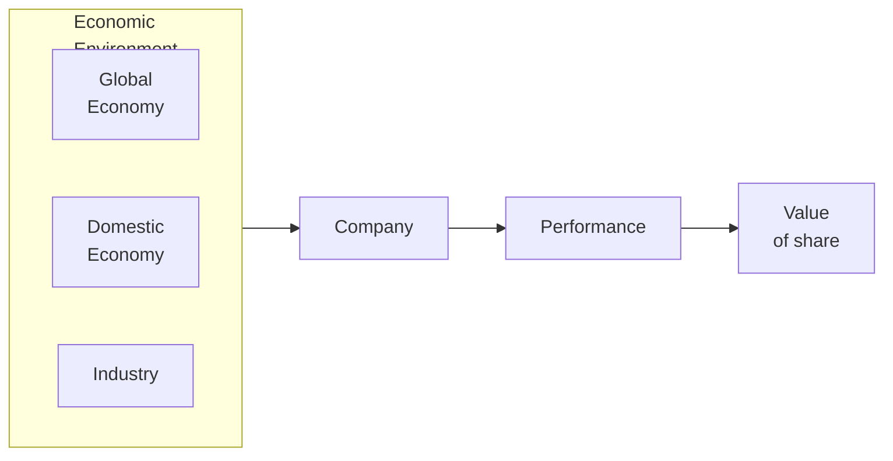

# Fundamental Analysis

Examines various factors affecting supply and demand conditions, thereby influencing future income from and value of an investment

Studies fundamental factors that determine earnings and risks associated with a share

Suitable for

- Long-term investing: value of share that should prevail in capital market
- Determining intrinsic worth of share
- Explaining price-behavior of shares in terms of underlying fundamental factors

## Why invest in assets with low P/E ratio?

- Store of value
- Expected future earnings

## GEIC Model

- **G**lobal economy
- Domestic **e**conomy
- **I**ndustry
- **C**ompany

## Global Economy

- Prospects for Exports
- Price competition
- Cost of foreign inputs
- Profits through foreign investments
- Exchange rate fluctuations
- Risk of changing political environment in world
- Increasing/decreasing peace in international scenario

Stronger globalization and international collaboration, higher the importance of monitoring global economy. Eg: sub-prime crisis

## Economy

Shocks: Change in macro-economic vars provide a force that goes against inertia inherent in the performance of firms, and hence the share prices

Types of shocks

- Supply
- Demand
- Financial market

### PEST

| Dimension     | Factors                                                      |
| ------------- | ------------------------------------------------------------ |
| Political     | Political stability Tax Policy Employment laws Environment regulations Trade restrictions & tariffs |
| Economic      | Economic growth Interest rates Exchange rates Inflation rate Unemployment |
| Social        | Health consciousness Population growth rate Age distribution Career attitudes Emphasis on safety Cultural dimensions of society |
| Technological | R&D Activity Automation Technological incentives Rate of technological change |

### SWOT

Strengths, Weaknesses, Opportunities, Threats

## Industry

An industry is set of companies that serves a particular niche of consumers

### Industry Phase

Identify which phase of the life cycle the industry belongs to

| Phase      |                                                 |
| ---------- | ----------------------------------------------- |
| Pioneering | Trial phase Potential to be commercialized |
| Expansion  | Starting to be commercialized                   |
| Stabilized | Fully commercialized                            |
| Decay      | Being abandoned                                 |

- Pioneering
- Expansion
- Stabilization/Maturation
- Decay

### Structural Analysis

Intensity of competition among firms in the same industry determines its profitability

Michael Porter’s Model: Rivalry among existing competitors depends on

- Threat of entry: New supplier
- Threat of substitution: New industry
- Bargaining powers of consumers
- Bargaining powers of suppliers

## Company

- Quantitative: Financial
- Qualitative: Non-Financial
  - Quality of mgmt
  - Product portfolio/range
  - Collaborations
  - Shareholders pattern and listing
  - R&D, Innovation
  - Diversification
  - Does this company fall under strict Govt regulations
  - Disputes & contingent liabilities
  - Availability of inputs
