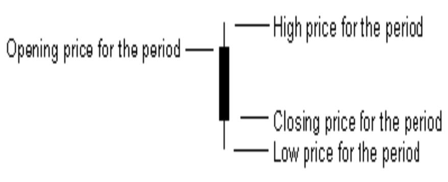
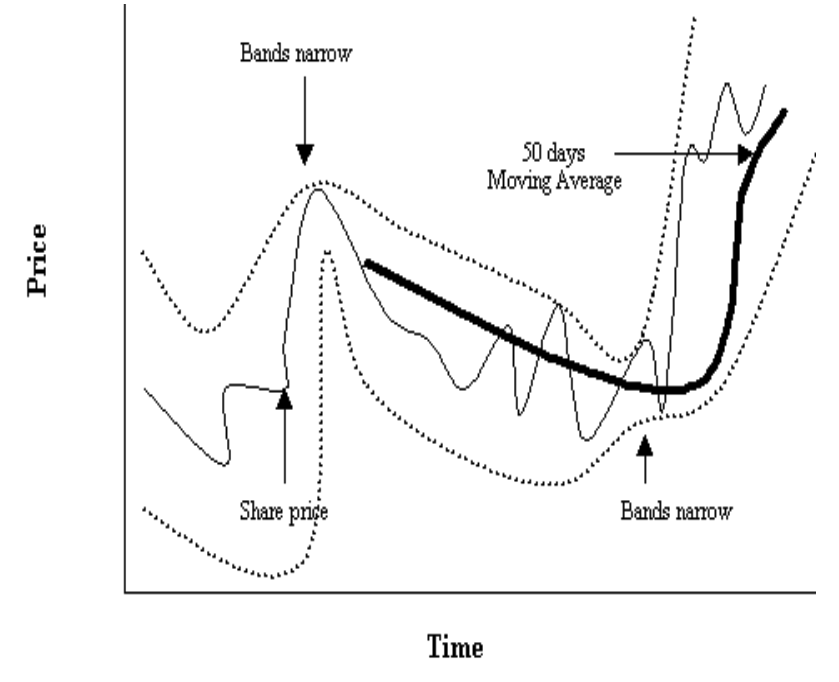
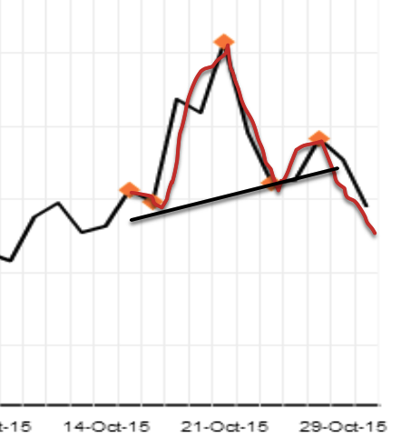
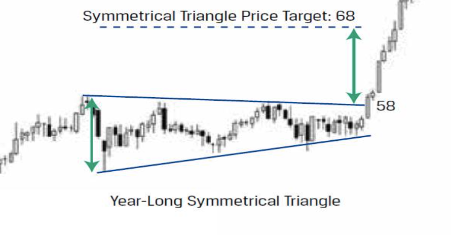
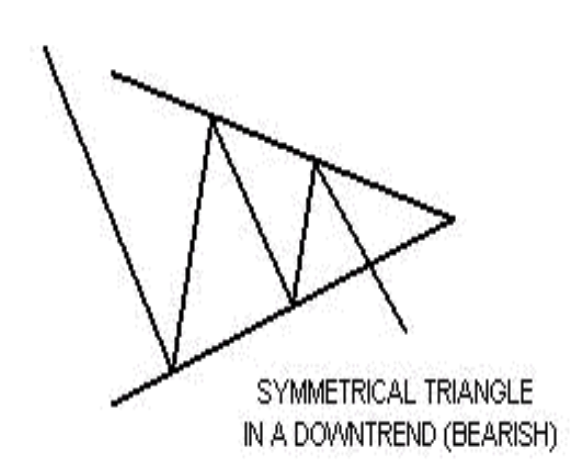
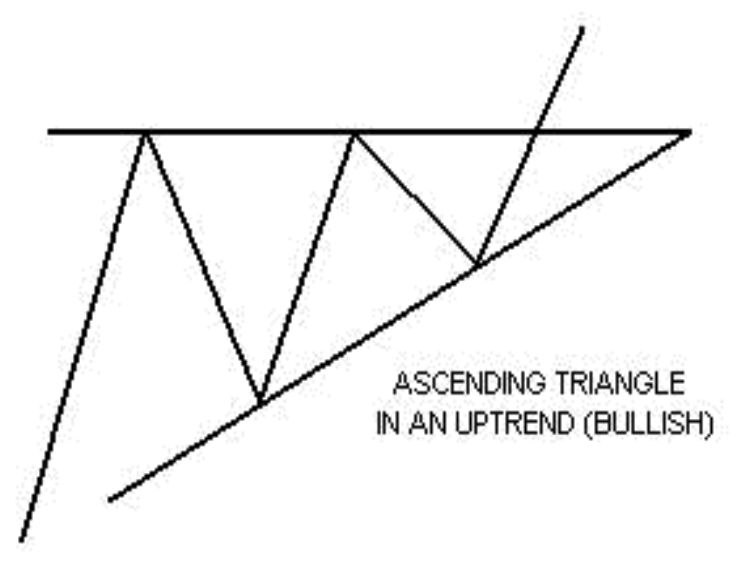
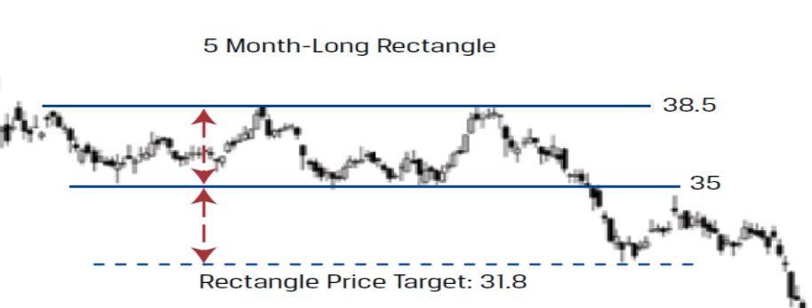
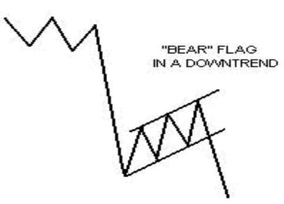
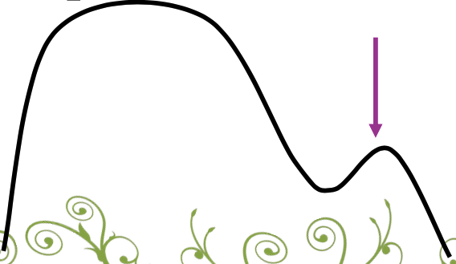

# Technical Analysis

1. Identify trend changes at early stage through predicting stock price patterns, using historical data (volume/price)
2. Identify when to buy/sell
3. Maintain investment position until evidence indicates that trend has reversed

## Notes

1. Probabilistic modelling; always uncertain, never deterministic
2. Continued success is dependent on keeping successful strategies known only to a few

## Premises

Market action determines everything

1. Everything will continue in state of rest/uniform motion unless compelled by external force
2. Market price is solely dependent on forces of demand and supply
3. Prices have a tendency to move in trends that persist for appreciable duration
4. Reversals of trends are caused by shifts in demand & supply
   1. There is a time gap b/w technicians perceiving a change and when investors assesses the change

## Tools

- Typical
  - Variables
    - Price
    - Volume
    - Rate of change
  - Charts & graphs
    - Line charts
      - Linear scale
      - Log scale
    - Bar charts: OHLC - Open High Low Close
    - Candle chart: 
    - Point & figure chart
- Dow Theory Measures
  - Moving averages
  - Momentum and oscillators
  - Breadth
- Market indicators
  - Investors’ sentiments
  - Contrary opinion
  - Professional investors’ behavior
  - Economic indicators

## Typical

|                   |                                                              |                                                              |
| ----------------- | ------------------------------------------------------------ | ------------------------------------------------------------ |
| OHLC              |                                                              |  |
| Candlestick chart | Candle color: Red/black: close>open Green/Blue: close>open |  |

## Dow Theory

Assumes that most shares follow the trend of the market most of the time

It intends to show the general trend/direction of the market as a whole and does not predict the direction of change in a particular security

In order to measure the “market”, two indices are used

- Industrial average: combination of blue-chip shares from industry
- Transportation average: shares of transport companies
  - To reinforce the conclusions obtained from Industrial Average

### Trends

|     | Primary                                                                                                            | Secondary                                                        | Tertiary|
|---       | ---                                                                                                                | ---                                                              | ---|
|          | Overall trend - Business cycles - Intrinsic value | Reactions that interrupt the progress of prices in primary trend  May give wrong signals & confuse market | Random movements Building blocks to secondary trends |
|Duration  | Few years                                                                                                          | Few months                                                       | Day-to-day |
|Direction | - bullish: upward - bearish: downward                                                                          | Opposing primary trend: Technical reaction - Technical corrections: upward -> downward - Technical rally: downward -> upward | |
| Concerns | Long-term investors | Weak holders Traders | High-frequency traders |

### Principle of Confirmation

Whatever trends emerge in Industrial average must be confirmed by Transportation average

If trends in share prices are contradictory to industrial production/transportation of goods, then one should not design a trading strategy in shares and must wait until one gets confirmation of trends

### Price-Volume

Volume is the ‘fuel’ to move prices

Usually, $\text{Volume} \propto \text{Price}$ , ie volume

- contracts on decline
- expands on rallies/advances

If it is against this normal relationship, it is an indicator of an upcoming trend reversal. However, it should only be used as background information, since the actual reversals would be signaled by averages

### Price Actions

Price actions determine the trend

- Bullish indications: successive rallies penetrate peaks while the trough of an intervening decline is above the preceding trough
- Bearish indications: series of declining peaks and troughs

## Averages

[Time Series Filters](../Econometrics/15_Time_Series_Filters.md) 

Usually uses the closing prices

Convention is to use 2 averages

- Slower average: larger window
- Faster average: smaller window

Notes

- Normally, an average moves along with a trend; but a reversal in trend may be captured by a crossover of 2 averages

- Signals to buy/sell are generated when the

  - price crosses the moving average

    or

  - one MA crosses the another

- Doubtful about this

  - Buy
    - price > moving average
    - Faster average > Slower average
  - Sell
    - price < moving average
    - Faster average < Slower average

- MA is a lagging indicator –> crossover will usually signal a trend reversal well after new trend has begin and is used mainly for confirmation

### Trend Channels

Trends have to be bounded

-  Trend channels
  - When prices trend between 2 parallel lines, this is referred to a channel
    - It is created by drawing 2 parallel lines
      - Line 1: Basic/main trendline
      - Line 2: Return/channel line

Use-case

- Represents area of support/resistance depending on direction of underlying trend
- Helps identify potential trend acceleration/reversal

|         |                                                              |
| ------- | ------------------------------------------------------------ |
| Bullish |  |
| Bearish |  |

### Envelops

2 symmetrical parallel lines to moving average

This is based on principle that prices fluctuate around a given trend in cyclical movements

Envelops consist of points of maximum and minimum divergence from some moving average

### Bollinger Bands

- Middle line: $\text{MA(close, $w$)}$
- Upper band: $\text{MA} + z_{\alpha/2} * \sigma (\text{close}, w)$
- Lower band: $\text{MA} - z_{\alpha/2} * \sigma (\text{close}, w)$

Whenever bands narrow, a change in trend occurs: Whenever bands narrow, they have been stable for a while and it is followed by movement which is more volatile and in opposite direction

## Patterns

### Psychological barriers

Support & resistance levels

- Bargain hunters “support” the lower level upwards
- Profit takers “resist” the upper level downwards

- Breakout: prices go outside the support/resistance level
- Pullback: prices return within support/resistance level

### Patterns

| Pattern                   | Trend     | Signal                  |                                                              |                                                              |
| ------------------------- | --------- | ----------------------- | ------------------------------------------------------------ | ------------------------------------------------------------ |
| Head & Shoulders          | Uptrend   | Bearish (reversal) |  |  |
| Inverted head & shoulders | Downtrend | Bullish (reversal) |                     |  |
| Symmetric triangle        | Uptrend   | Bullish                 |  |  |
| Symmetric triangle        | Downtrend | Bearish                 |  |                                                              |
| Ascending triangle        | Uptrend   | Bullish                 |  |  |
| Rectangle                 | Uptrend   | Bullish                 |  |  |
| Rectangle                 | Downtrend | Bearish                 |  |  |
| Flag                      | Uptrend   | Bullish                 |  |                                                              |
| Flag                      | Downtrend | Bearish                 |  |                                                              |
| Pennant                   | Uptrend   | Bullish                 |  |                                                              |
| Pennant                   | Downtrend | Bearish                 |  |                                                              |
| Cup & Handle              |           | Bullish                 |  |                                                              |
| Inverted Cup & Handle     |           | Bearish                 |  |                                                              |

## Momentum/Oscillator

Measures the velocity of price move

|                                                  | Indicates                                                    | Formula                                                      |                                                              |
| ------------------------------------------------ | ------------------------------------------------------------ | ------------------------------------------------------------ | ------------------------------------------------------------ |
| MACD Moving Averages Convergence Divergence | Trend-Deviation                                              | $\dfrac{\text{Faster EMA}}{\text{Slower EMA}}$ or $\text{Faster EMA} - \text{Slower EMA}$ |                                                              |
| Signal                                           | EMA of MACD                                                  |                                                              |                                                              |
| RSI Relative Strength Index                 | Buying/selling ratio  $\text{RSI} > 0.70 \implies$ Overbought $\text{RSI} < 0.30 \implies$ Oversold | $\dfrac{\text{RS}}{1+\text{RS}}$ $\text{RS} = \dfrac{\text{Avg(gains)}_w}{\text{Avg(losses)}_w}$ where $w=$ window size |  |

