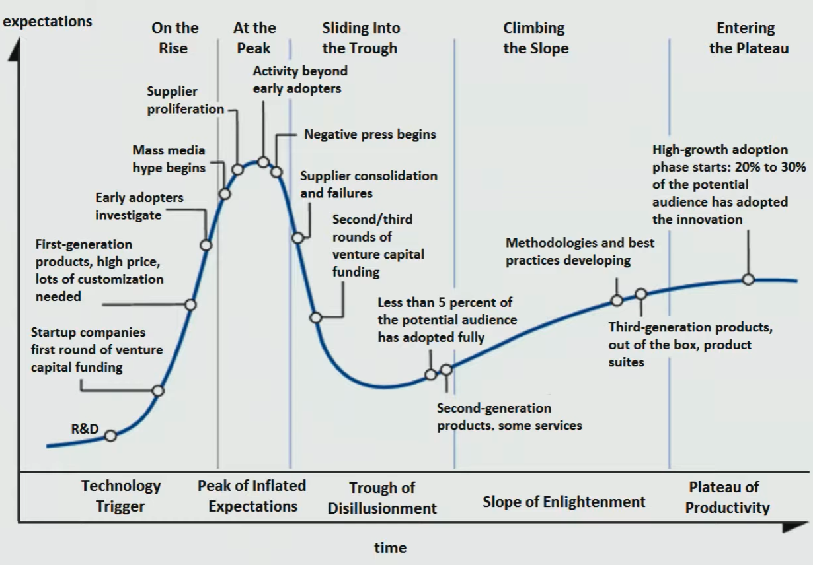

# General

## General Notes

- [ ] Never directly trust anything you read; always do the derivations & test everything for yourself
- [ ] [How to read a paper](https://cseweb.ucsd.edu/~dstefan/cse227-spring19/papers/keshav:how.pdf)
- [ ] Always be prepared; new opportunities may arise any time
- [ ] Always be eager to continuously learn & explore
- [ ] Be wary about the [Hype Cycle](#hype-cycle)

## Hype Cycle

Technology adoption cycle

Venture Capitalists know that 9/10 investments fail, but expect at least 1/10 makes enough money to compensate for the others

## General Tasks involved in Job Roles

[O*Net](https://www.onetonline.org/)