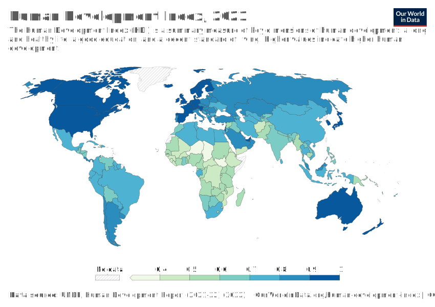

# Human Development Index Model

- Argues for holistic development
- Capability approach

Freedom 

Economic growth should only be a means and not an end goal

Focus on individual development, rather than market development

- Health
- Education
- Standard of living

State should be a integral part of the system

## HDI

Human Development Index

| Dimension          | Indicator                        | Min  | Max  |
| ------------------ | -------------------------------- | ---- | ---- |
| Health             | Life expectancy at birth         |      |      |
| Education          | Expected years of schooling      | 15   |      |
|                    | Average years of schooling       | 15   |      |
| Standard of living | Gross National Income per capita |      |      |

### Encourages

- Capability
  - Beings: Conscience
- Productivity
- Empowerment

### Significance

- Helps control population
- Increase efficiency
- Other resources are better utilized
- Society becomes healthy and safe
- Conservation of environment

### IDk

## Welfare States

- Financial services
- Social services
- Non-cash benefits

Modern welfare states: France, Finland, Belgium, Netherlands

## IDK

- Military expenditure
  - Vicious cycle of offensive and defensive
- Govts don’t keep education as a point in their agenda
- Life expectancy: Mental health is often forgotten 
- Electricity consumption as an indicator of development is not ideal, as governments will be incentivized to increase consumption and hence increase CO2
- Creating more awareness about smoking

## Case Studies

## Bihar Sithamali

Open Defecation: Gives a chance to interact with each other

## Kerala Development Model

### Advantages

### Disadvantages

- Agricultural stagnation
- Industrial stagnation
- Power deficiency
- Lack of good infrastructure
- Private sector declining
- Rising local unemployment in the state
- Poor investment in climate (2018, 2019, 2020 Floods)
- Headland workers: Harthal and Bandh

## IDK

- Remove table
- 3rd person: This paper highlights/attempts
  - 1st person may cause bias
  - Future/present-perfect study
    - Will analyze
    - analyzes

## Drawbacks

Measurement

- Civil war
- We are not considering other external factors such as
  - Invasion
  - Natural disasters

## Steps

- Objective
- Measurement
- Outcome