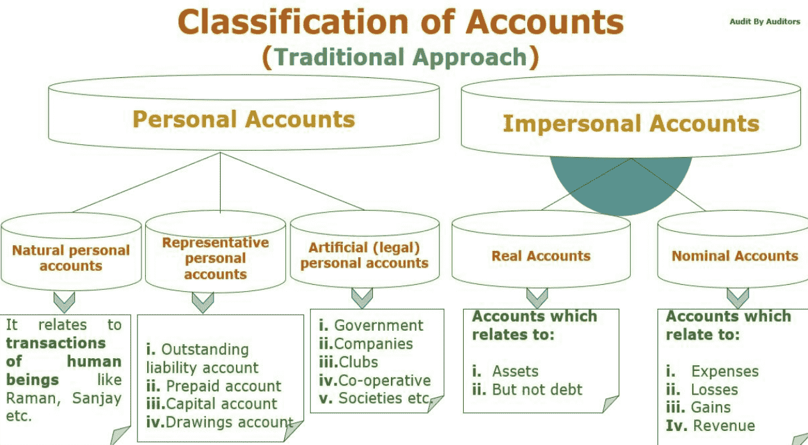
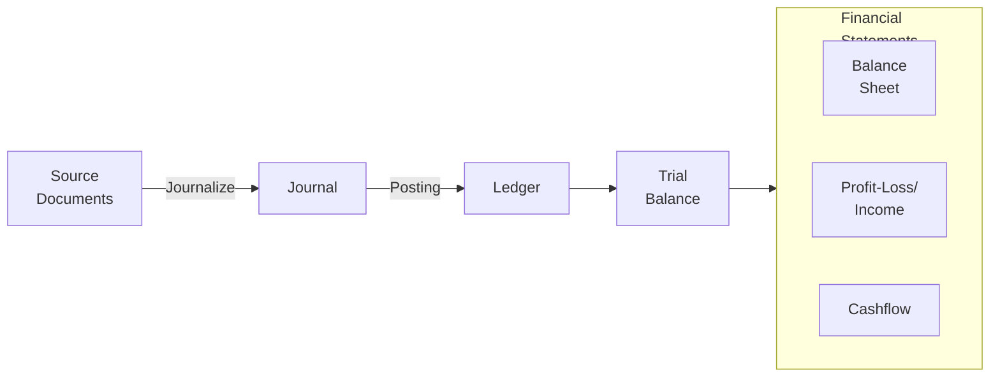

## Types of Accounts

| Account  | Debit             | Credit         |
| -------- | ----------------- | -------------- |
| Personal | Receiver          | Giver          |
| Real     | What comes in     | What goes out  |
| Nominal  | Expenses & Losses | Income & Gains |

## Accounting Equation

|           | Assets + Expenses | Liabilities + Equity + Revenue |
| :-------: | :---------------: | :----------------------------: |
| Increases |        Dr.        |              Cr.               |
| Decreases |        Cr.        |              Dr.               |

## Accounting Cycle

## Journal

Record of transactions, regardless of income, expenses, etc

| Date       | Particulars                      | Debit(Dhs) | Credit(Dhs) |
| ---------- | -------------------------------- | -------- | --------- |
| 2022-01-01 | Cash A/C Dr.                     | 20,000   |           |
|            | To Capital A/C                   |          | 20,000    |
|            | (Being commencement of business) |          |           |

To means: ==Debitor(Dr.) is **indebted** to Creditor(Cr.)==

### Purpose

- provides permanent record
- provides information of debit and credit in an entry and an explanation
- reduces the possibility of error as both aspects of a business transaction are written side by side

### Compound Journal Entries

| Date       | Particulars                | Debit (Dhs)| Credit(Dhs) |
| ---------- | -------------------------- | -------- | --------- |
| 2022-01-01 | Cash A/C Dr.               | 20,000   |           |
|            | To Electricity Company     |          | 10,000    |
|            | To Water Company           |          | 10,000    |
|            | (Expenditure on Utilities) |          |           |

==Transactions involving Discount A/C are always compound journal entries==

## Ledger

Summary statement of all the transactions relating to a person, asset, expense or income which have taken place during a given period of time and shows their net effect

- Debit side = Receipts side
- Credit side = Payment side

It is in a ‘T’ form

| Dr         |                 |            | < Account Name > |            | Cr.             |            |
| ---------- | --------------- | ---------: | ---------------- | ---------- | --------------- | ---------: |
| **Date**   | **Particulars** | **Amount** |                  | **Date**   | **Particulars** | **Amount** |
| 2022-01-01 | To Credit A/C   |            |                  | 2022-01-01 | By Debit A/C    |            |
|            |                 |            |                  |            |                 |            |
|            | Total           |        $d$ |                  |            | Total           |        $c$ |

## Overage Balance

Overage = surplus of debit/credit

| Symbol | Meaning      |
| ------ | ------------ |
| C/D    | Carried Down |
| B/D    | Brought Down |

| Case  | Dr             | Cr             |
| ----- | -------------- | -------------- |
| $d>c$ | To Balance B/D | By Balance C/D |
| $d<c$ | To Balance C/D | By Balance B/D |

## Trial Balance

List of **overages** of the ledger accounts at a particular point of time

The selected side (debit/credit) is the one having the amount brought down to next period.

If everything is right, the trial balance should result in

$$
\sum \text{Debit Overages} = \sum \text{Credit Overages}
$$

| S. No | Name of A/C | Debit (Dhs) | Credit (Dhs) |
| ----- | ----------- | ----------- | ------------ |
|       |             | $a$         |              |
|       |             |             | $b$          |
|       | Total       | $k$         | $k$          |

