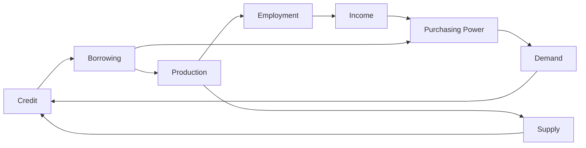

# Interest Rate

| Entity    | Interpretation of Interest Rat                                 |
| --------- | -------------------------------------------------------------- |
| Lender    | Income from fixed-income securities                            |
| Borrower  | Cost of borrowing                                              |
| Economist | Base/Repo rate at which central banks lend to commercial banks |
| Misc      | Discount Rate/Compounding Rate/Hurdle Rate                     |

## Factors that affect interest Rate

- Inflation
- Time
- Risk

## Interest-Based Instruments

- Simple loan
- Fully amortized loan: Fixed payment loan
- Coupon bond
- Discount bond: Zero-Coupon Bond

### YTM

Yield Till Maturity

- Coupon
- Capital Gains
- Reinvestment income

Opportunity of 

### TVM

Time Value of Money

## Determinants

Supply and change in bond market

### Change in equilibrium

- Change in Price of bond: Movements along a demand/supply curve
- Change due to other factors: Shifts in a demand/supply curve

#### Shift in Demand

| Increase in                                              | Shift in Demand Curve | Bond Price | Interest Rate |
| -------------------------------------------------------- | --------------------- | ---------- | ------------- |
| Wealth/Purchasing Power                                  | Right                 | Inc        | Dec           |
| Expected returns on bonds relative to alternative assets | Right                 | Inc        | Dec           |
| Risk of bonds relative to alternative assets             | Left                  | Dec        | Inc           |
| Liquidity of bonds relative to alternative assets        | Right                 | Inc        | Dec           |
| Expected Inflation                                       | Left                  | Dec        | Inc           |

####  Shift in Supply

| Increase in                                       | Shift in Supply Curve                            | Bond Price | Interest Rate |
| ------------------------------------------------- | ------------------------------------------------ | ---------- | ------------- |
| Wealth                                            | Left                                             | Inc        | Dec           |
| Profitability of project for which funds required | Right (Higher cost of capital is tolerated) | Dec        | Inc           |
| Expected Inflation                                | Right                                            | Dec        | Inc           |
| Govt Budget                                       |                                                  |            |               |

### Fisher Effect

$$
r = i - \pi_e
$$

- $r =$ Real Interest Rate
- $i=$ Nominal interest rate
- $\pi_e =$ Expected inflation rate

## Structure of Interest

|                | Interest rate of                   |
| -------------- | ---------------------------------- |
| Risk Structure | Different bonds at same time point |
| Term Structure | Same bond over time                |

### Risk Structure

| Risk Type            |             | Shift in Demand Curve | Bond Price | Interest Rate of Bond |
| -------------------- | ----------- | --------------------- | ---------- | --------------------- |
| Default Risk         | Bond Rating | Left                  | Dec        | Inc                   |
| Liquidity            |             | Right                 | Inc        | Dec                   |
| Income tax exemption |             | Right                 | Inc        | Dec                   |

High spread means 

Increase in interest rate of bond1 causes a decrease in another bond, due to its change in demand curve

