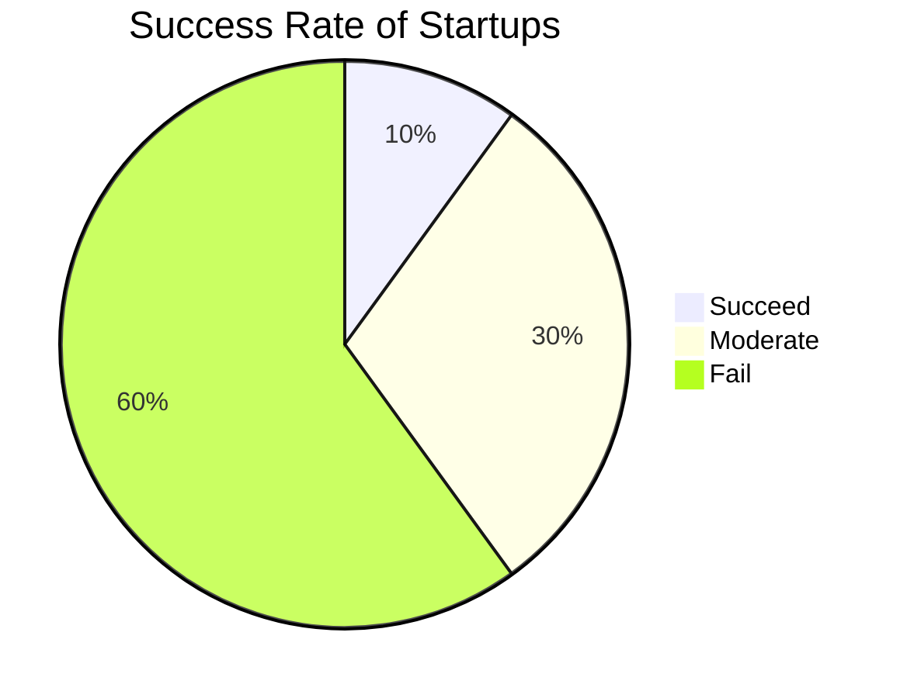

# Refining and Presenting your Venture Idea

- 1/10 startups succeed
- 6/10 startups

## Startup

Long term plan: Exit Strategy

|              |                                                              |
| ------------ | ------------------------------------------------------------ |
| Going public |                                                              |
| Get acquired | - In technology, this is not the right way to pitch. - It gives a message to investors that you are not interested in long-term growth. You’re just interested in build, sell and run |

Why would anyone want to acquire a company anyways?

- Startups are faster at innovating than large companies. 

|                         | Startup            | Corporate                                                    |
| ----------------------- | ------------------ | ------------------------------------------------------------ |
| Employees’ Motivation   | Get rich by stocks | Stable lifestyle                                             |
| Same goal               | ✅                  | ❌                                                            |
| No internal competition | ✅                  | ❌ Other employees will try to make you look bad so that they can get ahead of you |

## Elevator Pitch

> For ==**target customers**== who are dissatisfied with ==**current solution**==, ==**our product**== is a ==**new product category**== that provides ==**key problem solving opportunity**==. Unlike a ==**competitive substitute**==, we have assembled ==**key whole product features**==.

- It has to be spot-on since investors get thousands of pitches. They can easily determine if your pitch is valuable or not.
- Induce greed & urgency in the investors

##  The Pitch: KISS

### Structure

1. Hook
   1. < 7 seconds to engage audience 
   2. Phrases
      1. “Imagine … ”
      2. “Have you ever felt …”
      3. “Do you get ”

2. Solution
3. Technology
4. Business Model
5. Marketing & Sales
6. Competition
7. Management
8. Financials
9. Status & Timeline
10. The Offer

### Characteristics

- Focus should be on customer benefits, not on the technology

- Simple - No technical jargon

- Tailor the pitch for the Target Audience

- Lowest Common Denominator: Explain keeping in mind the least experienced/knowledgeable audience member

- Short (10/20/30): Audience questions will always take it to an hour, so prepare accordingly

- Pictures

- Answer details/curveballs quickly. 2 options:

  1. “No, that’s not the case. From our research, this is why ==**short reason**==. I’ll get back to you in more detail later.”

  2. “That’s a very good point. We are not very familiar with. Let’s discuss this in more detail later.”

  Make sure to shut off them quickly because you have an agenda to complete.

- Presentation

  - Passion and confidence
  - Engage the audience
  - Slow and calm speech
  - Get everyone nodding along with what you are saying

### Style

- Best presenter should be presenting
- Be/bring a highly knowledgeable teammate in the room
- Give firm answers
- Look at everyone in the room
- Do your research on your audience
- Pull questions

## When to Raise Money

- Finish closing money at least 6 months **before** you need it
- Make pitches to investors simultaneously. This way investors are not influenced by other investors
- Be “introduced”/use testimonials
- If you have 2 offers, prefer the quality of investor over the amount they’re offering

## Business Basics

- Profit & Cash Flow
- Business PLan
- Be flexible (Lean Startup methodology)
  - Initial vs Final Product/Service may not necessarily be the same
- Speed of progress is more important than Patents/Intellectual Property
- Mission
- The Team
  - Chemistry
  - Should be able to handle shocks
- Convey that you are
  - Be willing to persist after failure
  - Experienced to do a startup
  - Speed of Execution
- Focused about your value proposition. Pivot; You don’t always end up finishing with the idea you started with, but don’t keep changing your project unnecessarily

