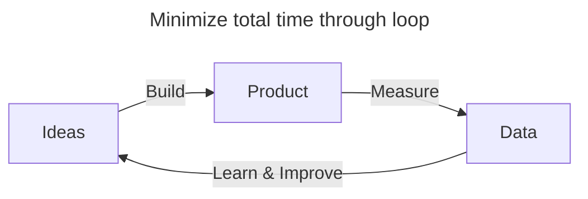
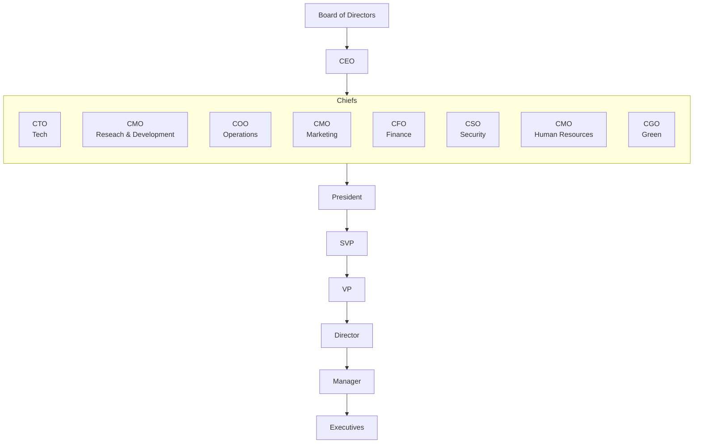

## Startup

## Startup Learning Loop

## Corporate Structure

### Projects

| Question | Aspect            | Responsible |
| -------- | ----------------- | ----------- |
| Why      | Purpose & Problem | Director    |
| What     | Solution          | Manager     |
| How      | Implementation    | Team Lead   |

