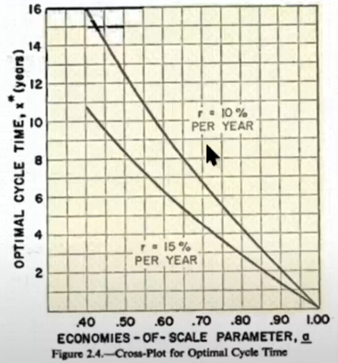
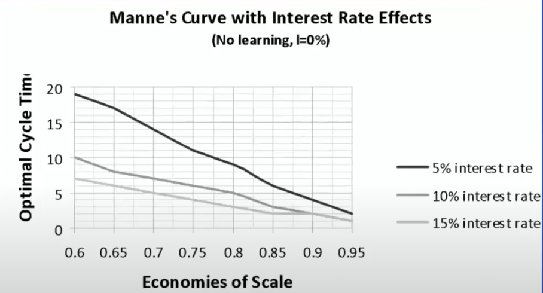

# Drivers of Flexibility

## Factors affecting flexible design vs immediate decision

| Factor             | Comment Against Flexibility          | Comment For Flexibility                                      |
| ------------------ | ------------------------------------ | ------------------------------------------------------------ |
| Uncertainty        |                                      |                                                              |
| Benefits of Scale  | Cheaper to produce at large quantity | Benefits not attained when set-up is under-utilized, which is common when set-up is made for larger capacity than requirement |
| Discount Rate      |                                      | Cancels out benefits of scale Future investments are better in terms of NPV |
| Learning           |                                      | Efficiency improves with time & experience                   |
| Competitive Gaming |                                      |                                                              |

## Manne’s Analysis

Analytic solution for simple case of constant linear growth

Provides simple demonstration of issues, by giving useful insight into trade-offs

- Optimal cycle time = most economical time between additions of capacity modules
- Cycle time defines model size (years * annual growth)

### Interpretation

1. Higher discount rate $\implies$ small size of modules
   1. High discount rates reduce present value of future costs, which counteract benefits of scale
2. Smaller $\alpha$ $\implies$ Larger benefits of scale

### Results

Manne’s present cost versus cycle time

1. Steep for small cycle times
2. Quite flat at bottom for large cycle times

### Learning Effects

