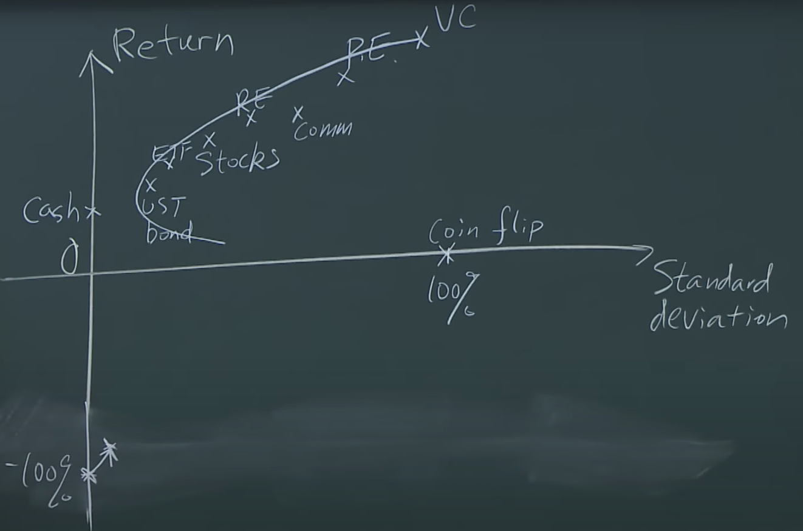
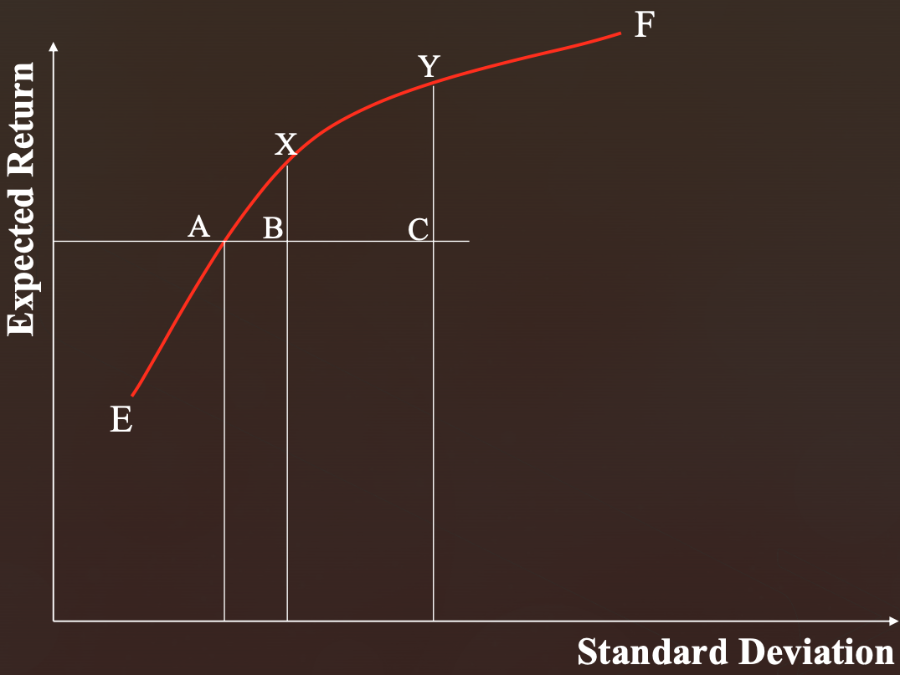
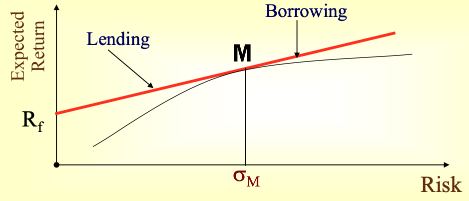
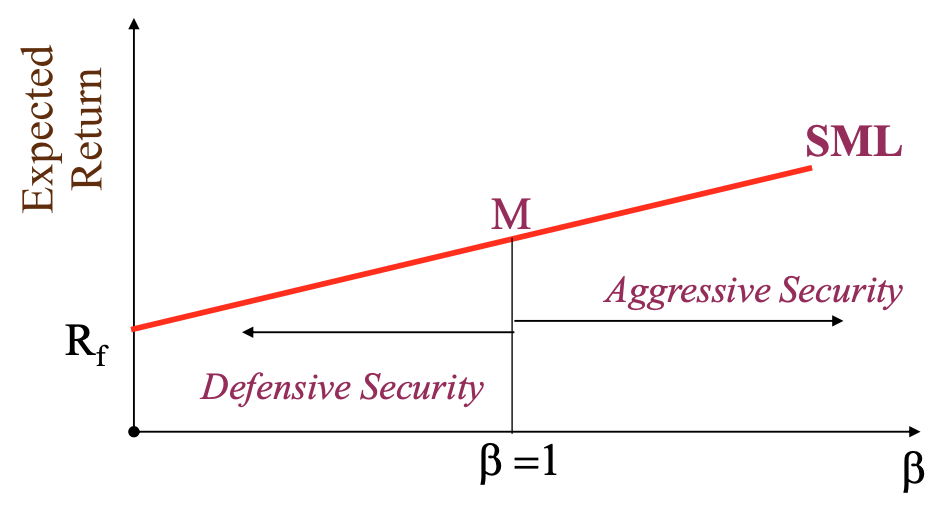

# Portfolio Theory

Shouldn't it be performed on forecasted time series?

## Markowitz Theory

Naive diversification of portfolio may/may not decrease risk

Markowitz: Nature and degree of covariates between securities determine whether portfolio risk can be reduced

Diversification pays when the securities have negative correlation

### Contributions

1. Quantification of risk & return
2. Efficient portfolio

### Efficient Set

A set of portfolios is called efficient set, if all the portfolios in it are non-dominated portfolios in terms of mean-variance dominance principle

### Mean-Variance Dominance Principle

A portfolio A dominates portfolio B if

- For given risk, portfolio A has higher expected return
- For given expected return, portfolio A has same/lower risk

### Efficient Frontier

### Mean-Variance Analysis

$$
\text{Obj}_\max = E[R_p] - \lambda \sigma^2_{R_p}
$$

### Limitations

| Limitation                                                   | Solution                      |
| ------------------------------------------------------------ | ----------------------------- |
| Variance is not ideal risk measurement since it penalizes both unwanted high losses and desired low losses | Semi-deviation VaR, CVaR |
| Sensitive to estimated parameters $\mu$ and $\sigma$         | Robust optimization           |

## Diversification & Reduction of Dispersion

Shows how naive diversification reduces discretion of returns in a stock portfolio

|                                                          |                                                              |
| -------------------------------------------------------- | ------------------------------------------------------------ |
| $\text{Risk} \propto \dfrac{1}{\text{no of securities}}$ |  |
| $\text{Marginal Risk Reduction} = -k$                    | Diminishing reduction with no of securities                  |
| 15-20 securities found to be the most appropriate        |                                                              |

## Sharpe’s Single Factor/Index Model

Linear relation between return of a security and the market index, in the absence of risk-free asset
$$
R_i = \alpha + \beta R_m + \epsilon
$$

- $\beta=$ systematic risk
- $\alpha=$ return independent of market

## Capital Market Line

Upon introduction of Risk-Free Asset, Efficient frontier becomes a straight line rising from risk-free rate and tangential to Markowitz Efficient Frontier, called Capital Market Line

- Lending portfolio: Portfolio where risk-averse investors in low risk assets
- Borrowing portfolio: Portfolio where risk-tolerant investors borrow at risk-free rate and invest in risky assets

Consists of efficient portfolios constructed by combining risk-free security and market portfolio

Represents equilibrium in the capital market. It does not show the relationship between expected rate of return of asset with individual risk

All portfolios on CML are perfectly correlated with market portfolio and hence they are completely diversified, and hence possess **no unsystematic risk**; the portfolio that the investor should pick depends on the risk tolerance

The slope of the CML gives the Sharpe Ratio of the market portfolio

$$
E(R_p) = R_f + \left[
\dfrac{R_m-R_f}{\sigma_m} \right
] \sigma_p
$$

### Systematic Risk Principle

In an equilibrium situation, the market will price only systematic risk

Hence, expected return on asset only depends on systematic risk

## Capital Asset Pricing Model

### Assumptions

- Investments judged only on associated risk and return
- Investors
  - maximize expected utility determined on associated risk and return
  - rational
  - risk-averse
  - Markowitz efficient
  - have same holding time horizon as others
  - can have unlimited borrowing and lending at risk-free rate
- Market
  - perfectly-competitive
  - frictionless
    - no transaction cost
    - no information cost
  - Capital market is in equilibrium
- Capital assets are perfectly divisible

### SML

Linear relationship between $E[R_i]$ vs $\beta_i$
$$
E[R_i] = R_f + \left[
\dfrac{R_m-R_f}{\beta_m} \right
] \beta_i
$$

Isn’t always $\beta_m = 1$

|                |             |
| -------------- | ----------- |
| $R_i > E[R_i]$ | underpriced |
| $R_i < E[R_i]$ | overpriced  |
| $\beta_i > 1$  | aggressive  |
| $\beta_i < 1$  | defensive   |

Slope is the Treynor Ratio

## Arbitrage Pricing Theory

Multi-factor pricing model, based on Arbitrage and Law of One Price

Linear relationship between expected return of security and $\beta$s of $k$ factors

Only sources of risk relevant in a security are systematic risk caused by $k$ factors

Breaks market risk into $k$ components
$$
E[R_i] = R_f + \sum_{\text{Factor: }j=1}^k \Big( E[R_{j}] - R_f \Big) \beta_{ji}
$$
These $k$ factors could be

- Chen, Roll & Ross
  - Growth rate in industrial production
  - Expected & unexpected inflation rate
  - Spread between long-term and short-term interest rates
  - Spread between low-grade and high-grade bonds
- Fama & French
  - Firm size
  - $\dfrac{\text{Book value}}{\text{market value}}$
  - Market portfolio
- Carhart: Fame & French model + Momentum

### Arbitrage

Arbitrage opportunity arises when investor can earn risk-free profits without making net investment

### Law of One Price

If 2 assets are equivalent in all economically relevant aspects, they should have the same market price

Enforced by arbitrageurs: if they observe any deviation, they engage in arbitrage and this will eliminate the opportunity

### Limitations

- Does not suggest any optimum portfolio that is to be selected by investor
- Does not explain how investors decide investment portfolio

## Von Neumann-Morgenstern Utility Theory

- Rational portfolio choice must apply preferences based on expected utility
- Optimal portfolio solves the expected utility max problem

- Wealth after one period: $W = W_0 (1+R_p)$
- Expected utility: $E[u(W)] = E[ \ u \Big( W_0(1+R_p) \Big) \ ]$

## IDK

When diversifying, diversify for the worst-case (such as at the event of a crisis), not just in the best-case/average-case

Idea
- Minimize the correlation in the worst case
	- returns should be uncorrelated/negatively correlated in worst-case
- If we don't have data for the worst case
	- Take a rolling correlation
	- For every pair of security, the correlation is the highest correlation they ever had
		- $r_{i,j} = \max \{ {r_{i, j}}_t \vert t \in [1, T] \}$