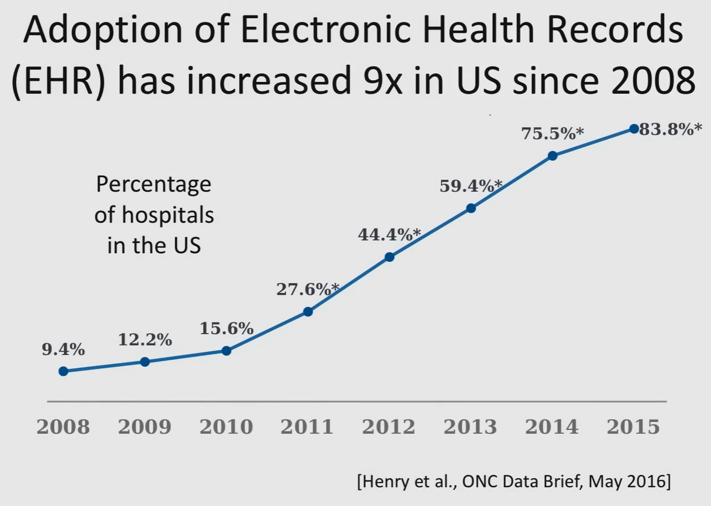

# Introduction

## Problems

- Misdiagnosis
- Late diagnosis
- Inappropriate management after diagnosis
- Medical errors are pervasive

## History

|       |                                           |                      |                       | Limitations                                                  |
| ----- | ----------------------------------------- | -------------------- | --------------------- | ------------------------------------------------------------ |
| 1970s | MYSIN expert system                       | Identifying bacteria |                       |                                                              |
| 1980s | INTERNIST-1/ Quick Medical Reference | Internal medicine    | Bayesian network-like | 1. Clinicians entered symptoms manually 2. Difficult to maintain 3. Difficult to generalize (prior probabilities will different across different parts of the world) |
|       | RX Project                                |                      |                       |                                                              |
| 1990s | ANN                                       |                      |                       | 1. Did not fit well into clinical workflow 2. Hard to get enough training data 3. Poor generalization to new places |

## What has changed?

### Data availability

- Adoption of Electronics Records
- Lab tests
- Imaging
- Vital signs
- Genomics
- Wearable sensors

 ### Standardization

- Reports
- Data storage
- APIs

OMOP

### Machine Learning

- Learning with high-dimensional features
- Semi-supervised and unsupervised learning
- Deep learning
- Democratization of machine learning
  - Open-source software

## Overview

Emergency department

- Limited resources
- Time sensitive
- Critical decisions

## Applications

- Better triage
- Faster diagnosis
- Early detection of adverse events
- Prevent medical errors
- Recommend treatment pathway
- Anticipating clinicians needs
- Reducing needs for specialist consults
- Automated documentation & billing
- Predicting patient’s future disease progression
- Continuous monitoring
- Discovery of new disease subtypes
- Design of new drugs
- Better targeted clinical trials

## What makes ML in healthcare different?

- Life/death decisions, similar to Autonomous Driving
  - Need robust algorithms
  - Checks and balances required for ML deployment
  - Need fair & accountable algorithms
- Lot of scope for unsupervised learning
- Causal learning required: just prediction insufficient
- Very little labelled data: need to use semi-supervised algorithms
- Small sample size
- Data quality issues
  - Varying time intervals
  - Missing data
  - Censored labels
- Data sensitivity
  - Difficulty of de-identifying
- Difficulty of deploying ML
  - Commercial electronic health record software is difficult to modify
  - Different standards used
  - Careful testing and iteration needed