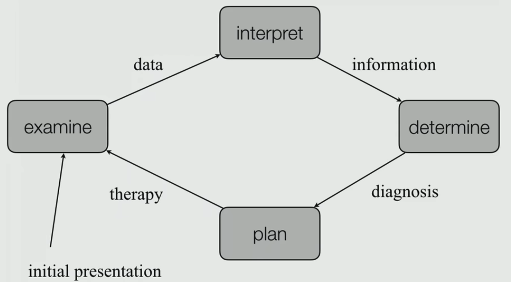

# Clinical Care

## Goals of Health Care

- Cure Morbidity (sickness)
- Disability
- Delay Mortality
- Keep people healthy

## Tasks of Health Care

- Diagnosis
- Prognosis
- Treatment
- Prevent/Public Health

## Medical Cycle

## Enterprise-level clinical process automation

## How does the Health System Learn

Randomized Clinical Trials

### Limitations

- Heterogeneity: most cases to which RCT results are applied to do not fit trial criteria
- Short follow-up
- Small samples

## Paying for Health Care

- Companies spend lot on healthcare
- Increased demand
- Waste: Unnecessary procedures