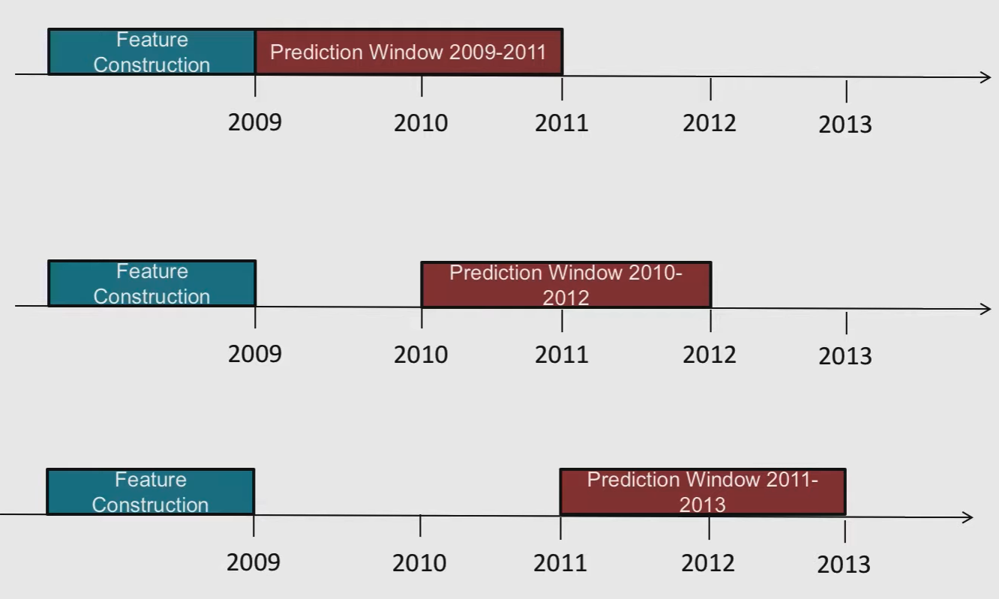
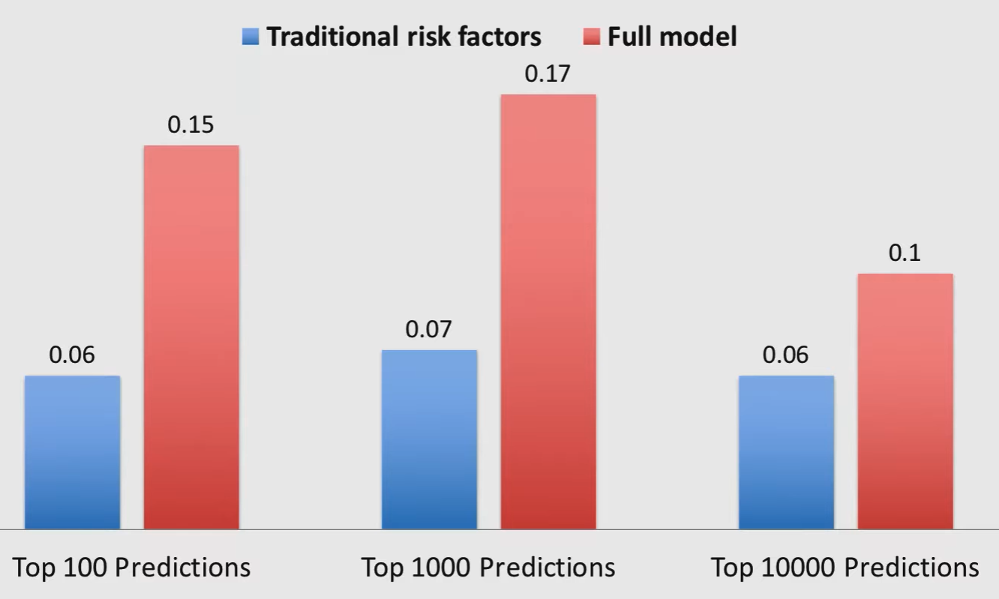
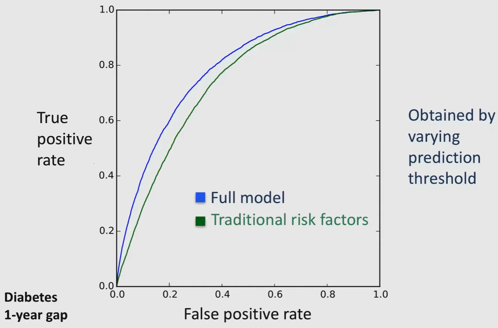
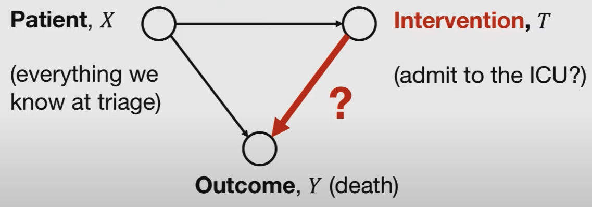

# Risk Stratification

Separating a patient population into high-risk and low-risk of having an outcome

- Predicting something in the future
- Goal is different from diagnosis, with distinct performance metrics
- Fuzzy classification
- Diverse data

Risk stratification drives interventions that target high-risk patients

Goal is to reduce cost and improve patient outcomes

## Applications

- Pre-mature infant’s risk of severe morbidity
- Does this patient need to be admitted to coronary-care unit
- Likelihood of hospital readmission

## Types

|             | Traditional                                                  | AI                                                           |
| ----------- | ------------------------------------------------------------ | ------------------------------------------------------------ |
|             |                                                              | Use readily-available data and feed into model               |
| Pros        | Simple                                                       | - Population-level - Automated: Fits more easily into workflow - Higher accuracy - Quicker to derive |
| Limitations | Manual Sample-specific Not used as much as required due to high friction |                                                              |
| Example     | APGAR Scoring system                                         | AI                                                           |

### APGAR Scoring system

## Framing for Supervised ML

Why are gaps important? To avoid label leakage

Sparsity-encourage models

- Easier to interpret
- Helps deploy model to different clinics where they may not have access to all the data

## How to get labels

- Manual
  - Label patients’ data by “chart review”
    - Visualization of individual patient data time series
- Automatic
  - Rule-based
    - Labels may get revised regularly based on standards
    - For eg
      - 2020: 200 units of sugar = diabetes
      - 2025: 100 units of sugar = diabetes
  - Machine learning to predict if the patient is “currently” diabetic

Based on

- medications: may not have record of
  - purchase
  - intake
- lab data

## Metrics

|                                    |                                                              |      |
| ---------------------------------- | ------------------------------------------------------------ | ---- |
| PPV Positive Predictive Value |  |      |
| AUC-ROC                            |   |      |
| Calibration                        |  |      |

## Intervention-Tainted Outcomes

Form of Self-Selection Bias

Let

- Group A: Patients with Pneumonia **with** history of asthma
- Group B: Patients with Pneumonia **without** history of asthma

Observation: Group A dies less often than group B

### Discussion

1. Reason group A dies less is due to more intensive care
2. Long survival time may be due to treatment

### Conclusion

1. Does this mean group A has lower risk? No
2. Should we treat group A with less priority? No

### Hacks

1. Remove such features from the model; not feasible for high-dimensional data
2. Redefine outcome by finding a pre-treatment surrogate (such as lactate levels)
3. Consider treated patients as right-censored by treatment

### Solutions

1. Interpretable models are very important
2. Causality modelling: Reframe question to “Will admission to ICU lower likelihood of death for patient”

## Deep Learning for Risk Stratification

Not very big gains

Baseline is L1-regularized Logistic Regression, with good structural features

Sequential data in medicine is very different from language modelling

- Many time scales
- Significant missing data
- Multi-variate observations
- Not enough data to learn subtle non-linear interactions
