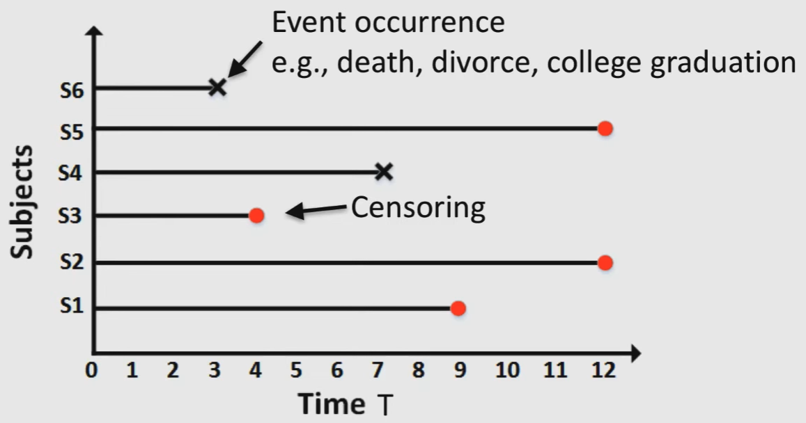
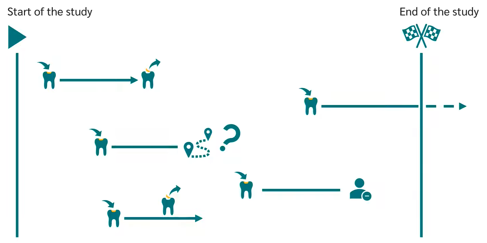

# Survival Modelling

Variable studies is the time until an event occurs

Predict when some event will happen

Focus on right-censored data

Always finite time period: start & end time period

## Cases

| Treatment          | Event                                   | knowledge of true survival duration |
| ------------------ | --------------------------------------- | ----------------------------------- |
| within time period | within time period                      | ✅                                   |
| within time period | within time period but not noticed | ❌                                   |
| within time period | not within time period                  | ❌                                   |
| within time period | Discontinued study                      | ❌                                   |
| within time period | Unexpected event                        | ❌                                   |

## Challenges to classification

- Less training data
- Pessimistic estimates due to choice of window

## Challenges to regression

- Non-gaussian: $T$ is non-negative; may want long tails
- If we just naively remove censored events, model will be biased predict lower survival, since the people who got removed due to censoring did not get diabetes (ever/yet)

## Notation & Formalization

Let

- Data
  - $X=$ features
  - $t=$ time
  - $b(t)=\{ 0, 1 \} =$ binary indicator denoting whether time is of censoring/event occurrence
- $f(t)=P(t) =$ probability of death at time $t$
- $S(t) =$ probability of individual surviving beyond time $t$
- $T_d=$ time of death

$$
\begin{aligned}
s(t)
&= P(T_d>t)
&&= 1-P(T_d<t) \\
&= \int_{t}^\infty f(x) \cdot dx
&&= 1-\int_{0}^t f(x) \cdot dx
\end{aligned}
$$

## Methods

### Kaplan-Meier Estimator

Graphical representation of survival function

- Non-parametric model
- Good for unconditional density estimation

- $d(t)=$ no of events at time $t$
- $n(t)=$ no of individuals alive and uncensored at time $t$

$$
\hat s_{k-m}(t)
= \prod_{k: y(k) \le t}
\left(
1-\dfrac{d(k)}{n(k)}
\right)
$$

### Log-Rank Test

Compares the time until and event occurs of 2/more independent samples

“Is there a significant difference between the 2 curves”

Hypothesis test

- $H_0:$ identical distribution curves
- $H_1:$ different distribution curves

$p < \alpha \implies$ reject $H_0$

### Cox Proportional Hazards Model

Identify if there are other parameters that affect the curve

## Evaluation

### C-Statistic/Concordance-Index

Evaluate model’s ability to predict relative survival times

Equivalent to AUC for binary classification without censoring
$$
\hat c = \dfrac{1}{n} \sum_{i: b_i=0} \sum_{j: y_i < y_j} I \Big[ S(\hat y_j \vert X_j) > S(\hat y_i \vert X_i) \Big]
$$

### Mean-Squared Error for uncensored individuals

### Held-out censored likelihood

### Binary Classifier

Derive binary classifier from learnt model and check calibration
