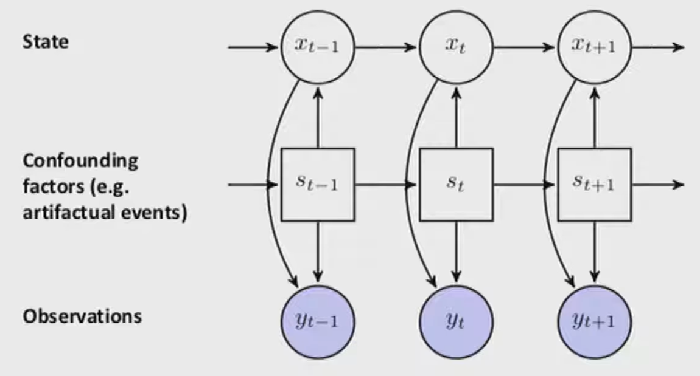
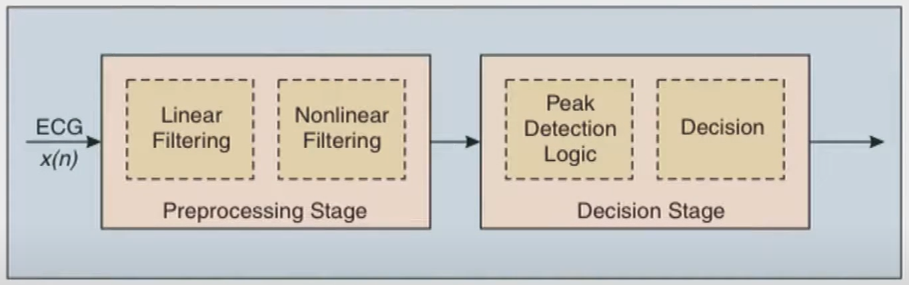

# Physiological Time Series

## Problems

- Measurements confounded by
  - Interventions
  - Measurement errors

## IDk

- Once measurement issues identified, we must impute the missing data
  - Can help mitigate alarm fatigue by not alerting the clinicians when unnecessary

## Switching linear dynamical systems

## Traditional Modelling

