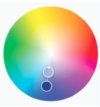
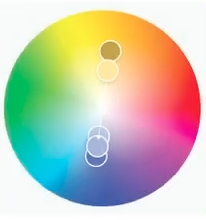
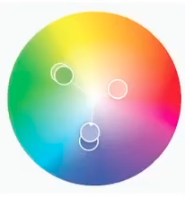
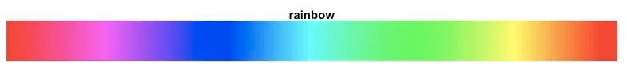
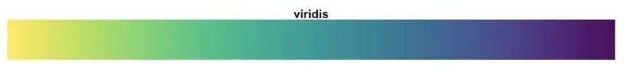

# Introduction
## Principles of Design

CRAP
- [ ] Minimalism
	- [ ] Replace text with icons
	- [ ] Few functional elements as possible
	- [ ] Few visual elements (color, typography) as possible
- [ ] Contrast
	- [ ] Typography
	- [ ] Colors
- [ ] Repetition
	- [ ] Typography
	- [ ] Colors
- [ ] Alignment
	- [ ] Everything aligned to something else on page
	- [ ] Share lines and repeat alignments where possible
- [ ] Proximity: Group related items together
	- [ ] White space
	- [ ] Color
	- [ ] Location
	- [ ] Contrast
	- [ ] Repetition
	- [ ] Alignment
	- [ ] Typography

## Typography

|        |             |
| ------ | ----------- |
| Family | Serif       |
|        | Sans Serif  |
|        | Slab Serif  |
|        | Monospaced  |
|        | Script      |
| Weight | Extra light |
|        | Light       |
|        | Regular     |
|        | Semi bold   |
|        | Bold        |
|        | Black       |
| Style  | Regular     |
|        | Italic      |
|        | Underline   |
| Size   |             |
| Color  |             |
## Colors

### Color Systems

| System |                              | Purpose         |
| ------ | ---------------------------- | --------------- |
| HSL    | Hue, Saturation, Luminance   | Human-Intuitive |
| RGB    | Red, Green, Blue             | Screens         |
| CMYK   | Cyan, Magenta, Yellow, blacK | Print           |

 ### Color Palette

| Aspect                    |                         | Meaning                                                                               | Example                                                                                            |
| ------------------------- | ----------------------- | ------------------------------------------------------------------------------------- | -------------------------------------------------------------------------------------------------- |
| Contrast                  | Monochromatic           | All have the same hue                                                                 |                                                                       |
|                           | Complementary           |                                                                                       |                                                                       |
|                           | Split Complementary     |                                                                                       |                                                                 |
|                           | Triad                   |                                                                                       |                                                                               |
| Usability & Accessibility | Perceptually-uniformity | Values close to each other use similar colors Values far away use different colors | Bad: Rainbox   Good: Vivirdis, Inferno  |
|                           | Colorblind-safety       | Colors should be distinguishable by people with common forms of colorblindness        |                                                                                                    |

