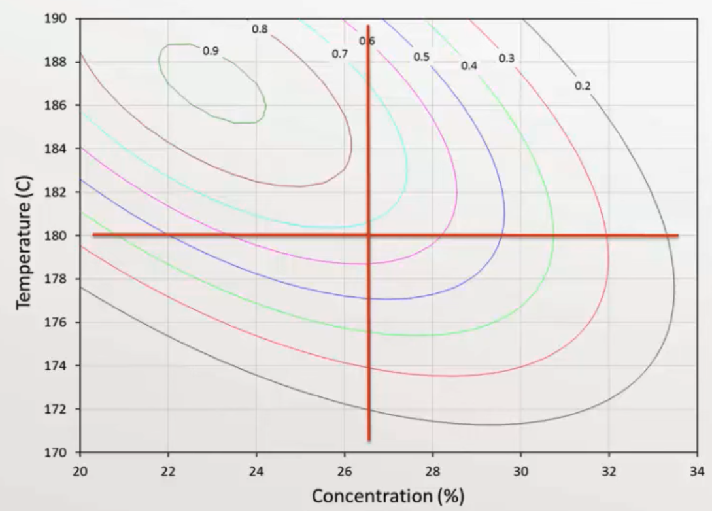
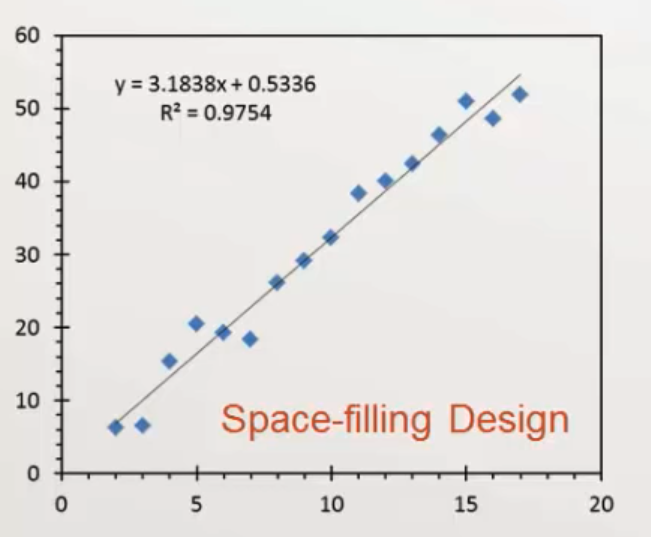
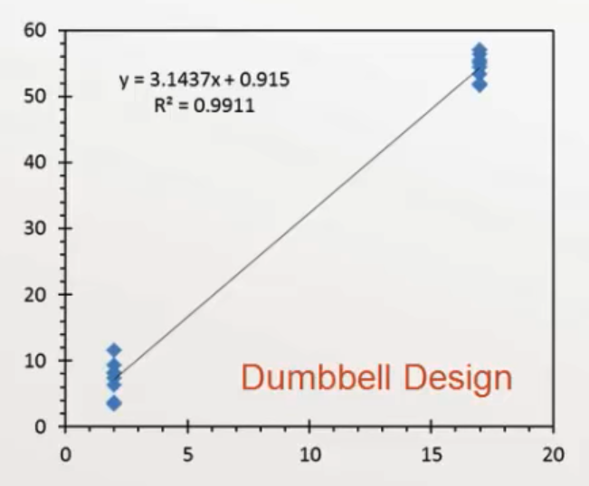

# Introduction

Planning experiment to promote good decision making, with minimum cost

Counter-intuitive point: the best time to design experiment is after experiment is finished, especially the first time when you don’t know the underlying data-generating response process

## Experiment

Deliberate variation of one/more process variables while observing effect on one/more response variables

## Experimental Design

- Maximize information gain
- Minimize resources (time and cost)

DOE is a procedure to plan experiments to efficiently provide valid conclusions

Does the experiment have enough statistical power to answer research questions?

## Process

1. Define objectives of experiment
2. Define [inputs](#Types-of-Input-Vars) to the process

## Types of Input Vars

|                                             |                                                      | Dealing                                                      |
| ------------------------------------------- | ---------------------------------------------------- | ------------------------------------------------------------ |
| Controlled & observed/ Factors         | Direct control of experimenter                       | Variation + repeats/replication experiments in a systematic way |
| Uncontrolled & observed/ Nuisance vars | Not controlled by experimenter, but measured         | - Blocking - Analysis of covariance                     |
| Uncontrolled & unobserved                   | Unknown to experimenter, but affects output response | Randomization: Impact of variable averages out to 0          |

## Uses

- Exploratory work
  - Comparison: Choosing between alternatives
  - Screening: Selecting key factors that affect a response
- Response surface modeling: Optimize given process
  - Hitting and control target response with minimum variability
  - Maximize/minimize response/goal
  - Increase process robustness
- Prediction

## RSM

Response Surface Methodology

Looks for quadratic/higher order trends

Assumes all variables significant

Quadratic response always has a stationary point (min/max/saddle point)

Can be used to optimize a process
$$
y_i =
\beta_0 +
\sum_{i=1}^k \beta_i x_i +
\sum_{i=1}^k \beta_{ii} x_i^2 +
\sum_{i} \sum_{j>i} \beta_{ij} x_i x_j +
u_i
$$
One at a time

### Properties

|               |                                                              |
| ------------- | ------------------------------------------------------------ |
| Orthogonality | No collinearity/multi-collinearity of factors                |
| Rotatability  | Variance of response at $x$ depends only on distance of $x$ from design center point, and not direction (ie, $x_j$)  - All first-order orthogonal designs are rotatable - Composite face-center design is not rotatable |
| Uniformity    | Control no of center points to achieve uniform precision, until $\sigma^2_{y, \text{center}} = \sigma^2_{y, \text{extreme}}$ |
| Efficiency    | No of required experimental runs                             |

### Notes

- Beware of extrapolation
- Multiple responses
  - Overlapping response contour plots
  - Combined cost function
- PCA can be useful

## Pitfalls of DOE & RSM

- Optimization of process without understanding the process
- Design assumes a model, so there is no way to test model error as the model always fits
- A quadric model will always show you an optimum point, but its accuracy depends on the accuracy of the model
  - Exponential data fir with a quadratic model will show an optimum that does not exist

## DOE for Prediction

Goal: equalize the leverage of every point

### Optimal design

Algorithmic approach to searching the design space and pick values of input vars in experiment to produce desired statistical properties

- Smallest SE of model parameters and of predictions, for a given $n$
- Smallest $n$, for a given SE of model parameters & predictions

#### Limitations

- Model must be specified ahead of time
- Range of each input var must be specified ahead of time
- With multiple input vars, there can be tradeoffs b/w parameter variances

### Types

| Design        |                                                              | Use when                                      | Advantage                       | Disadvantage                   |                                                              |                                $\text{SE}(b_1)$ For SLR |
| ------------- | ------------------------------------------------------------ | --------------------------------------------- | ------------------------------- | ------------------------------ | ------------------------------------------------------------ | -----------------------------------------------------------: |
| Space-Filling | Evenly spaced out $x$ or $y$                                 | check whether the model is correct            | Intuitive Can verify model | Wasted opportunity cost of SE  |  | $\sqrt{3 \times \dfrac{n-1}{n+1}} \times \dfrac{\text{RMSE}}{\sqrt{n} \left( \dfrac{x_\max - x_\min}{2}  \right)}$ |
| Dumbbell      | - half data points at the lowest $x$ value - half data points at the highest $x$ value | structural model already known                | Lowest SE of parameters         | Cannot verify structural model |  | $1 \times \dfrac{\text{RMSE}}{\sqrt{n} \left( \dfrac{x_\max - x_\min}{2}  \right)}$ |
| Equal-Thirds  | - 1/3 highest - 1/3 middle - 1/3 lowest            | Compromise between space-filling and dumbbell |                                 |                                |                                                              | $\sqrt{\dfrac{3}{2}} \times \dfrac{\text{RMSE}}{\sqrt{n} \left( \dfrac{x_\max - x_\min}{2}  \right)}$ |

### Principles

1. Capacity for primary model
2. Capacity for alternate model
3. Minimum variance of estimated model parameters or predict values
   - Except for simple cases, must search for optimal design
4. Sample where the variation is
   - For non-constant variance, $n_i \propto \sigma_{yi}^2$
   - For curves, sample more in steep regions: Think about evenly-space $y$ values rather than evenly-space $x$ values
5. Repeats and replication: To compute a model-independent estimate of process standard deviation
6. Randomization and blocking
   - allows detection of drift
   - reduces influence of effect modifiers

### What to optimize

| Optimality           | Objective                                                    | Uncorrelated Obs Linear Model | Uncorrelated Obs Quadratic Model | Correlated Obs (autoregressive) Linear Model | Correlated Obs  (autoregressive) Quadratic Model |
| -------------------- | ------------------------------------------------------------ | ---------------------------------- | ------------------------------------- | ------------------------------------------------- | ----------------------------------------------------- |
| A (Average)     | Min average variance of estimates of model parameters (trace of covariance matrix) |                                    |                                       |                                                   |                                                       |
| C (Combination) | Min variance of predetermined linear combination of model parameters (selected subset of important parameters) |                                    |                                       |                                                   |                                                       |
| D (Determinant) | Min determinant of covariance matrix Max determinant of information matrix | Dumbbell                           | Equal-Thirds                          | $\approx$ equally-spaced $x$                      | $\approx$ equally-spaced $y$                          |
| E (Eigenvalue)  | Max the minimum eigenvalue of information matrix Min multi-collinearity |                                    |                                       |                                                   |                                                       |
| T                    | Max trace of information matrix                              |                                    |                                       |                                                   |                                                       |
| G                    | Min the maximum $h_{ii}$ Min maximum prediction variance |                                    |                                       |                                                   |                                                       |
| I (Integrated)  | Min average prediction variance over design space            |                                    |                                       |                                                   |                                                       |
| V Variance      | Min average prediction variance for $m$ specific points      |                                    |                                       |                                                   |                                                       |

Information matrix $= X^T X$ 

## IDK

|                                  | Repetition                                                   | Replication                                                  |
| -------------------------------- | ------------------------------------------------------------ | ------------------------------------------------------------ |
|                                  | Duplication of experiment on some data with same experimental run | Repeated experimental runs where entire procedure is repeated independently at a different time |
|                                  |                                                              | Each replicate is subject to same variability, but independently (ie complete block) |
| Include all sources of variation | ❌                                                            | ✅                                                            |
| Example                          | Repeat generation of one data point through five “readings” to independently assess variability |                                                              |
