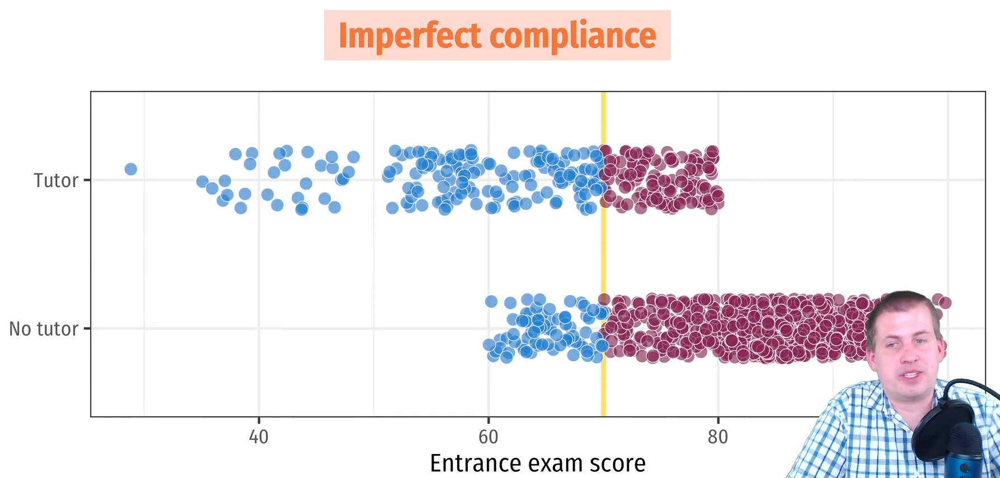
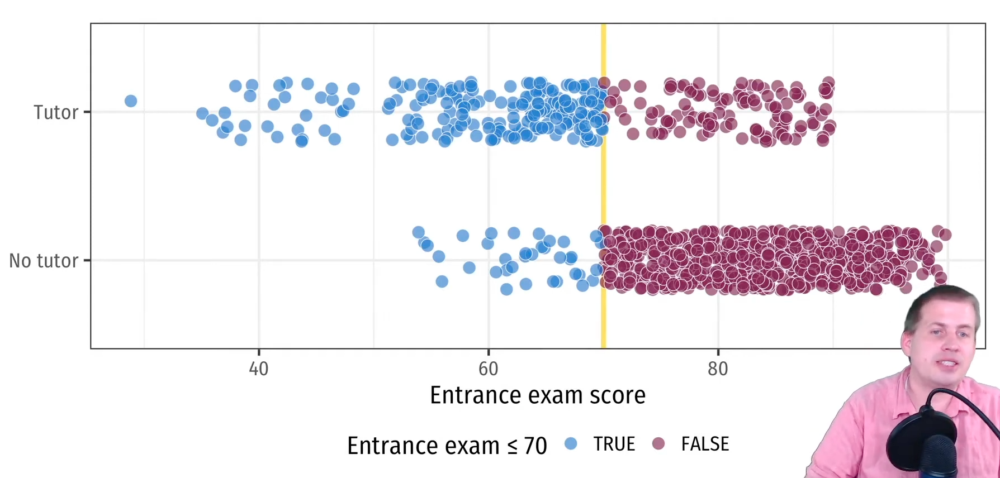

# Types of Experiments

| Type                                 |                                                                                                                                                                                                                                                                                                                                                                                                                                                                                                                                                                                                                                                  | Free from Self-Selection | External Validity | Example                                                                                                                                                                                                                                                                                                     |                                                                | LATE                    |
| ------------------------------------ | ------------------------------------------------------------------------------------------------------------------------------------------------------------------------------------------------------------------------------------------------------------------------------------------------------------------------------------------------------------------------------------------------------------------------------------------------------------------------------------------------------------------------------------------------------------------------------------------------------------------------------------------------ | ------------------------ | ----------------- | ----------------------------------------------------------------------------------------------------------------------------------------------------------------------------------------------------------------------------------------------------------------------------------------------------------- | -------------------------------------------------------------- | ----------------------- |
| RCT (Randomized Control Trials) |                                                                                                                                                                                                                                                                                                                                                                                                                                                                                                                                                                                                                                                  | ✅                        | ⚠️                |                                                                                                                                                                                                                                                                                                             |                                                                | Only for compliers      |
| Natural/ Quasi                    | A situation where the researcher does not assign treatment to individuals  Treatment is “as if” random, as implicit randomization occurs                                                                                                                                                                                                                                                                                                                                                                                                                                                                                                   | ❌                        | ✅                 |                                                                                                                                                                                                                                                                                                             |                                                                |                         |
| Regression Discontinuity Design      | Discrete treatment status determined by an underlying continuous variable, which is used for quasi experiments  Assumption: People right before and after threshold are identical  Running/forcing variable: Index/measure that determines eligibility  Cutoff/cutpoint: threshold that formally assigns access to program  Limitations - Requires lots of data in the neighborhood of the threshold - Poor generalizability: The validity of the results is usually restricted to this region - Throws away the lot of information in the non-random parts - Doesn’t allow building structural causal model |                          |                   | Uni admission cutoff provides a natural experiment on uni education. Students **just** above/below are likely to be very similar. For these students, uni education is “as if” random. Comparing these students (ones that went to uni/not) produces an estimate of the causal effect of college education. |  | People in the bandwidth |
| Differences-in-Differences           | 2 time-series process $y_1$ and $y_2$ have the factors affecting them                                                                                                                                                                                                                                                                                                                                                                                                                                                                                                                                                                            |                          |                   |                                                                                                                                                                                                                                                                                                             |  |                         |
| Instrumental Variables               | IV technique helps work around simultaneous causal relationships - Education -> Earnings -> Education -> ... - Supply --> Demand --> Supply --> ...                                                                                                                                                                                                                                                                                                                                                                                                                                                                                        |                          |                   |                                                                                                                                                                                                                                                                                                             |                                                                | Only for compliers      |

## Compliance

| Type          | What they do when assigned to control group $T=0$ | What they do when assigned to treatment group $T=1$ |
| ------------- | ------------------------------------------------- | --------------------------------------------------- |
| Compliers     | $T=0$                                             | $T=1$                                               |
| Always takers | $T=1$                                             | $T=1$                                               |
| Never takers  | $T=1$                                             | $T=1$                                               |
| Defiers       | $T=0$                                             | $T=1$                                               |

## Differences-in-Differences

Let

- Control: $y_0$ be the time series with $x=0$
- Treated: $y_1$ be the time series with $x=1$
- $D_t$ be the difference of the 2 series

$$
\begin{aligned}
y_{0t}
&= f(t) + \beta_1 (T=0) \\
&= f(t) \\
y_{1t} &= f(t) + \beta_1 (T=1) \\
D_t &= (y_1 - y_0)_t
\end{aligned}
$$

### Assumptions

- Parallel trends: $f_1(t) = f_0(t)$
	- confirmed by evaluating regions without the treatment
- No differential timing: Check Goodman-Bacon decomposition
- Absence treatment: no other variables
- Difference between the treatment & the control group is time-invariant
	- any difference in their difference must be due to the treatment effect.

### Why not other way?
- Wrong ways: Impossible to know if change happened because of treatment or naturally
	- Only comparing treatment group before/after
	- Only comparing treatment/control group at a particular time

## RDD

### Threats

#### Manipulation

People may change behavior when they know of the cutoff

Discontinuity exists in the running variable even without any treatment

Check with McCrary Density Plot

#### Non-Compliance

People on the margin of the cutoff may/may not get treatment, by misrepresenting the running variable
- Some people may not want treatment even though they crossed the cutoff
- Others may request access to the above discarded treatment spots

This is different from manipulation, where the actual running variable comes out different

For eg: Misreporting income

### Types

|       | $T$                                                         |                                                                                                                                        |                           |
| ----- | ----------------------------------------------------------- | -------------------------------------------------------------------------------------------------------------------------------------- | ------------------------- |
| Sharp | $\begin{cases} 1, & z \ge z_0\\ 0, & \text{o.w}\end{cases}$ |                                                                                                                                        |                           |
| Fuzzy | $\begin{cases} , & z \ge z_0\\ , & \text{o.w}\end{cases}$   | Doubly-local effect: CACE only around cutoff  Useful when there is non-compliance  Use above/below threshold as instrument |  |

## What to Choose

