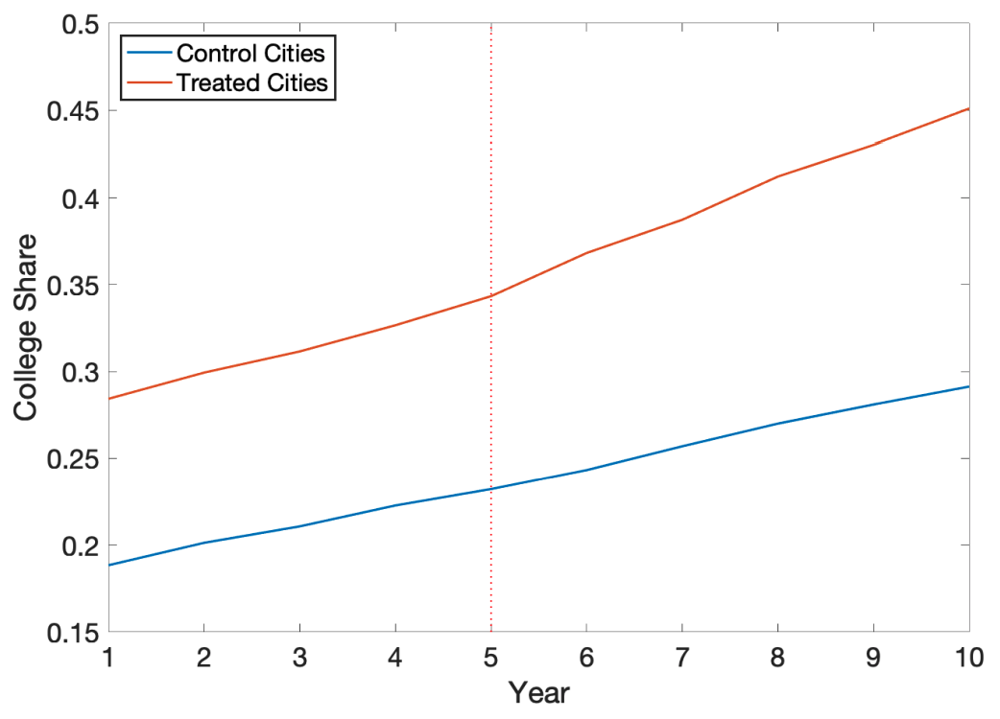

# Types of Experiments

| Type                                 |                                                              | Example                                                      |                                                              |
| ------------------------------------ | ------------------------------------------------------------ | ------------------------------------------------------------ | ------------------------------------------------------------ |
| Natural/Quasi                        | In non-experimental settings, sometimes implicit randomization occurs, and the treatment occurs “as if” it is random | Uni admission cutoff provides a natural experiment on uni education. Students **just** above/below are likely to be very similar. For these students, uni education is “as if” random. Comparing these students (ones that went to uni/not) produces an estimate of the causal effect of college education. |                                                              |
| Regression Discontinuity Design      | Discrete treatment status determined by an underlying continuous variable, which is used for quasi experiments |                                                              |  |
| Differences-in-Differences           | 2 time-series process $y_1$ and $y_2$ have the factors affecting them |                                                              |  |
| RCT (Randomized Control Trials) |                                                              |                                                              |                                                              |

### Types of RDD

|       | $x$                                                          |
| ----- | ------------------------------------------------------------ |
| Sharp | $\begin{cases} 1, & z \ge z_0\\ 0, & \text{o.w}\end{cases}$  |
| Fuzzy | $\begin{cases} p(z), & z \ge z_0\\ 0, & \text{o.w}\end{cases}$ |

## Blocking vs Randomization

|               |                                                              |
| ------------- | ------------------------------------------------------------ |
| Blocking      | Randomly assign - half of participants w/ new shoes - half of participants w/ old shoes |
| Randomization | Every participants is given - one new shoe - one old shoe  (randomly assigned to left/right foot) |

> Block what you can, randomize what you cannot

## Random Treatment Assignment

Used for removing sources of variation due to nuisance factors

### Blocking/Randomized Complete Block Design (RCBD)

| $\alpha_1$ | $\alpha_2$ | $\alpha_3$ | $\alpha_4$ |
| ---------- | ---------- | ---------- | ---------- |
| $b$        | $a$        | $a$        | $c$        |
| $a$        | $c$        | $b$        | $b$        |
| $c$        | $b$        | $c$        | $a$        |

$$
x \in \{ a, b, c \} \\
s \in \{ \alpha_1, \alpha_2, \alpha_3, \alpha_4 \}
$$

Note: The term ‘blocking’ originated  from agriculture, where a block is typically a set of homogeneous (contiguous) plots of land with similar fertility, moisture, and weather, which are typical nuisance factors in agricultural studies

### Latin Square Design (LSD)

|           | $\alpha_1$ | $\alpha_2$ | $\alpha_3$ |
| --------- | ---------- | ---------- | ---------- |
| $\beta_1$ | $a$        | $b$        | $c$        |
| $\beta_2$ | $b$        | $c$        | $a$        |
| $\beta_3$ | $c$        | $a$        | $b$        |

$$
\begin{aligned}
x &\in \{ a, b, c \} \\
s_1 &\in \{ \alpha_1, \alpha_2, \alpha_3 \} \\
s_2 &\in \{ \beta_1, \beta_2, \beta_3 \}
\end{aligned}
$$

A Latin square of order $n$ is an $n \times n$ array of cells in which $n$ symbols are placed, one per cell, in such a way that each
symbol occurs once in each row and once in each column
