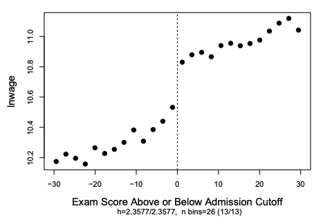
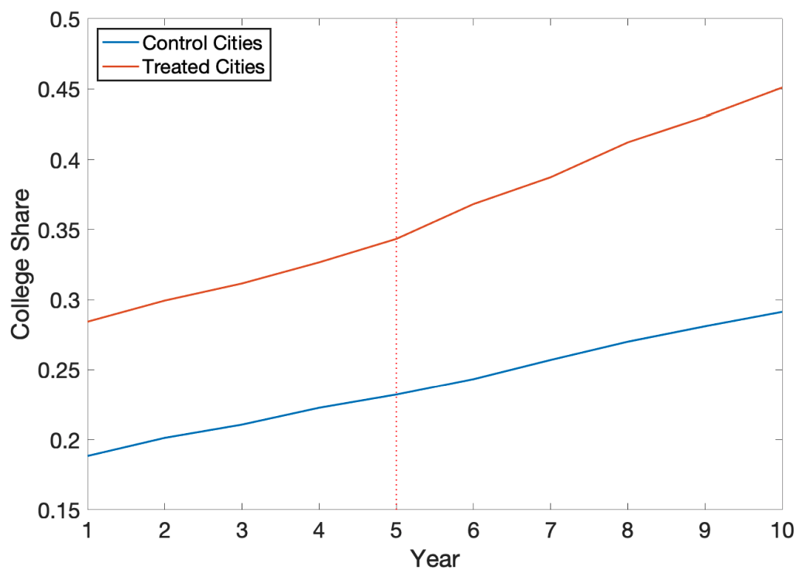

# Types of Experiments

| Type                                 |                                                                                                                                                | External Validity | Free from Self-Selection | Example                                                                                                                                                                                                                                                                                                     |                                                                |
| ------------------------------------ | ---------------------------------------------------------------------------------------------------------------------------------------------- | ----------------- | ------------------------ | ----------------------------------------------------------------------------------------------------------------------------------------------------------------------------------------------------------------------------------------------------------------------------------------------------------- | -------------------------------------------------------------- |
| RCT (Randomized Control Trials) |                                                                                                                                                | ⚠️                | ✅                        |                                                                                                                                                                                                                                                                                                             |                                                                |
| Natural/ Quasi                    | A situation where the researcher does not assign treatment to individuals  Treatment is “as if” random, as implicit randomization occurs | ✅                 | ❌                        |                                                                                                                                                                                                                                                                                                             |                                                                |
| Regression Discontinuity Design      | Discrete treatment status determined by an underlying continuous variable, which is used for quasi experiments                                 |                   |                          | Uni admission cutoff provides a natural experiment on uni education. Students **just** above/below are likely to be very similar. For these students, uni education is “as if” random. Comparing these students (ones that went to uni/not) produces an estimate of the causal effect of college education. |  |
| Differences-in-Differences           | 2 time-series process $y_1$ and $y_2$ have the factors affecting them                                                                          |                   |                          |                                                                                                                                                                                                                                                                                                             |  |
| Instrumental Variables               |                                                                                                                                                |                   |                          |                                                                                                                                                                                                                                                                                                             |                                                                |

### Types of RDD

|       | $x$                                                            |
| ----- | -------------------------------------------------------------- |
| Sharp | $\begin{cases} 1, & z \ge z_0\\ 0, & \text{o.w}\end{cases}$    |
| Fuzzy | $\begin{cases} p(z), & z \ge z_0\\ 0, & \text{o.w}\end{cases}$ |

## Differences-in-Differences

Let

- Control: $y_0$ be the time series with $x=0$
- Treated: $y_1$ be the time series with $x=1$
- $D_t$ be the difference of the 2 series

$$
\begin{aligned}
y_{0t}
&= f(t) + \beta_1 (T=0) \\
&= f(t) \\
y_{1t} &= f(t) + \beta_1 (T=1) \\
D_t &= (y_1 - y_0)_t
\end{aligned}
$$

### Assumptions

- Parallel trends: $f_1(t) = f_0(t)$
	- confirmed by evaluating regions without the treatment
- No differential timing: Check Goodman-Bacon decomposition
- Absence treatment: no other variables
- Difference between the treatment & the control group is time-invariant
	- any difference in their difference must be due to the treatment effect.

### Why not other way?
- Wrong ways: Impossible to know if change happened because of treatment or naturally
	- Only comparing treatment group before/after
	- Only comparing treatment/control group at a particular time
