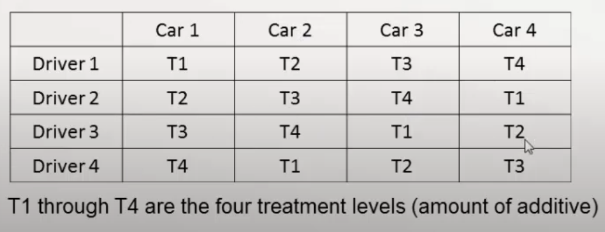

# Nuisance Removal

## Blocking vs Randomization

> Block what you can, randomize what you cannot

|               | Blocking                                                     | Covariate analysis                                           | Randomization                                                |
| ------------- | ------------------------------------------------------------ | ------------------------------------------------------------ | ------------------------------------------------------------ |
|               | Group experiments into blocks, each having a fixed value of the variable | Put measured uncontrolled inputs into the model Ignore them when modeling is complete |                                                              |
|               | Increase $\text{cov}(T_1, T_2)$ to decrease $\sigma^2(T_1-T_2)$ | Model impact of variable, and then subtract it out           | Prevent unknown effect from biasing results                  |
|               | Error that is same for $T_1$ and $T_2$ will cancel out       |                                                              | Turn systematic errors into random errors which average out to zero |
| Effective for | Measured uncontrolled inputs                                 |                                                              | Unmeasured uncontrolled inputs                               |
| Application   | Understanding treatment effects                              |                                                              | Allows for time-series analysis to detect drift              |
| Example       | Randomly assign each person to - one new shoe - one old shoe  (randomly assigned to left/right foot) |                                                              | Randomly assign - half of participants w/ new shoes - half of participants w/ old shoes |

$$
\begin{aligned}
\sigma^2(\text{ATE})
&= \sigma^2(T_1-T_2) \\
&= \sigma^2_{T_1} + \sigma^2_{T_2} - 2 \text{ cov}(T_1, T_2)
\end{aligned}
$$

For measured uncontrolled inputs, use blocking or covariate analysis to remove effect of nuisance factors, and reduce known variability

- Different measurement tools, prices batches
- Spatial/temporal variations

## Random Treatment Assignment

Used for removing sources of variation due to nuisance factors

### Blocking/Randomized Complete Block Design (RCBD)

- Complete experiment is performed for each block
  - Each block sees each treatment exactly onec
  - With each block, testing order is randomized
- Examples of blocks
  - Raw material batches
  - People (operators)
  - Process/measurement tools
  - Time

| $\alpha_1$ | $\alpha_2$ | $\alpha_3$ | $\alpha_4$ |
| ---------- | ---------- | ---------- | ---------- |
| $T_2$      | $T_1$      | $T_1$      | $T_3$      |
| $T_1$      | $T_3$      | $T_2$      | $T_2$      |
| $T_3$      | $T_2$      | $T_3$      | $T_1$      |

$$
T \in \{ T_1, T_2, T_3 \} \\
s \in \{ \alpha_1, \alpha_2, \alpha_3, \alpha_4 \}
$$

Note: The term ‘blocking’ originated  from agriculture, where a block is typically a set of homogeneous (contiguous) plots of land with similar fertility, moisture, and weather, which are typical nuisance factors in agricultural studies
$$
y_{ij} = f(T_i) + \text{Block}_j + u_{ij}
$$

### Balanced Incomplete Block Design

### Latin Square Design (LSD)

|           | $\alpha_1$ | $\alpha_2$ | $\alpha_3$ |
| --------- | ---------- | ---------- | ---------- |
| $\beta_1$ | $T_1$      | $T_2$      | $T_3$      |
| $\beta_2$ | $T_2$      | $T_3$      | $T_1$      |
| $\beta_3$ | $T_3$      | $T_1$      | $T_2$      |

$$
\begin{aligned}
T &\in \{ T_1, T_2, T_3 \} \\
s_1 &\in \{ \alpha_1, \alpha_2, \alpha_3 \} \\
s_2 &\in \{ \beta_1, \beta_2, \beta_3 \}
\end{aligned}
$$

A Latin square of order $n$ is an $n \times n$ array of cells in which $n$ treatments are placed, one per cell, such that each treatment only occurs

- once in each row
- once in each column

Requirements

- Number of levels of each blocking var must equal number of levels of primary var
- No interactions between input vars, especially b/w nuisance vars

Outcome

- Not complete block
- Model is orthogonal, if no interactions

$$
y_{ijk} = f(T_i) + R_j + C_k + u_{ijk}
$$

Example: Test effect of amount of gasoline additive on emissions

