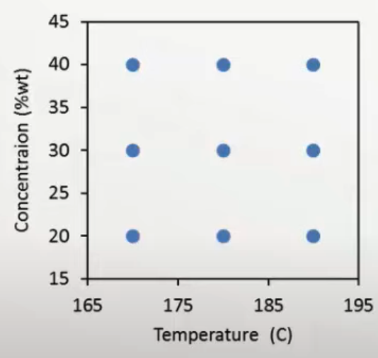
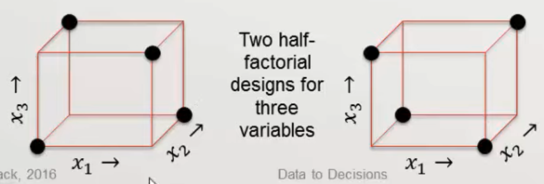
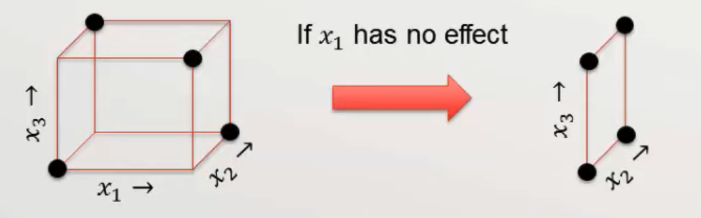
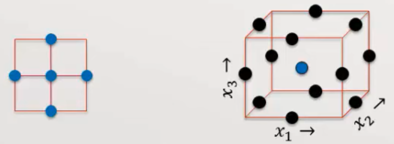

# Factorial Design

## Circular

Experimental design that sets

- which predictor vars to vary
- Over what range
- Sampling plan: With what distribution of values

Given nature of model, we can easily decide how to sample

| Design                | Limitation                           |                                                              | No of measurements            |
| --------------------- | ------------------------------------ | ------------------------------------------------------------ | ----------------------------- |
| One at a time         | Cannot help investigate interactions |  |                               |
| Full factorial design |                                      |  | $r \prod \limits_{i=1}^F l_i$ |

## Full Factorial Design

1. Use $l_i$ levels for factor $F_i$
2. It is common to normalize each factor to $[-1, 1]$: coded vars
3. Perform $r$ complete replicates of experiment
   1. Replicates are required to estimate error

Adding center point

- Center point is often the POR (plan of record) and significant data may already exist about its response
- For LR
  - Center points do not affect orthogonality of design
  - Center points do not change any model parameter except the intercept
- Repeated center point can be used to check linear model validity: is non-linear term required?

## 2-level factorial design

For each factor, run every combination at 2 levels: high and low labelled as $-1, +1$

For $F$ factors there will be $r \times 2^F$ experimental runs for full factorial design

With this, we can detect

- linear variations only
- interactions

We cannot detect

- Non-linear variations

This design is completely orthogonal

## Fractional Factorial Design

Many higher order interactions may be negligible (sparsity-of-effects) principle, and hence redundant

- We can reduce number of runs by eliminating higher-order model interactions, especially the ones that are not relevant to us

Choosing subset of full factorial design

- Balanced: all combinations have same number of obs
- Orthogonal design: effects of any factor sum to zero across effects of other factors

### Half-Factorial design

Limitation

- Aliasing: some terms may get confounded by 2-factor interactions
  - Not all terms can be distinguished in 8 runs

$(x_1 x_2 = x_3 x_4), (x_1 x_3 = x_2 x_4) \implies$ collinearity

### Projections

If one of the factors proves to have no effect on the response, the $F$ factor half-factorial design collapses to a $k-1$ factor full-factorial design

## CCD

Central Composite Design

1. Take 2-level factorial design
2. Add center point with repeats: middle point b/w all factors
3. Add axial (star) points: center point except w/ one var changed to be at +/- an extreme value. Do this for all vars

$n$ level CCD more efficient than $(n+1)$ level factorial design
$$
n = r(2^F + 2F + 1)
$$

### Types

| Type          |                                                              | Rotatable |
| ------------- | ------------------------------------------------------------ | --------- |
| Circumscribed | Every factor data point on radius  equidistant from center: $2^{F/4}$ |           |
| Face-Centered | Every factor data point on the line segments connecting all the initial factors | ❌         |

### Examples

| Level | Type          |                                                              |
| ----- | ------------- | ------------------------------------------------------------ |
| 2     | Circumscribed |  |
| 2     | Face-Centered |  |
| 3     |               |  |

## Box-Behnken Design

1. Put a data point in the center
2. Put a data point at midpoint each edge of process space

### Disadvantages

- Does not contain embedded factorial design: hence, cannot do pre-survey and add more points
- No corner (extreme points)

## Repeated Center Points

- Repeated center points are not randomized
- They are run as the first and last data points
- Every spread through rest of data collection

- Help check against process instability
- All other points should have randomized order

The number of repeated center points can be set to create “uniform precision”, as $\sigma^2_{y \text{ center}} = \sigma^2_{y \text{ corner}}$

## Sequential DOE

Steepest Ascent/Descent

1. Start with factorial design (linear model) about current process (POR: Plan of Record)
   - In scaled coordinates, $(0, 0, \dots, 0)$ represents center point
2. Move in direction of steepest ascent/descent
   1. Find factor $j$ with max $\vert \beta_j \vert$
   2. Move a distance of the $j$th factor: $\Delta x_j \approx 1$ (higher/lower based on judgment)
   3. For every other factor, move a distance of $\Delta x_{j'} = \dfrac{\Delta x_j \beta_{j'}}{\beta_j}$
   4. Measure response at this new point
   5. Keep moving until response goes down

### IDK

1. Start with 2-level full factorial design with repeated center points
2. Extend to central composite design if quadratic model needed

Results in 2 blocks: control number center repeated to ensure uniformity and rotatability

| No of Factors | Factorial Center Repeats | Added star center repeats |
| ------------- | ------------------------ | ------------------------- |
| 2             | $r$                      | $r$                       |
| 3             | $1.4 r + 0.5$            | $r$                       |
| 4             | $2r$                     | $r$                       |
| 6             | $4 (r-4)$                | $r$                       |

## Mixtures

Factors with constraints

Consider

- $x_j \in [0, 1] \quad \forall j \in F$
- $\sum_{j}^F x_j = 1$

## Simplex Design

Applicable for Mixtures

Each factor taking $(m+1)$ evenly space values
$$
x_j = \{ v/m \} \\
v \in [0, m] \\
\forall j \in F
$$

## Taguchi Methods

Statistical methods for improving manufacturing quality

1. Optimization involves use of [loss function](#loss-function)
2. Quality begins with designing a process with inherently high quality
3. Use DOE

### Loss Function

| Goal                              | Loss Function | Eg                  |
| --------------------------------- | ------------- | ------------------- |
| More the better                   | Monotonic     | Production output   |
| Less the better                   | Monotonic     | Pollution emissions |
| Hitting target with min variation | Quadratic     |                     |

