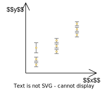

# IDK

## Pre-Survey/Exploratory Designs

Sequential approach: simple screening pre-survey experiment first (such as 2-level factorial design), followed by through investigation

Use $\le 25\%$ of total available data for collection into screening

We want to know: what vars are the most important and over what ranges

Do low-cost pre-survey DOE that focuses on high-priority

Based on this outcome, perform full experiment

## Experiment Pointers

- Always perform experiment with both trial & control samples
  
- Always get the raw data; processing should be done by analyst, not data providers

- Every data point should have central tendency & uncertainty associated
  - Incorporate all potential uncertainty associated with collecting the data & use [Uncertainty Propagation](../Machine_Learning/09_Uncertainty.md#Uncertainty-Propagation)
  - Observation: Use robust [summary statistics](05_Data_Exploration.md#Summary-Statistics): Median
  - Spread/Uncertainty of estimate
    - Standard error, not standard deviation
    - Use non-robust summary statistics
- Every data point fed to model should be iid observation

## Data Template

### For Collection

| Type  | Category_ID | Subcategory_ID | Reading_ID | Value |
| ------- | ------- | ---------- | :--------: | ----: |
| Control | Product A | Sample 1  | 1          | x     |
| Control | Product A | Sample 1  | 2          | x     |
| Control | Product A | Sample 1  | 3          | x     |
| Control | Product A | Sample 2  | 1          | x     |
| Control | Product A | Sample 2   | 2          | x     |
| Control | Product A | Sample 2   | 3          | x     |
| Control | Product B | Sample 1   | 1          | x     |
| Control | Product B | Sample 1   | 2          | x     |
| Control | Product B | Sample 1   | 3          | x     |
| Control | Product B | Sample 2   | 1          | x     |
| Control | Product B | Sample 2   | 2          | x     |
| Control | Product B | Sample 2   | 3          | x     |
| Trial | … | … | … | … |

### For Modelling

We cannot use the collection data directly for modelling as each row is not iid observation. Hence aggregation is required to obtain the central tendency & uncertainty for each iid observation.

| Type    | Category_ID | Subcategory_ID | Central Tendency (Median) | Uncertainty (IQR) |
| ------- | ----------- | -------------- | -----------------------------: | ---------------------: |
| Control | Product A   | Sample 1       |                              x |                      x |
| Control | Product A   | Sample 2       |                              x |                      x |
| Control | Product B   | Sample 1       |                              x |                      x |
| Control | Product B   | Sample 2       |                              x |                      x |
| Trial   | …           | …              |                              … |                      … |

