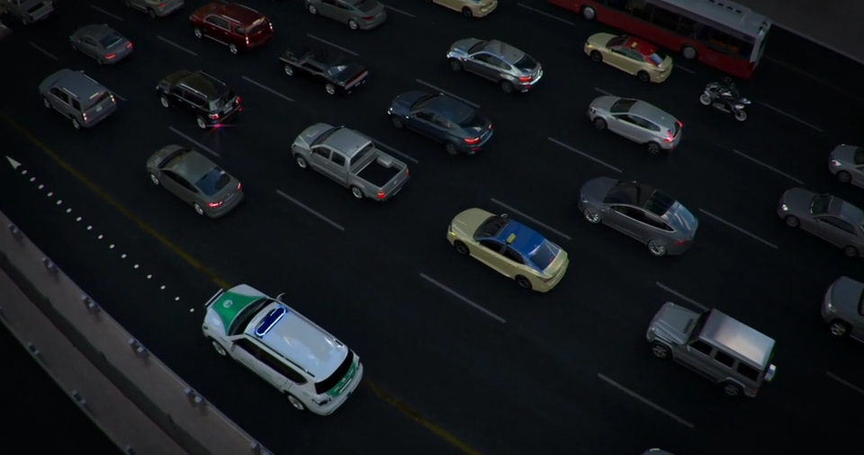

# Introduction

## Skills Required

- Car control
- Visual scanning
- Identifying and weighing risk
- Thinking & responding
- Making decisions

## Road User

Anyone using the road

- People
  - Pedestrians
  - Children
  - Cyclists/Motorcyclists
  - People of determination
- Emergency vehicles
  - Official vehicles
  - Police
  - Ambulance
  - Fire Engine
  - Military vehicles

- Vehicles
  - Cars
  - Trucks
  - Trams

## Attitude in Driving

Difficult in UAE due to people of different nations, making it hard to predict their move

Responsibility to be positive and ensure everyone’s safety

- Most traffic violations like beating the red light is usually caused by bad attitude of the driver
- Flashing headlights to intimidate others increases risk of crash
- Proper use of indicator provides allows other drivers to react appropriately
- Driving too fast for the situation is an unacceptable driving behavior

## Always give way

- Pedestrians

- Emergency vehicles

  - |                         | They will use                                                |                                                              |
    | ----------------------- | ------------------------------------------------------------ | ------------------------------------------------------------ |
    | Highways                | Fast lane                                                    |  |
    | Congested highways      | Emergency yellow area                                        |  |
    | Internal roads          | Between vehicles                                             |                     |
    | Junction                | Between vehicles                                             |  |
    | Junction with red light | Move to the side without crossing the signal                 |  |
    | Roundabouts             | Do not enter If you are already inside, keep moving and move to the right lane once exited |   |

- Tram

IDK

- Do not follow emergency vehicles
- Do not use emergency yellow area (road shoulders)
- People walking along or crossing the roads should be considered as among the many hazards on the road
- When dealing with pedestrian, drivers must give way, always
- When approaching a pedestrian crossing where pedestrians are present, drivers must stop and give way to pedestrians
- You are causing an obstruction to the tram and can attract fines if Stopping or parking near the tram track, and/or
  Littering or fixing any hoarding at the tram track.

## Watch out

- Children: Do unexpected things
- People of determination vehicles
- School busses: Slow down, stop and wait till the bus starts moving
- Busses and taxi lanes
- Motorcyclist and cyclist: When drivers making right turns should watch out for cyclists
- Animals: unpredictable; Camels
  - Do not horn as they cause them to run

Areas

- Residential areas
- Mosques
- Playgrounds
- Shops
- Shopping malls
- Parks
- School areas

Guideline (SSS)

- Space: 1.5m
- Speed: Slow down
- Sound: Lightly sound horn

## Weird Areas

Slip lane: free-right separated from main road by a traffic island

‘Bicycle Shared Starting’ Marking’

‘Bicycle Shared Ending Marking’

## Insurance

### Parties

1. Insurer
2. Owner of vehicle and insurance policy
3. Other vehicle involved in car accident

### Policies

- Comprehensive/Full: All damage cost covered by insurance for both second and third party
- TPL (Third Party Liability): Will only cover damage cost for third party; second party will be responsible for bearing their own costs

Conditions where insurance does not cover

- Driver under influence of alcohol/sedative medicine
- When driving different vehicle category without license
- When driving vehicle in a country where insurance does not cover
- When driver is driving without specs for whom it is mandatory as mentioned in license

## Consequences of accidents

- Fatalities
- Serious injuries
- Vehicle damage
- Property damage
- Vehicle reparation
- Problems from vehicle insurance
- Fines

## Vehicle Safety Features

- Seat belt
- Child restraint system add-on
  - Baby seats
    - Rear-facing
      - It provides more protection to baby head because neck is not fully developed and it is more vulnerable to the forces during brake or collision
    - <1 yr
    - <13 kg
    - <65 cm
    - Integral harness
  - Child seat
    - Forward-facing
    - 1>4 yrs
    - 9-18 kg
    - 65-95 cm
    - Internal harness
  - Booster Seat
    - 4-6 yrs
    - 15-25 kg
    - 95-125 cm
  - Booster cushion
    - 6-11 yrs
    - 22-36 kg
    - 125-140 cm
- Airbags: Designed to protect adults; children must be kept away
  - SRS (Supplement Restraint System)
  - Only effective when used with seat belts
  - Distance between face and steering wheel should be >25 cm
- Head restraint: Prevents whiplash injury
  - Distance between head and restraint should be <10cm
- Crumble zone

## Driver Assistance Systems

- Conventional Cruise Control
- Adaptive Cruise Control
- Intelligent Speed Assistance
- Lane Support Systems: > 50 km/h
  - Lane Departure Warning
  - Lane Keep Assist
  - Lane Centering Assist
- Blind Spot Monitoring
- Forward Collision Mitigation
  - Forward COlloysion Warning
  - Autonomous Emergency Braking
- Parking Assistance
- Anti-Lock Braking System
- Electronic Stability Programme
